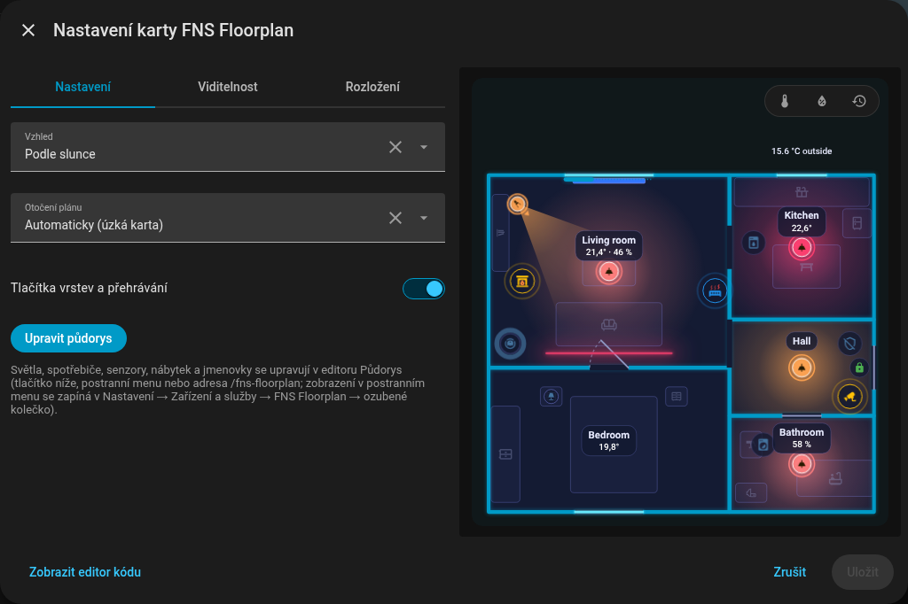
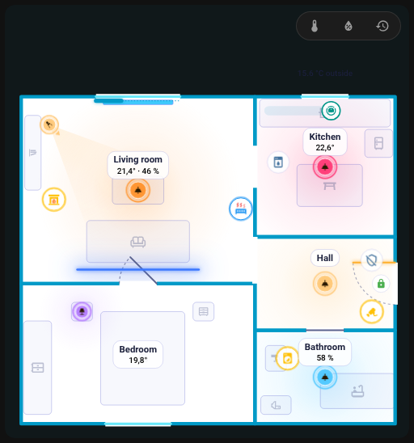
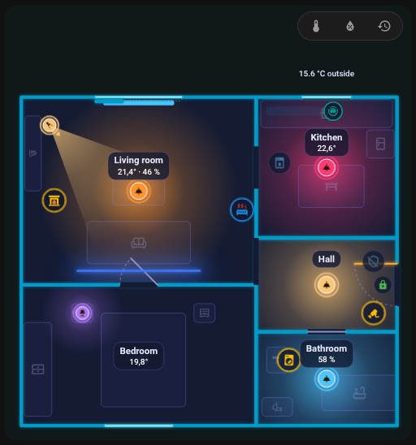
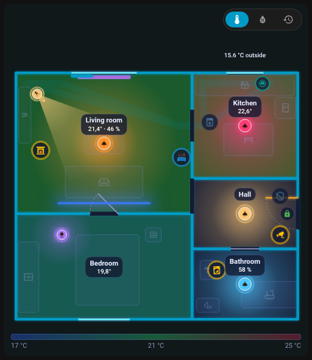
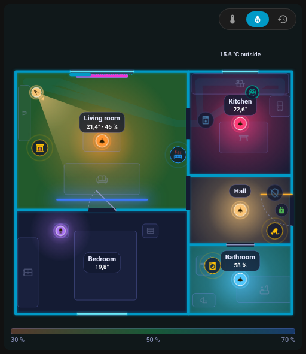
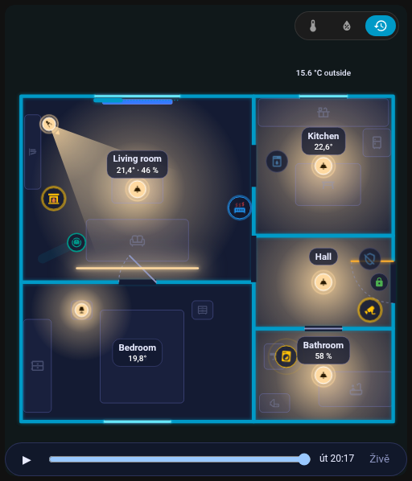

# Karta

## Přidání karty

Uprav dashboard, **Přidat kartu** a vyhledej **FNS Floorplan**; nebo v YAML:

```yaml
type: custom:fns-floorplan-card
```

Karta zobrazuje půdorys uložený v editoru a po každém uložení se sama překreslí (odebírá půdorys přes websocket a po restartu Home Assistantu se přihlásí znovu).

{ loading=lazy }

## Volby

| Volba | Hodnoty | Výchozí | Popis |
|-------|---------|---------|-------|
| `mode` | `auto`, `ha`, `day`, `night` | `auto` | Vzhled karty |
| `rotate` | `auto`, `true`, `false` | `auto` | Otočení půdorysu o 90 stupňů |
| `level` | id patra | první patro | Výchozí patro; ukládá se jen, když to není první |
| `tools` | `true`, `false` | `true` | `false` skryje tlačítka vrstev a přehrávání |

```yaml
type: custom:fns-floorplan-card
mode: ha
rotate: auto
level: upstairs
tools: false
```

Vizuální editor karty má stejná pole (Vzhled, Otočení plánu, Výchozí patro, Tlačítka vrstev a přehrávání) a tlačítko **Upravit půdorys**, které otevře editor.

### mode

- `auto`: den, když je `sun.sun` nad obzorem, jinak noc,
- `ha`: řídí se světlým nebo tmavým motivem Home Assistantu,
- `day`, `night`: vždy jeden vzhled.

### rotate

- `auto`: karta užší než 600 px otočí široký půdorys o 90 stupňů, ale jen když je půdorys víc než 1,25krát širší než vysoký,
- `true`: otáčí vždy, `false`: nikdy.

## Světlý a tmavý vzhled

Karta vypadá dobře v obou motivech. S `mode: ha` následuje světlý nebo tmavý motiv Home Assistantu, s `auto` rozhoduje slunce a `day` nebo `night` zafixuje jeden vzhled (viz [mode](#mode)).

| Tmavý motiv | Světlý motiv |
|---|---|
| { loading=lazy } | { loading=lazy } |

Vzhled samotné karty lze nastavit i nezávisle na motivu:

| Režim `day` | Režim `night` |
|---|---|
| { loading=lazy } | { loading=lazy } |

{ loading=lazy }

*Karta přepínající z tmavého vzhledu na světlý a zpět.*

## Vzhled

- Zdi a záře přebírají `--primary-color` tvého motivu; pozadí karty má stejnou barvu s 5% neprůhledností. Barvy zařízení pocházejí z barev stavů motivu.
- Jmenovky a ikony mají na obrazovce zhruba stejnou velikost (text asi 11 px): na malé kartě rostou (jmenovky až 2,2krát, ikony 1,5krát) a na obří se zmenšují (0,5krát).
- Půdorys má nejvýše 85 % výšky okna; na velmi široké kartě zůstává uprostřed.
- Při více patrech jsou vlevo nahoře záložky pater.

## Vrstvy: teplota, vlhkost a přehrávání

Pokud není `tools: false`, nabízí řada odznaků nad půdorysem:

- **teplota** (stupně C): místnosti se obarví podle teploty (17 až 25 stupňů C),
- **vlhkost** (%): místnosti se obarví podle vlhkosti (30 až 70 %),
- **přehrávání** (ikona hodin): **lišta přehrání dne**.

Při zapnuté teplotě nebo vlhkosti se pod půdorysem objeví barevná legenda. Volba se pamatuje v prohlížeči. Jmenovka místnosti normálně ukazuje teplotu, vlhkost a další hodnoty v noci bíle a ve dne černě; nízká nebo vysoká teplota je modrá nebo červená. Čip s venkovní teplotou pochází z místnosti nastavené jako `outdoor`.

{ loading=lazy }

{ loading=lazy }

{ loading=lazy }

*Zapnutí a vypnutí vrstvy teploty.*

## Přehrání dne

Tlačítko s hodinami otevře lištu **pod půdorysem**, která ho nezakrývá. Přehraje **posledních 24 hodin** z historie Home Assistantu: světla, dveře a zařízení se vrací v čase. Šablony v pravidlech zůstávají během přehrávání živé.

{ loading=lazy }

## Chování při klepnutí

| Položka | Klepnutí | Podržení |
|---------|----------|----------|
| Světlo | přepnout | detail |
| Spotřebič, vysavač, dveře, okno | detail | detail |
| Scéna, tlačítko, skript | aktivovat | |
| Místnost | otevře [panel místnosti](room-panel.md) | |

Vše lze měnit u jednotlivých položek pomocí [akcí](editor/items.md#actions). Tooltipy uvádějí, co dělá klepnutí, dvojklik a podržení.

## Animace

Co karta ukazuje, když se mění entity:

{ loading=lazy }

*Vchodové dveře se otevřou a zavřou, křídlo se otáčí.*

{ loading=lazy }

*Okno se otevře a zavře.*

{ loading=lazy }

*Roleta se zatahuje podél okna.*

{ loading=lazy }

*Světla se zapínají jedno po druhém, každá místnost září barvou svého světla.*

{ loading=lazy }

*Světlo mění barvu.*

{ loading=lazy }

*Pohybový senzor vyšle vlnku a pak se uklidní.*

{ loading=lazy }

*Běžící pračka má kolem ikony kroužek.*

{ loading=lazy }

*Odpočítávací kroužek kolem myčky, dokud běží její časovač.*

{ loading=lazy }

*Spuštěný alarm obarví celý byt, dokud ho nevypneš.*

{ loading=lazy }

*Plamen krbu plápolá, dokud je jeho spínač zapnutý.*

## Výkon

Animace běží jen, když se něco hýbe a když je karta na obrazovce. Karty, které nejsou vidět, se neanimují a `prefers-reduced-motion` potlačí animace ikon.

Dál: [Panel místnosti](room-panel.md).
