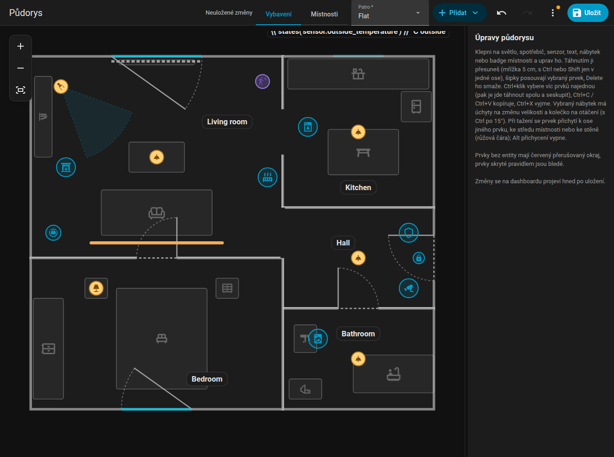
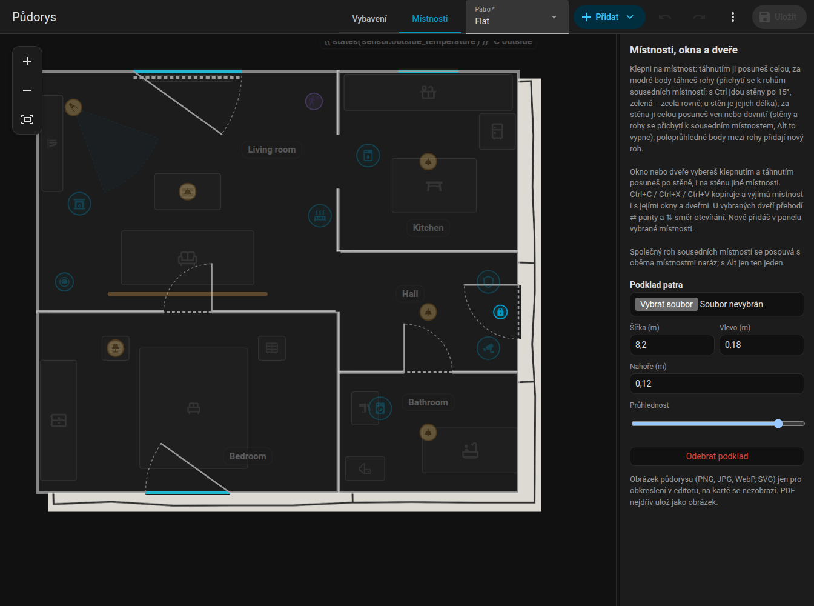

# Přehled editoru

Editor je panel **Půdorys** v postranním menu (adresa `/fns-floorplan`, jen pro administrátory). Upravuje stejný půdorys, který zobrazuje karta. V Home Assistantu se nic nezmění, dokud nestiskneš **Uložit**.

{ loading=lazy }

## Rozvržení

- **Horní lišta**, podobná editoru automatizací v Home Assistantu:
    - přepínač režimu **Vybavení / Místnosti**,
    - výběr patra (když má půdorys více pater),
    - **Přidat** (nabídka všeho, co lze umístit),
    - tlačítka zpět a vpřed, tlačítka přiblížení (+, -, celý plán),
    - **Uložit**,
    - nabídka **Další akce** (tři tečky) s položkami **Historie uložení**, **Kontrola entit**, **Zahodit změny** a správou pater (nové, přejmenovat, smazat). Tečka u nabídky upozorní, že kontrola našla problémy.
- **Půdorys** uprostřed. Kolečkem myši přibližuješ kolem kurzoru, tažením za prázdné místo plán posouváš, na dotykovém displeji přibližuješ dvěma prsty.
- **Boční panel** vpravo zobrazuje formulář vybraného prvku. Tažením za proužek mezi plánem a panelem měníš jeho šířku (od 260 px do 60 % okna, nejvýše 720 px); šířka se pamatuje v prohlížeči.

Na telefonu (užším než 800 px) vyplní půdorys celou obrazovku a formulář se otevře jako spodní list, když klepneš na prvek, přidáš nový nebo otevřeš historii či kontrolu. Táhnutí prvku list neotevírá. Zavřeš ho křížkem nebo klepnutím na ztmavený půdorys.

## Režimy

| Režim | Co upravuješ | Zbytek |
|-------|--------------|--------|
| **Vybavení** | Světla, LED pásky, spotřebiče, senzory, texty, nábytek, jmenovky místností | Místnosti jsou vidět, ale jsou zamčené |
| **Místnosti** | Místnosti (rohy, stěny, celé místnosti), dveře a okna | Prvky jsou ztlumené a zamčené |

Viz [Místnosti](rooms.md), [Dveře a okna](openings.md) a [Položky](items.md).

## Výběr, přesouvání, posouvání šipkami

- Kliknutím prvek vybereš, tažením ho přesuneš. Mřížka má krok 5 cm.
- **Šipky** posunou výběr o 5 cm, **Delete** ho smaže.
- **Ctrl+klik** přidá prvky do výběru. Vybrané prvky se společně přesouvají, posouvají, kopírují a mažou.
- **Seskupit** (ve formuláři vícenásobného výběru) uloží `group`, takže klepnutí na jednoho člena vždy vybere celou skupinu.
- **Esc** zruší výběr.
- Při tažení ukazují růžové **vodicí čáry** zarovnání s ostatními prvky, středem místnosti a stěnami.

## Klávesové zkratky { #keyboard-shortcuts }

| Zkratka | Akce |
|---------|------|
| ++ctrl+z++ | Zpět (100 kroků) |
| ++ctrl+y++ nebo ++ctrl+shift+z++ | Vpřed |
| ++ctrl+c++ / ++ctrl+x++ / ++ctrl+v++ | Kopírovat / vyjmout / vložit prvky nebo místnosti. Vložení na stejném patře posune kopii o 30 / 50 cm, na jiném patře skončí kopie na stejném místě. Místnost se kopíruje i s dveřmi a okny. |
| ++ctrl++ + klik | Přidat do výběru |
| ++delete++ | Smazat výběr (vybraný roh místnosti se smaže, minimum jsou 3 rohy) |
| Šipky | Posun o 5 cm |
| ++alt++ při tažení | Vypne přichytávání a vodicí čáry |
| ++ctrl++ při tažení | Drží pohyb na jedné ose (určí ji prvních 5 cm pohybu). Při tažení rohu místnosti s Ctrl se naopak stěny přichytávají po 15 stupních, viz [Místnosti](rooms.md#angles-and-lengths). |
| ++ctrl++ při otáčení | Otáčí po 15 stupních místo po 1 stupni |
| ++esc++ | Zruší výběr |

Na macOS používej ++cmd++ místo ++ctrl++.

## Zpět, vpřed a ukládání

Každá změna jde na zásobník zpět (100 kroků). Revize se nikdy nevrací. Editor tě upozorní, když odcházíš s neuloženými změnami.

**Uložit** zapíše celý půdorys. Každé uložení zvýší revizi plánu `rev`. Editor posílá revizi, kterou načetl, a pokud mezitím někdo uložil novější plán, uložení se odmítne se zprávou o konfliktu: zvol **Zahodit změny**, plán se znovu načte a své úpravy zopakuješ. Viz [Websocket API](../reference/websocket-api.md#revisions-and-conflicts).

Uložené plány se uchovávají: viz [Historie a kontrola](../history.md).

## Patra { #levels-floors }

Půdorys bez pater má jedno patro. V nabídce **Další akce** (tři tečky) pomocí **Nové patro…**, **Přejmenovat patro…** a **Smazat patro…** patro přidáš, přejmenuješ nebo smažeš (smazané patro odnese své místnosti a prvky s sebou; první patro smazat nejde). Nové patro začíná v režimu **Místnosti**.

Místnosti a prvky patří k patru přes klíč `level`; ty bez něj patří k prvnímu patru. Dveře a okna následují svou místnost. Výběr patra nahoře přepíná patro, které upravuješ, a karta zobrazuje záložky pater. Viz [Formát plánu](../reference/plan-format.md#levels).

## Podklad pro obkreslení { #tracing-image }

Chceš-li kreslit přes existující výkres, nahraj obrázek pod patro: správa pater, **Podklad patra**. Můžeš ho posouvat, měnit mu velikost a nastavit průhlednost. Obrázek je vidět jen v editoru, na kartě nikdy. Povolené formáty jsou PNG, JPG, WEBP a SVG do 15 MB. Soubor se ukládá do `www/fns_floorplan/` v tvé konfiguraci (zpřístupněný jako `/local/fns_floorplan/...`).

{ loading=lazy }

## Nativní pole Home Assistantu

Formuláře používají vlastní výběry Home Assistantu (výběr entity, číslo, seznam, přepínač, výběr barvy, výběr ikony) ve sbalitelných sekcích (Základ, Když běží, Vzhled, Pozice, Akce, Pravidla). Které sekce jsou otevřené, se pamatuje. Výběr entity hledá i podle názvu.

Prvky bez entity mají červený čárkovaný obrys, takže nedokončenou práci poznáš na první pohled.
