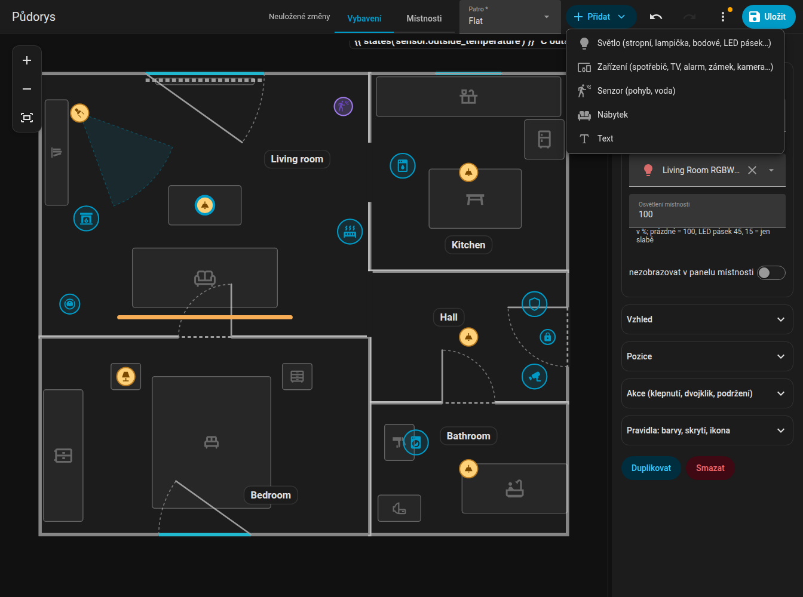
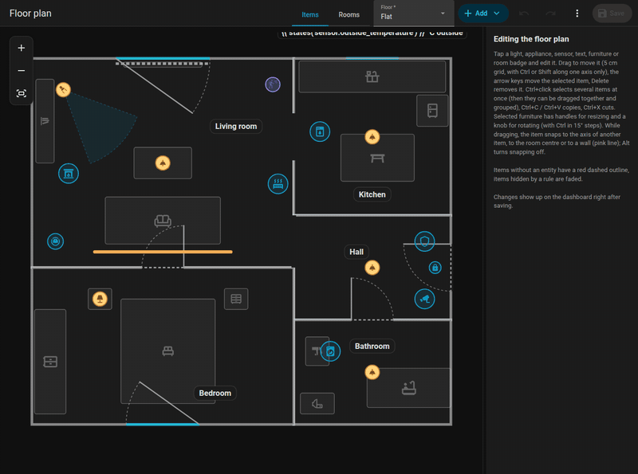
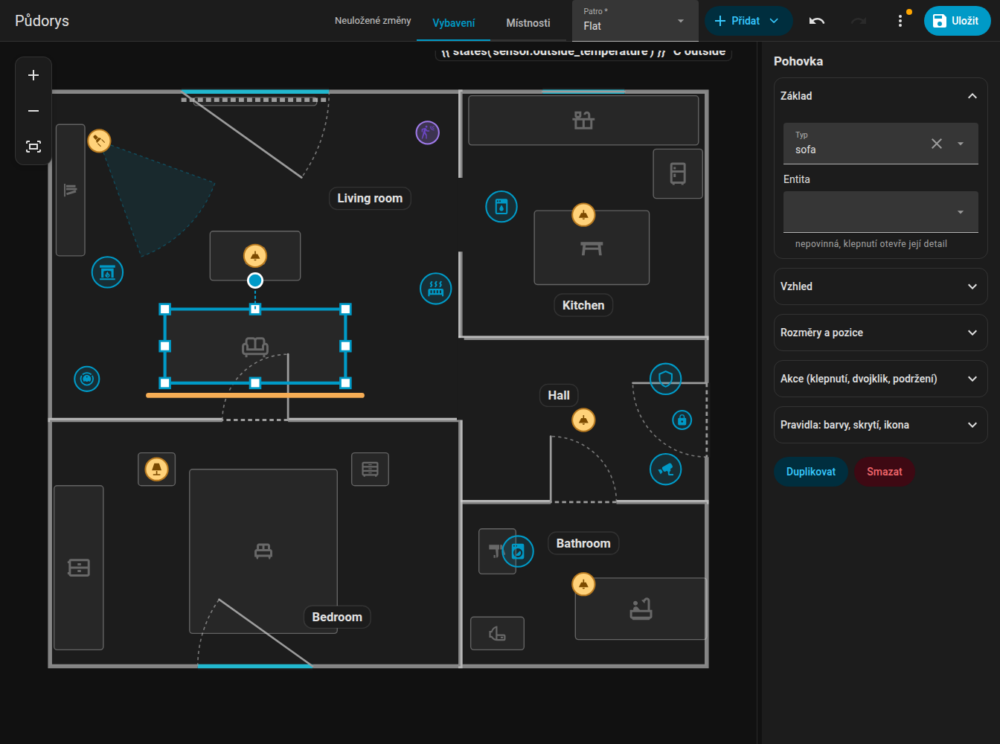
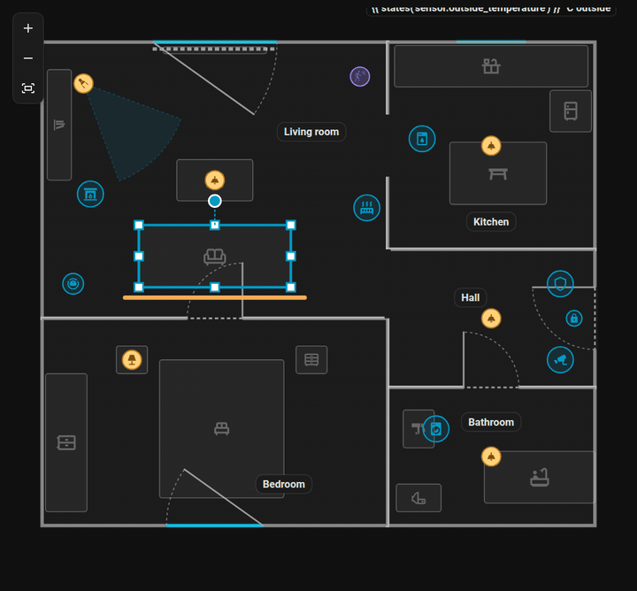
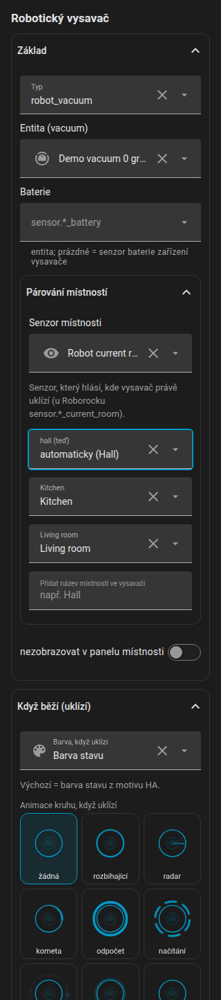
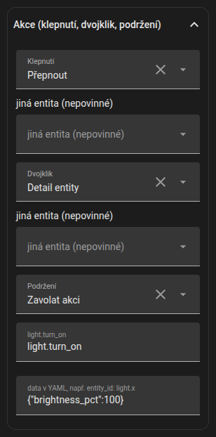

# Položky

Položky jsou vše na půdorysu, co není zeď: světla, spotřebiče, senzory, texty, nábytek a jmenovky místností. Upravuješ je v režimu **Vybavení**. **Přidat** vloží novou; každou položku lze **duplikovat** a **smazat**.

{ loading=lazy }

{ loading=lazy }

*Přidání světla z nabídky Přidat a umístění na plán.*

## Společná nastavení

| Nastavení | Klíč | Význam |
|-----------|------|--------|
| Entita | `entity` | Vybírá se ze všech entit tvého Home Assistantu (výběr hledá i podle názvu) |
| Pozice | `x`, `z` | V metrech; nebo přetáhni |
| Velikost | `size` | `xs`, `s`, `m` (výchozí), `l`, `xl`, `xxl` (0,6 až 2násobek); pro světla, spotřebiče, dok a texty |
| Ikona | `icon` | Libovolná ikona `mdi:`; tlačítka **Bez ikony** (`icon: none`) a **Vrátit výchozí** |
| Vrstva | `layer` | Pořadí překrytí mezi položkami stejného druhu: **Do popředí**, **Výše**, **Níže**, **Do pozadí** |
| Klepnutí / dvojklik / podržení | `tap_action` ... | [Akce](#actions) |
| Pravidla | `rules` | Viz [Pravidla](rules.md) |
| Nezobrazovat v panelu místnosti | `sheet_hide` | Vynechá položku z [panelu místnosti](../room-panel.md) |

Rychlé umístění: když přidáš položku do vybrané místnosti, skončí na pozici v mřížce 3 × 3 uvnitř ní, s odstupem od zdí.

## Světla

Přidej **Stropní světlo**, **Závěsné světlo**, **Panel**, **Lampičku**, **Nástěnné světlo**, **Bodové světlo (směrové)** nebo **LED pásek**. Přiřaď entitu `light`.

- Světlo se řídí svou barvou (`rgb_color`) nebo teplotou chromatičnosti (`color_temp_kelvin`), jinak je teple bílé. Jas zmenšuje a tlumí záři a zesvětluje odznak nebo pásek.
- **Svítidla jednoho světla v jedné místnosti jsou v editoru jedna položka**, stejně jako na kartě: táhneš celou skupinu a změny i smazání platí pro všechna. Stropní spoty jedné místnosti jsou jedna položka.
- `room_light` určuje, jak velká část místnosti při rozsvíceném světle září (podíl, `1` = 100 %, `false` = téměř nic).
- **Bodové světlo** (`lamp_spot`): kužel světla ve směru `rotation` (0 = doprava, 90 = dolů), široký `beam` stupňů (výchozí 40), oříznutý místností. Nikdy se neslučuje s dalšími svítidly stejného světla.
- **LED pásek** (`led_strip`): úsečka s délkou `w`; září skutečnou barvou světla. `glow_side` ho nechá svítit jen na jednu stranu (`1` = vpravo od směru pásku, `-1` = na druhou stranu, bez hodnoty = všemi směry).
- Vypnuté světlo má ikonu ztlumenou a bez vnějšího kruhu. Pásek má neviditelnou oblast 16 px pro klepnutí.

## Spotřebiče a další zařízení

**Přidat, Zařízení** (a konkrétní typy) vytvoří `device` určitého druhu `kind`:

| Druh | Vypadá jako |
|------|-------------|
| `fan`, `purifier`, `dishwasher`, `dryer` | Animované ikony (sušička se třese, myčka poskakuje) |
| `boiler` | Ohřívač vody |
| `radiator` | Při animaci stoupají vlny tepla (barvu určuje `wave`) |
| `alarm` | Štít podle stavu; byt při poplachu pulzuje červeně, při zabezpečování oranžově |
| `media` | Ikona TV, reproduktoru nebo Kodi, zvukové vlny a název během přehrávání, obal v odznaku (`cover: false` ho vypne) |
| `aquarium` | Bublinky |
| `camera`, `fridge`, `lock` | Ikona s barvou stavu |
| `fireplace` | Plamen, který při hoření mihotá |
| `generic` | „Jiné zařízení“: vlastní ikona entity, chování podle domény (viz níže) |

Nastavení: `name`, `entity`, `active` (seznam stavů nebo `{"above": n}`, které se počítají jako „běží“), `text` (vždy zobrazený pod ikonou), `text_on` (zobrazený, když běží; oba mohou být šablony jako `{{ states('sensor.washer_time') }}`), `label_position` (`top`, `left`, `right`, výchozí je pod ikonou) a `label_vertical` (popisek otočený o 90 stupňů), `color` / `color_on` (barva v klidu / za běhu; bez nich se použije barva stavu z motivu tvého Home Assistantu), `fx` (animace kruhu: `ring`, `radar`, `comet`, `countdown`, `spin`, `orbit`, `breath`, `blink`, `heartbeat`, `shake`, `none`).

Textové štítky pod ikonou mají pozadí ve stylu jmenovky místnosti (ve dne světlé, v noci tmavé).

### Jiné zařízení podle domény

Zařízení `generic` se chová rozumně podle domény své entity. Tvá vlastní nastavení a pravidla mají přednost před těmito výchozími hodnotami.

| Doména | Běží, když | Text | Kruh | Klepnutí |
|--------|-----------|------|------|----------|
| `fan` | zapnuto | rychlost v % | spin | detail |
| `siren` | zapnuto | žádný | blink | detail |
| `input_boolean`, `switch`, `binary_sensor` | zapnuto | žádný | ring | detail |
| `humidifier` | zapnuto | vlhkost v % | breath | detail |
| `water_heater` | není vypnuto | teplota | breath | detail |
| `climate` | `hvac_action` je heating / cooling / ..., bez něj stav není vypnuto | aktuální → cílová teplota | breath | detail |
| `valve`, `cover` | open, opening, closing | poloha v % | spin při pohybu, jinak ring | detail |
| `lawn_mower` | mowing | žádný | comet | detail |
| `vacuum` | cleaning, returning | žádný | comet | detail |
| `camera` | recording, streaming | žádný | radar | detail |
| `person`, `device_tracker` | doma | název zóny, když je pryč | ring | detail; fotka v odznaku, mimo domov šedá |
| `script` | zapnuto | žádný | spin | spustí skript |
| `scene`, `button`, `input_button` | nikdy | žádný | krátké blikání při změně času | aktivuje scénu / stiskne tlačítko |
| `input_select`, `select` | nikdy | stav | žádný | detail |
| `number`, `input_number`, `counter`, `sensor` | nikdy | hodnota s jednotkou | žádný | detail |
| `weather` | nikdy | teplota | žádný | detail |
| `sun` | nad obzorem | žádný | ring | detail |
| `timer` | active | žádný | countdown z vlastního časovače | detail |

Zařízení `generic` s entitou `alarm_control_panel.*` nebo `lock.*` se chová jako vyhrazený druh alarm nebo lock.

### Animace ikon

Spotřebič bez vlastní animované ikony (generic, camera, fridge, lock, alarm) dostane CSS animaci podle názvu ikony, když je ve stavu zapnuto: větrák a ozubené kolo se otáčejí, pračka a sušička se třesou, myčka poskakuje, oheň mihotá, reproduktory pulzují, garážová vrata a rolety hýbou jen lamelami, stoupá pára, nabíjející se baterie rozsvěcují políčka jedno po druhém a tak dále. Ikony končící na `-off` se nikdy neanimují. Pravidlo s `animate: false` animaci vypne a `prefers-reduced-motion` ji potlačí.

## Senzory

**Přidat, Senzor** umístí binární senzor podle `entity`. Jeho `device_class` rozhoduje, co dělá na kartě:

- `motion`, `occupancy`, `presence`: plynulé **vlnky**, dokud je zapnutý,
- `moisture`: místnost pulzuje červeně a objeví se štítek „Únik vody“.

Na kartě se senzor kreslí jen jako vlnky nebo jako pulzování místnosti; editor ho zobrazuje s ikonou podle jeho třídy. Senzory mají také `layer`, ten ale v editoru záleží jen mezi senzory.

## Textové položky

**Přidat, Text** umístí volný text: `text` (prostý nebo šablonu `{{ }}`), nebo `entity`, jejíž stav se zobrazí. Nastavení: `x`, `z`, `rotation`, `size`, `color`, `background` (`none` = bez pozadí). Styl: jako jmenovka místnosti.

```yaml
texts:
  - id: t_outside
    text: "Venku {{ states('sensor.outdoor_temperature') }} °C"
    x: 4.2
    z: 0.3
    size: l
    background: none
```

## Nábytek { #furniture }

**Přidat, Nábytek** přidá jeden z těchto typů (ve výběru seřazené podle názvu, s vyhledáváním; „Jiný“ je poslední):

| Typ | Význam | Typ | Význam |
|-----|--------|-----|--------|
| `bed` | Postel | `bunk_bed` | Patrová postel |
| `nightstand` | Noční stolek | `wardrobe` | Šatní skříň |
| `dresser` | Komoda | `shelf` | Police, knihovna |
| `tall_cabinet` | Vysoká skříň | `sideboard` | Příborník |
| `sofa` | Pohovka | `sofa_corner` | Rohová sedačka (tvar L) |
| `coffee_table` | Konferenční stolek | `table` | Stůl |
| `chair` | Židle | `desk` | Psací stůl |
| `office_chair` | Kancelářská židle | `bench` | Lavice |
| `coat_rack` | Věšák | `tv_board` | TV stolek |
| `tv_wall` | Televize na zdi (přehrává barvy, když má přehrávač) | `kitchen` | Kuchyňská linka |
| `kitchen_wall` | Horní skříňky | `kitchen_tall` | Vysoká kuchyňská skříň |
| `fridge` | Lednice | `sink` | Dřez |
| `stove` | Sporák | `dishwasher` | Myčka |
| `washer` | Pračka | `dryer` | Sušička |
| `bathtub` | Vana | `shower` | Sprcha |
| `washbasin` | Umyvadlo | `wc` | WC |
| `radiator` | Radiátor | `robot_vacuum` | Dok robotického vysavače, viz [Robotický vysavač](../robot-vacuum.md) |
| `other` | Jiný | | |

- Vybraný kus má v rozích a po stranách úchyty pro **změnu velikosti** (protější strana zůstává na místě, mřížka 5 cm) a kolečko pro **otáčení** po 1 stupni (++ctrl++ pro 15 stupňů). Ikona se otáčí s nábytkem.
- **Rohová sedačka** má tvar L; sedák je 40 % kratší strany.
- `color` nastavuje výchozí barvu kusu; pravidlo má přednost.
- Nábytek je v editoru ztlumený, aby neodváděl pozornost.

{ loading=lazy }

{ loading=lazy }

*Změna velikosti pohovky úchyty a otáčení (Ctrl = kroky po 15 stupních).*

{ loading=lazy }

## Vrstvy

Pořadí překrytí se porovnává jen mezi položkami stejného druhu. Použij **Do popředí / Výše / Níže / Do pozadí** ve formuláři. Robotický vysavač má vlastní pravidla, viz [Robotický vysavač](../robot-vacuum.md#layer-and-stacking).

## Skupiny a vícenásobný výběr

Přes Ctrl+klik vyber víc položek. Ve formuláři výběru stiskni **Seskupit**: uloží se `group` a klepnutí na kteréhokoli člena vybere celou skupinu. Vybrané položky se společně přesouvají, posouvají, kopírují (++ctrl+c++, ++ctrl+v++), vyjímají (++ctrl+x++) a mažou. Viz [zkratky](index.md#keyboard-shortcuts).

## Akce { #actions }

Každá položka (i dveře a okna) přijímá `tap_action`, `double_tap_action` a `hold_action` ve formátu Home Assistantu:

| `action` | Význam |
|----------|--------|
| `toggle` | Přepne entitu |
| `more-info` | Otevře detail entity |
| `perform-action` | Zavolá akci: `perform_action` a `data` |
| `navigate` | Přejde na `navigation_path` |
| `url` | Otevře `url_path` |
| `none` | Nedělá nic |

Výchozí chování: světlo se při klepnutí přepne a při podržení ukáže detail; spotřebič, vysavač, dveře a okno ukážou detail. Dvojklik zpozdí jednoduché klepnutí o 250 ms, ale jen když je nastavena akce dvojkliku. Při najetí myší na položku se zobrazí tooltip: název a co dělá klepnutí, dvojklik a podržení.

{ loading=lazy }

```yaml
tap_action:
  action: perform-action
  perform_action: scene.turn_on
  data:
    entity_id: scene.movie_night
hold_action:
  action: more-info
```

Dál: [Pravidla](rules.md).
