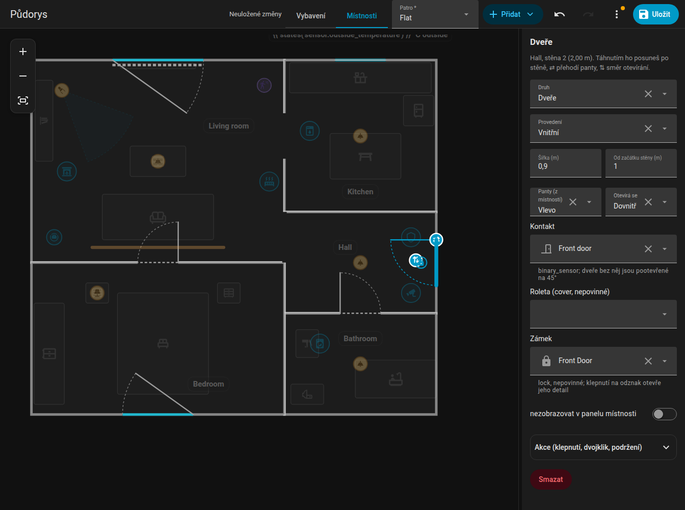
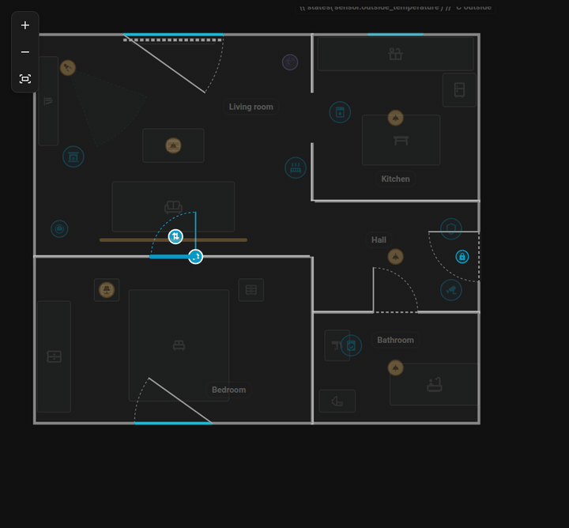
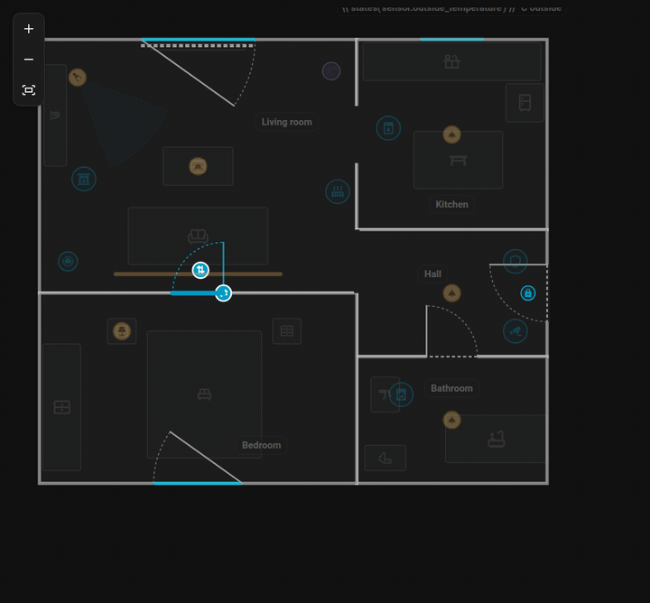

# Dveře a okna

Dveře a okna („otvory“) patří ke stěně místnosti. Upravuješ je v režimu **Místnosti**.

{ loading=lazy }

## Přidání a posouvání

1. Vyber místnost a v bočním panelu zvol stěnu (nebo vyber místnost a použij tlačítka **+ Dveře** / **+ Okno** u vybrané stěny).
2. Na té stěně se objeví nové dveře nebo okno.
3. **Kliknutím** ho vyber a **tažením** po stěně posuň. Šipky ho posunou o 5 cm.
4. Přetáhni ho na stěnu **jiné místnosti** a přesune se tam (vyhrává nejbližší stěna na patře).

Přidání nebo odebrání rohu místnosti otvor nikdy neposune z místa, kde byl.

{ loading=lazy }

*Posunutí dveří po stěně a přetažení na stěnu jiné místnosti.*

{ loading=lazy }

*Dvě úchytky vybraných dveří přehodí stranu pantů a směr otevírání.*

## Nastavení

| Nastavení | Klíč | Význam |
|-----------|------|--------|
| Typ | `type` | `door` nebo `window` |
| Provedení dveří | `style` | Běžné dveře (vnitřní, vchodové, prosklené) nebo `passage` = jen otvor bez křídla |
| Šířka | `width` | V metrech |
| Od začátku stěny | `offset` | Vzdálenost středu otvoru od začátku stěny |
| Panty | `hinge` | `left` nebo `right`, při pohledu z místnosti |
| Otevírání | `swing` | `in` nebo `out` |
| Kontakt | `contact` | Binární senzor (kontakt dveří / okna) |
| Zámek | `lock` | Entita `lock` zobrazená u dveří |
| Roleta | `blind` | Entita `cover` vykreslená jako pruh podél okna |

Křídlo a oblouk ukazují panty a směr otevírání. U vybraného otvoru tlačítko **Panty na druhou stranu** zrcadlově přehodí stranu pantů a **Otevírat na druhou stranu** směr otevírání, přímo na plánu.

## Kontaktní senzor

S `contact` se otvor animovaně otevírá (dveře se otevřou do 90 stupňů), po dobu otevření svítí oranžově a prvních 6 sekund po otevření pulzuje. Bez kontaktu:

- **dveře** jsou nakreslené pootevřené o 45 stupňů,
- **okno** nebo prosklené balkonové dveře zůstávají zavřené.

Klepnutí na otvor na kartě otevře detaily kontaktu (more-info). Na otvory můžeš nastavit i [akce klepnutí](items.md#actions).

## Zámky

`lock` přijímá entitu zámku a u dveří uvnitř místnosti nakreslí malý odznak zámku. Je zelený, když je zamčeno, oranžový, když je odemčeno, červený, když se zasekl, a modrý s kruhem při zamykání nebo odemykání. Klepnutí otevře jen detaily, takže se dveře nikdy neodemknou omylem. Velikost určuje `lock_size` (výchozí S).

## Rolety

`blind` je entita `cover` (roleta nebo žaluzie). Vykreslí se jako pruh podél okna, který se s postupným zavíráním rolety prodlužuje, na tečkované dráze přes celou šířku okna: zavřeno z 50 % vyplní polovinu. Když se cover pohybuje, pruh se animuje. Klepnutí na roletu otevře její detaily.

| Klíč | Efekt |
|------|-------|
| `blind_side: out` | Vykreslí roletu před zdí místo uvnitř |
| `blind_invert: true` | Pro rolety, které pro „zavřeno“ hlásí 100 |

Poloha se bere z `current_position` coveru, bez něj ze stavu `closed`.

## Příklad

```yaml
openings:
  - id: d_front
    room_id: hall
    edge: 0
    offset: 1.1
    width: 0.9
    type: door
    hinge: left
    swing: in
    contact: binary_sensor.front_door
    lock: lock.front_door
  - id: w_living
    room_id: living_room
    edge: 2
    offset: 1.8
    width: 1.4
    type: window
    contact: binary_sensor.living_room_window
    blind: cover.living_room_blind
    blind_side: out
```

Dál: [Položky](items.md). Reference: [Formát plánu](../reference/plan-format.md#openings).
