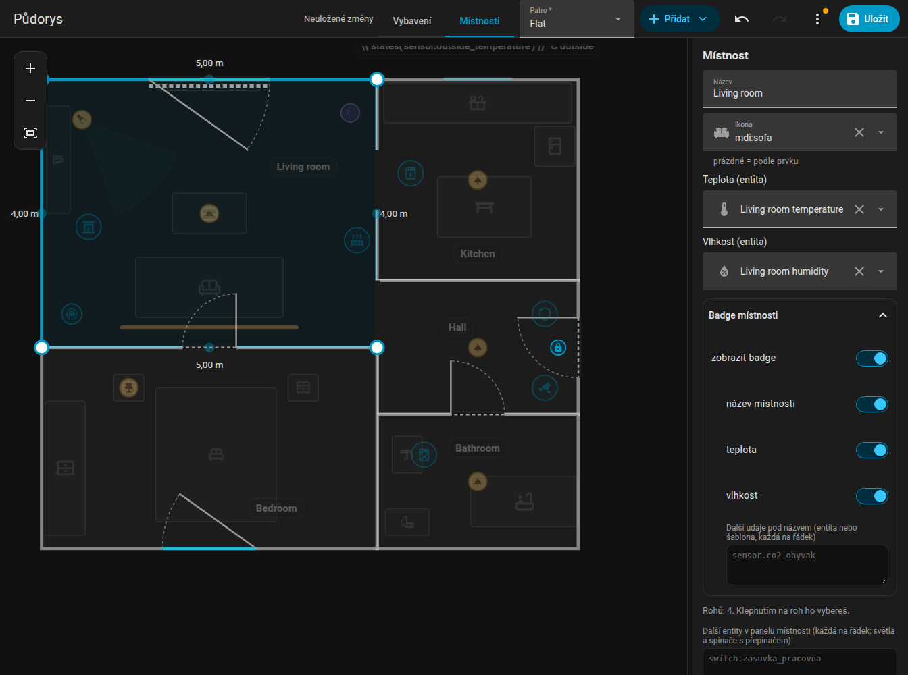

# Místnosti

Přepni editor na **Místnosti** a upravuj tvar bytu. Vše ostatní je v tomto režimu ztlumené a zamčené.

{ loading=lazy }

## Přidání místnosti

**Přidat, Místnost** vloží čtverec 2 × 2 metry. Každá místnost je samostatný mnohoúhelník s `id`, `name` a `points` v metrech (`x` doprava, `z` dolů).

## Rohy

- Klikni na místnost a vyber ji. **Modré body** jsou její rohy; táhni je. Poloprůhledné body mezi rohy při tažení přidají nový roh.
- Vyber roh a stiskni **Delete** (nebo tlačítko v bočním panelu), roh se odstraní. Místnost potřebuje aspoň tři rohy.
- Boční panel ukazuje souřadnice vybraného rohu a umožňuje je zadat ručně.
- Přidání nebo odebrání rohu nechá dveře a okna místnosti tam, kde jsou.

## Stěny a celé místnosti

- Táhni **celou stěnu** vybrané místnosti: oba její rohy se posouvají kolmo ke stěně. Roh sdílený se sousedem jde s ní.
- Tažením za samotnou místnost **přesuneš celou místnost**.
- Šipky posunou vybranou místnost, roh nebo stěnu o 5 cm.

{ loading=lazy }

*Tažení celé stěny: délky sousedních stěn se přepočítají.*

{ loading=lazy }

*Přesun celé místnosti tažením za podlahu.*

## Přichytávání k sousedům

Rohy, stěny i celé místnosti se přichytávají k rohům a stěnám ostatních místností na stejném patře do vzdálenosti 15 cm, což ukazuje růžová vodicí čára. S ++alt++ přichytávání vypneš. Jinak platí mřížka 5 cm.

{ loading=lazy }

*Roh se přichytí k rohu sousední místnosti.*

## Sdílené stěny

Každá místnost má vlastní mnohoúhelník, takže stěna mezi dvěma místnostmi jsou ve skutečnosti dvě stěny přes sebe. Když táhneš roh, který leží přesně na rohu jiné místnosti, **posunou se oba společně** (s Alt jen jeden). Tažením stěny se posouvají i rohy jiných místností, které na ní leží kdekoli. Pokud je chceš záměrně oddělit, drž Alt.

## Úhly a délky { #angles-and-lengths }

- Vybraná místnost ukazuje **délku každé stěny** (vně místnosti), živě při tažení.
- Drž ++ctrl++ při tažení rohu: stěna k sousednímu rohu se přichytí po **15 stupních** a délka po 5 cm. V blízkosti průsečíku obou stěn roh do průsečíku skočí, čímž vznikne pravý úhel.
- Stěny vybraného rohu jsou označené: zelená značka **rovně**, když je stěna přesně vodorovná nebo svislá, jinak oranžová značka s úhlem.

{ loading=lazy }

*Tažení rohu s podrženým Ctrl: kroky po 15 stupních a zelená značka „rovně“.*

## Název, ikona a klima

| Pole | Význam |
|------|--------|
| Název | Zobrazuje se na jmenovce místnosti a v panelu místnosti |
| Ikona | Zobrazuje se v hlavičce [panelu místnosti](../room-panel.md) (`icon`) |
| Teplota | Senzor teploty (`temperature`) |
| Vlhkost | Senzor vlhkosti (`humidity`) |
| Další entity | Entity pro panel místnosti (`sheet_extra`), každá na řádek; **Přidat entitu** pod polem ji vybere z Home Assistantu |

Oba seznamy (další entity i údaje jmenovky) berou jeden záznam na řádek, s úvodní `- ` i bez ní. Berou také **šablonu**, která vypíše id entit – každé na řádek, jako seznam nebo oddělené čárkou. Šablona přes víc řádků je jeden záznam:

```jinja

- light.terrace
- switch.blinds

- light.night_lamp

```

## Jmenovka místnosti

Každá místnost ukazuje **jmenovku** (odznak) s názvem a hodnotami. Volby:

| Klíč | Efekt |
|------|-------|
| `label_info` | Seznam toho, co zobrazit: `temperature`, `humidity`, id entit nebo šablony. Výchozí: teplota a vlhkost. Ve formuláři přidá **Přidat entitu** entitu jako nový řádek |
| `label_name: false` | Skryje název, hodnoty nechá |
| `label_hidden: true` | Skryje celou jmenovku |
| `label_rotation` | Otočí jmenovku (ve stupních) |

V režimu **Vybavení** můžeš jmenovku přetáhnout na nové místo; poloha se ukládá do `labels`. Místnosti berou i [pravidla](rules.md): `tint` podbarví podlahu, `hide` skryje jmenovku.

## Smazání

**Smazat místnost** v bočním panelu odstraní místnost i s jejími dveřmi, okny a jmenovkou.

Dál: [Dveře a okna](openings.md).
