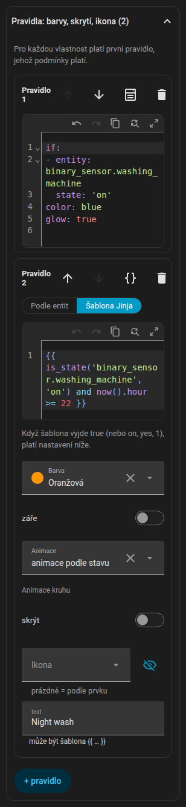

# Pravidla

Pravidla umožňují, aby položka reagovala na víc než jen svůj vlastní stav. Existují u každého druhu položky: světel, LED pásků, spotřebičů, doku robotického vysavače, nábytku, textů i místností.

{ loading=lazy }

## Jak se pravidla vyhodnocují

`rules` je uspořádaný seznam. Každé pravidlo má podmínky (`if`) a výstupy. **U každého výstupního pole vyhrává první pravidlo, jehož podmínky platí všechny a které toto pole nastavuje.** Pravidlo bez `if` je výchozí.

```yaml
rules:
  - if: [ ... ]        # musí platit všechny podmínky (AND)
    color: red
  - color: blue        # bez "if": platí, když žádné dřívější pravidlo barvu nenastavilo
```

## Podmínky

Podmínky můžeš psát ve dvou režimech. Každé pravidlo má přepínač **Podle entit / Šablona Jinja**; přepnutí z entit na Jinja stávající podmínky převede.

=== "Podle entit"

    Podmínka je `{entity, attribute?, state | state_not | above | below}`. `state` a `state_not` mohou být seznam. `{any: [podmínky]}` je skupina OR.

    ```yaml
    if:
      - entity: climate.living_room
        attribute: hvac_action
        state: heating
      - entity: sensor.outdoor_temperature
        below: 5
      - any:
          - entity: binary_sensor.window
            state: "on"
          - entity: binary_sensor.door
            state: "on"
    ```

    Ve formuláři má každá podmínka entitu (se zkratkou **tato entita**), volitelný atribut a operátor je / není / větší než / menší než / šablona. Nové podmínky se předvyplní entitou položky (místnost použije svůj senzor teploty).

=== "Šablona Jinja"

    Jediná podmínka `{template: "{{ ... }}"}`. Home Assistant ji vyhodnocuje živě a platí pro `true`, `on`, `yes`, `1` nebo nenulové číslo.

    ```yaml
    if:
      - template: "{{ is_state('binary_sensor.front_door', 'on') and states('sensor.outdoor_temperature') | float(0) < 0 }}"
    ```

Výstup `text`, který obsahuje `{{ }}`, je rovněž šablona.

## Výstupy

| Výstup | Efekt |
|--------|-------|
| `color` | Obarví ikonu a rámeček odznaku; u nábytku obrys a výplň; u světla přebije barvu žárovky (odznak, záře, pásek); u robota nahradí barvu motivu, i v doku |
| `glow` | Přidá kolem položky záři |
| `animate` | Přebije `active` u spotřebiče: `true` / `false`. `animate: false` zastaví i animaci ikony |
| `wave` | Barva vln tepla u radiátoru |
| `text` | Nahradí text pod ikonou (prostý nebo šablona) |
| `tint` (nebo `color`) | U místnosti: podbarví podlahu; `opacity` určuje sílu (výchozí 0,14) |
| `hide` | Skryje položku (u místnosti její jmenovku) |
| `icon` | Vymění ikonu (spotřebiče, světla, nábytek, dok). `none` ji odstraní; vyber ji ve výběru ikon |
| `background` | Pozadí textové položky |
| `fx` | Animace kruhu: `ring`, `radar`, `comet`, `countdown`, `spin`, `orbit`, `breath`, `blink`, `heartbeat`, `shake`, `none` |
| `progress` | Entita, která řídí `countdown` (viz níže) |
| `progress_total` | Délka v minutách pro `countdown` |

Barvy: `red`, `orange`, `yellow`, `green`, `blue`, `purple`, `pink`, `white`, `black`, libovolný název barvy motivu vybraný ve formuláři (ukládá se pod názvem, například `teal`), nebo libovolná barva CSS (hex, `rgb(...)`, `var(...)`).

Světla, LED pásky, dok a nábytek nemají vlastní animaci kruhu, takže se kruh objeví, jen když ho pravidlo nastaví přes `fx`. Kruh LED pásku je uprostřed pásku, u nábytku uprostřed obdélníku.

Pro výstup kruhu platí priorita: pravidlo, pak vlastní nastavení spotřebiče, pak výchozí chování alarmu podle stavu.

### Odpočet { #countdown }

`fx: countdown` kreslí ubývající oblouk. Odkud bere průběh:

- `progress: timer.kitchen`: `timer` (aktivní nebo pozastavený),
- `progress: sensor.dryer_remaining` s `device_class: duration` (sekundy, minuty nebo hodiny; celek je `progress_total`, jinak nejvyšší dosud viděná hodnota),
- `progress: sensor.dryer_end` s `device_class: timestamp` (čas konce; začátek je `last_changed` běžícího zařízení, jinak `progress_total`),
- `progress: sensor.dryer_progress` v `%`: kruh se **plní jako baterie** (0 % prázdný, 100 % plný),
- `progress_total: 45` bez entity: odpočet o této délce v minutách, počítaný od změny entity z podmínky pravidla (u spotřebiče od okamžiku, kdy se rozběhne).

Bez ničeho z toho je odpočet jen dekorativní cyklus o délce 4 sekundy.

## Pravidla jako YAML

Každé pravidlo má v hlavičce tlačítko **{ }**, které otevře jen toto pravidlo jako YAML v editoru kódu Home Assistantu (barvy syntaxe, čísla řádků, nápovědy entit a ikon). Změna se potvrdí, když editor opustíš. Stejné YAML vidíš ve [formátu plánu](../reference/plan-format.md#rules).

## Asistent AI Task

Pokud má tvůj Home Assistant entitu `ai_task.*`, která podporuje generování dat, zobrazí sekce Pravidla tlačítko **Navrhnout s AI**. Jednou větou popiš, co chceš. Editor pošle popis službě `ai_task.generate_data` spolu s formátem pravidel, výstupy povolenými pro tuto položku, její entitou (stav a atributy), stávajícími pravidly a seznamem tvých entit (až 1500, bez entit update, event, scene a script). Odpověď dorazí jako YAML a otevře se jako **návrh**; pravidla nahradí teprve **Použít návrh**. Pokud požadavek nejde splnit, asistent odpoví jednou větou, kterou uvidíš jako zprávu.

## Příklady

### Dokončení praní

```yaml
devices:
  - id: washer
    kind: generic
    name: Pračka
    entity: sensor.washer_state
    icon: mdi:washing-machine
    x: 1.2
    z: 3.4
    rules:
      - if:
          - entity: sensor.washer_state
            state: running
        color: blue
        animate: true
        fx: countdown
        progress: sensor.washer_finish_time   # device_class: timestamp
      - if:
          - entity: sensor.washer_state
            state: finished
        color: green
        fx: blink
        text: Hotovo
```

### Otevřené dveře

Šablona s `now()` se překresluje každou minutu, takže se pravidlo zapne pět minut po otevření dveří.

```yaml
rooms:
  - id: hall
    name: Předsíň
    points: [[0, 0], [3, 0], [3, 2.5], [0, 2.5]]
    rules:
      - if:
          - template: >-
              {{ is_state('binary_sensor.front_door', 'on')
                 and (now() - states.binary_sensor.front_door.last_changed).total_seconds() > 300 }}
        tint: orange
        opacity: 0.3
```

### Poplach při úniku vody

```yaml
devices:
  - id: leak
    kind: generic
    name: Únik vody
    entity: binary_sensor.kitchen_leak
    x: 2.0
    z: 1.0
    rules:
      - if:
          - entity: binary_sensor.kitchen_leak
            state: "on"
        color: red
        glow: true
        fx: blink
        text: Únik!
      - hide: true
```

Poslední pravidlo nemá podmínku, takže se položka skryje vždy, když voda neuniká.

### Procentuální kruh jako baterie

```yaml
devices:
  - id: phone_battery
    kind: generic
    name: Telefon
    entity: sensor.phone_battery_level
    x: 4.0
    z: 2.0
    rules:
      - if:
          - entity: sensor.phone_battery_level
            below: 20
        color: red
        fx: countdown
        progress: sensor.phone_battery_level
      - fx: countdown
        progress: sensor.phone_battery_level
        color: green
```

### Odpočet časovače

Trouba, která odpočítává 45 minut od okamžiku zapnutí:

```yaml
devices:
  - id: oven
    kind: generic
    name: Trouba
    entity: switch.oven
    x: 3.1
    z: 0.4
    rules:
      - if:
          - entity: switch.oven
            state: "on"
        fx: countdown
        progress_total: 45
        color: orange
```

A pomocník kuchyňský časovač, který řídí kruh:

```yaml
    rules:
      - if:
          - entity: timer.kitchen
            state: active
        fx: countdown
        progress: timer.kitchen
        color: yellow
```

### Radiátor reagující na okno, boost a ventil

```yaml
devices:
  - id: radiator_living
    kind: radiator
    entity: climate.living_room
    x: 4.3
    z: 1.1
    rules:
      - if:
          - entity: switch.boost_living_room
            state: "on"
        color: yellow
      - if:
          - any:
              - entity: binary_sensor.living_room_window
                state: "on"
              - entity: binary_sensor.balcony_door
                state: "on"
        color: blue
      - if:
          - entity: switch.valve_living_room
            state: "on"
        color: orange
        animate: true
        wave: red
      - animate: false
```

Zpět na [Položky](items.md) nebo do [Formátu plánu](../reference/plan-format.md#rules).
