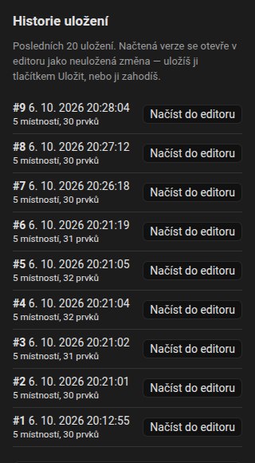
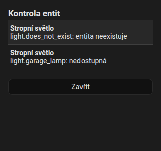

# Historie a kontrola

Obojí najdeš v nabídce **Další akce** (tři tečky) [editoru](editor/index.md).

## Historie { #history }

Integrace uchovává **posledních 20 uložených půdorysů** (v `.storage/fns_floorplan.history`). Každé uložení odešle předchozí půdorys do historie.

1. Otevři nabídku, **Historie uložení**.
2. Seznam ukazuje každou revizi s datem, počtem místností a prvků.
3. Vyber jednu: načte se do editoru jako **neuložená změna**, takže se na ni můžeš podívat, opravit ji a **Uložit**, nebo ji **Zahodit**.

Obnovení se uloženého půdorysu nedotkne, dokud neuložíš. Příkazy, které za tím stojí, najdeš ve [Websocket API](reference/websocket-api.md#history).

{ loading=lazy }

## Kontrola

**Kontrola entit** vypisuje problémy půdorysu:

- entity, které už **neexistují**,
- entity, které jsou **nedostupné**,
- prvky **bez entity**,
- totéž uvnitř pravidel,
- názvy místností ve vysavači, které nejsou spárované.

Kliknutím na řádek skočíš na příslušný prvek. Tečka u nabídky se zobrazí, když jsou nějaké problémy.

{ loading=lazy }
