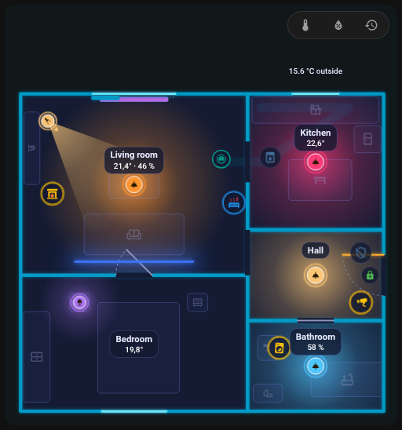
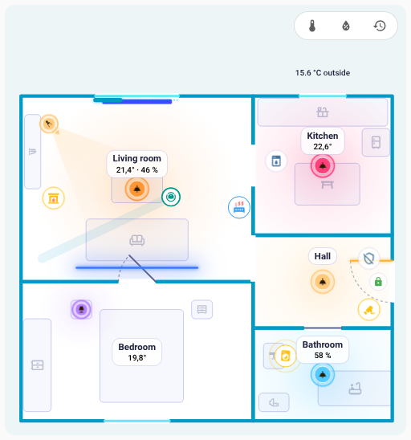

# FNS Floorplan – nápověda

FNS Floorplan promění dashboard v Home Assistantu v živý půdorys domova: světla září svou skutečnou barvou, dveře a okna se otevírají a robotický vysavač jezdí po místnosti, ve které zrovna uklízí. Půdorys si nakreslíš ve vestavěném editoru, bez YAML a bez práce s obrázky.

Najdeš tu návody ke kartě a editoru i řešení nejčastějších problémů. Když něco nejde, najdi příznak, který vidíš.

!!! info "Inspirováno NeonPlan 3D"
    FNS Floorplan vznikl z inspirace kartou [NeonPlan 3D](https://github.com/Mastershort/neonplan3d), 3D půdorysem pro Home Assistant. Jeho myšlenku převádí do animovaného 2D plánu s vlastním editorem. [Přicházíš z NeonPlan 3D?](quick-start.md#coming-from-neonplan-3d)

!!! tip "Zeptej se na GitHubu"
    Nenašel se tvůj problém? [Založ nové issue](https://github.com/matata86/fns-floorplan/issues) na GitHubu, nebo si nejdřív vyzkoušej [živé demo](https://matata86.github.io/fns-floorplan/demo/), běží v něm skutečná karta s vymyšlenými stavy.

!!! example "Líbí se ti FNS Floorplan?"
    Podpoř ho přes [Ko-fi](https://ko-fi.com/matata86), [PayPal](https://paypal.me/matata86) nebo [Bitcoinem](support.md).

## Začínáme
- [Instalace](installation.md)
- [Rychlý start: první půdorys asi za deset kroků](quick-start.md)

## Karta
- [Karta: přidání a všechny volby](card.md)
- [Světlý a tmavý vzhled](card.md#light-and-dark)
- [Animace](card.md#animations)
- [Panel místnosti](room-panel.md)

## Editor
- [Přehled editoru](editor/index.md)
- [Místnosti](editor/rooms.md)
- [Dveře a okna](editor/openings.md)
- [Položky](editor/items.md)
- [Pravidla](editor/rules.md)
- [Vzhled](editor/look.md)
- [Historie a kontrola](history.md)

## Robotický vysavač
- [Robotický vysavač: senzor místnosti, dok a jízda](robot-vacuum.md)

## Když něco nejde
- [Po instalaci se karta nenajde](help/card-not-found.md)
- [Občas se objeví „Custom element doesn't exist“ nebo chyba konfigurace](help/custom-element-missing.md)
- [Po aktualizaci karta zobrazuje starou verzi](help/old-version-after-update.md)
- [Karta hlásí, že čeká na integraci](help/waiting-for-integration.md)
- [Půdorys je prázdný](help/plan-empty.md)
- [V postranním menu chybí položka](help/sidebar-entry-missing.md)
- [Chybí ikony](help/icons-missing.md)
- [Při ukládání se hlásí, že se půdorys mezitím změnil (konflikt)](help/plan-conflict.md)
- [Karta se seká nebo je pomalá](help/performance.md)
- [Světlo nesvítí v barvě, kterou čekám](help/light-wrong-colour.md)
- [Pravidlo se neuplatní](help/rule-not-applied.md)
- [Některé texty se nepřekládají](help/languages.md)
- [Něco jiného nefunguje](help/still-not-working.md)

## Reference
- [Formát plánu](reference/plan-format.md)
- [Websocket API](reference/websocket-api.md)

## Změny
- [Co se změnilo v které verzi](changelog.md)

{ loading=lazy }

| Tmavý motiv | Světlý motiv |
|---|---|
| { loading=lazy } | { loading=lazy } |
