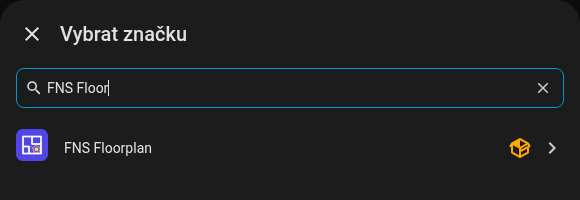

# Instalace

## Požadavky

- Home Assistant **2025.1.0** nebo novější.
- [HACS](https://hacs.xyz) pro doporučenou instalaci (funguje i ruční instalace).
- Účet administrátora pro editor. Karta samotná funguje pro každého uživatele.

## Instalace přes HACS

FNS Floorplan není ve výchozím seznamu HACS, přidáš ho proto jako vlastní repozitář.

1. Otevři **HACS** v postranním menu Home Assistantu.
2. V pravém horním rohu otevři nabídku s třemi tečkami a zvol **Vlastní repozitáře**.
3. Jako repozitář zadej `https://github.com/matata86/fns-floorplan`, jako kategorii vyber **Integrace** a klikni na **Přidat**.
4. V HACS vyhledej **FNS Floorplan** a klikni na **Stáhnout**.
5. **Restartuj Home Assistant** (Nastavení, Systém, Restartovat).

{ loading=lazy }

## Ruční instalace

1. Stáhni nejnovější verzi ze [stránky s vydáními](https://github.com/matata86/fns-floorplan/releases) nebo naklonuj repozitář.
2. Zkopíruj složku `custom_components/fns_floorplan` do složky `custom_components` v konfiguraci Home Assistantu tak, aby existoval soubor `custom_components/fns_floorplan/manifest.json`.
3. Restartuj Home Assistant.

## Přidání integrace

1. Jdi do **Nastavení, Zařízení a služby, Přidat integraci**.
2. Vyhledej **FNS Floorplan** a přidej ho. Není co nastavovat, může existovat jen jedna instance.

{ loading=lazy }

Integrace kartu zaregistruje sama, takže nemusíš ručně přidávat zdroj do dashboardu.

## Možnosti

Klikni na **Konfigurovat** u integrace.

| Možnost | Výchozí | Význam |
|---------|---------|--------|
| Zobrazit editor v postranním menu | zapnuto | Přidá do postranního menu položku **Půdorys** (jen pro administrátory). |

Editor je vždy dostupný na adrese `/fns-floorplan` (například `http://homeassistant.local:8123/fns-floorplan`), i když je položka v menu skrytá. Editor karty na dashboardu má tlačítko **Upravit půdorys**, které otevře stejnou adresu.

## Aktualizace

Aktualizuj přes HACS jako každou jinou integraci a restartuj Home Assistant. Karta i editor se načítají s verzí integrace v adrese, takže prohlížeč zahodí starou cache sám. Pokud přesto vidíš starou verzi, mrkni do [Častých otázek](faq.md#the-card-shows-the-old-version-after-an-update).

Tvůj půdorys uchovává Home Assistant (`.storage/fns_floorplan`) a aktualizace se ho nedotknou.

## Odinstalace

1. Odstraň kartu ze všech dashboardů.
2. **Nastavení, Zařízení a služby, FNS Floorplan, nabídka se třemi tečkami, Smazat.**
3. Odstraň repozitář v HACS (nebo smaž složku `custom_components/fns_floorplan`) a restartuj.
4. Volitelně smaž uložené soubory půdorysu `.storage/fns_floorplan` a `.storage/fns_floorplan.history` a podkladové obrázky ve složce `www/fns_floorplan/`.

Dál: [Rychlý start](quick-start.md).
