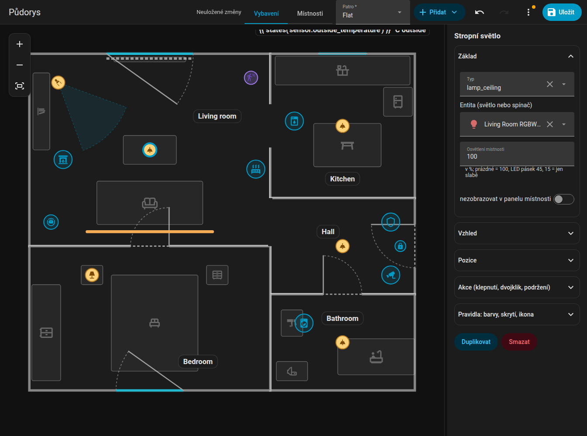

# Rychlý start

Od nuly k funkčnímu půdorysu za deset kroků. Předpokládá, že je integrace [nainstalovaná](installation.md).

1. **Otevři editor.** Klikni na **Půdorys** v postranním menu nebo otevři `/fns-floorplan`.
2. **Přepni na Místnosti.** Záložky nahoře jsou **Vybavení**, **Místnosti** a **Vzhled**. Zvol **Místnosti**.
3. **Přidej místnost.** Otevři **Přidat** a zvol **Místnost**. Objeví se čtverec 2 × 2 metry. Modré body v rozích přetáhni do tvaru své místnosti, poloprůhledné body mezi rohy přidají nový roh. Podrobnosti v [Místnostech](editor/rooms.md).
4. **Pojmenuj ji.** V bočním panelu zadej název místnosti a případně entitu teploty a vlhkosti.
5. **Přidej další místnosti.** Přetáhni je k sobě, rohy se přichytí k rohům sousedů do vzdálenosti 15 cm.
6. **Přidej dveře a okna.** Vyber místnost, v bočním panelu zvol stěnu a přidej dveře nebo okno; po stěně je posuneš tažením. Viz [Dveře a okna](editor/openings.md).
7. **Přepni na Vybavení.** Pomocí **Přidat** vlož světla, spotřebiče, senzory a nábytek. U každého vyber entitu. Viz [Položky](editor/items.md).
8. **Ulož.** Klikni na **Uložit**. Půdorys se uloží v Home Assistantu a všechny otevřené karty se samy překreslí.
9. **Přidej kartu.** Uprav dashboard, **Přidat kartu**, vyhledej **FNS Floorplan**, nebo použij YAML:

    ```yaml
    type: custom:fns-floorplan-card
    mode: auto
    rotate: auto
    ```

10. **Vyzkoušej to.** Rozsviť světlo, otevři dveřní kontakt, spusť myčku. Klepnutím na místnost otevřeš [panel místnosti](room-panel.md).

{ loading=lazy }

## Přicházíš z NeonPlan 3D? { #coming-from-neonplan-3d }

FNS Floorplan vznikl z inspirace kartou [NeonPlan 3D](https://github.com/Mastershort/neonplan3d). Pokud už jsi tam svůj domov nakreslil, můžeš ho jednorázově převést a nemusíš začínat od nuly:

1. Získej budovu z NeonPlanu příkazem websocketu `neonplan3d/building/get` a výsledek ulož jako `building.json`.
2. Převeď ji:

    ```bash
    python3 tools/import_neonplan.py building.json > plan.json
    ```

    Volitelný druhý soubor (`extras.json`) doplní to, co NeonPlan nezná: zařízení, polohy jmenovek a pravidla. Viz komentář na začátku skriptu.

3. Ulož `plan.json` příkazem `fns_floorplan/plan/save` (viz [Websocket API](reference/websocket-api.md)) a výsledek doladíš v editoru.

!!! warning "Pozor"
    Import nahradí celý půdorys. Spusť ho jednou na začátku, ne poté, co jsi půdorys upravoval.

## Co dál

- Ať spotřebič reaguje na víc než jen svůj stav, pomocí [Pravidel](editor/rules.md).
- Přidej robotický vysavač: [Robotický vysavač](robot-vacuum.md).
- Podlož pod půdorys obrázek a obkresli ho: [Přehled editoru](editor/index.md#tracing-image).
- Více pater: [Přehled editoru](editor/index.md#levels-floors).
- Změň barvy stěn, podlah, jmenovek a stavů v záložce [Vzhled](editor/look.md).
