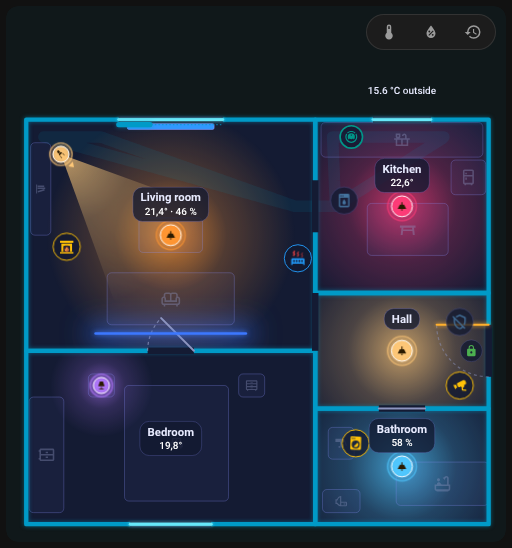

# Robotický vysavač

Robotický vysavač se kreslí jako malý robot, který bydlí ve svém **doku** a při úklidu jezdí po místnosti, kterou hlásí.

{ loading=lazy }

## Položka dok

Přidej **Robotický vysavač** (typ nábytku `robot_vacuum`) a umísti ho tam, kde stojí dok. Jeho formulář obsahuje:

| Pole | Klíč | Význam |
|------|------|--------|
| Entita | `entity` | Entita `vacuum` |
| Senzor místnosti | `room_sensor` | Senzor, jehož stav je název místnosti, ve které vysavač je (u Roborocku `sensor.*_current_room`) |
| Párování místností | `room_map` | `{ "<název místnosti ve vysavači>": "<id místnosti v půdorysu>" }` |
| Baterie | `battery` | Senzor baterie; prázdné = senzor `battery` zařízení vysavače |
| Sekce Když běží (uklízí) | `color_on`, `fx`, `progress`, `progress_total` | Vzhled při úklidu |
| Pořadí při překrytí | `layer` | Viz [níže](#layer-and-stacking) |

Dok přijímá i [pravidla](editor/rules.md) (`color` v pravidlu nahradí barvu motivu, i v doku) a akci klepnutí; výchozí klepnutí otevře detail.

## Senzor místnosti a room_map

Karta potřebuje vědět, kterou místnost půdorysu vysavač hlásí. Tabulka **Párování místností** ve formuláři doku vypisuje názvy z `options` senzoru místnosti, klíče, které už jsou v `room_map`, aktuální stav a názvy, které přidáš ručně. U každého názvu vyber:

- **automaticky**: stejný název nebo id jako místnost v půdorysu, bez ohledu na velikost písmen a diakritiku,
- **konkrétní místnost**,
- **nepárovat** (`__none`): robot do té místnosti nezajíždí.

**Kontrola** (viz [Historie a kontrola](history.md)) ohlásí názvy z `options` senzoru, které nejsou spárované.

```yaml
furniture:
  - id: dock
    type: robot_vacuum
    entity: vacuum.robot
    room_sensor: sensor.robot_current_room
    room_map:
      Obývací pokoj: living_room
      Kuchyň: kitchen
      Chodba: __none
    x: 0.4
    z: 3.1
```

Starší půdorys s klíčem `vacuum` na nejvyšší úrovni (`entity`, `room_sensor`) stále funguje; editor ho při příštím uložení převede na dok.

## Jak jezdí

| Stav | Co uvidíš |
|------|-----------|
| `cleaning` | Robot jezdí v pruzích po místnosti ze senzoru místnosti a za sebou nechává stopu |
| `returning` | Jede do doku; stopa se smaže |
| `docked`, `charging` | Sedí v doku. **Kruh kolem něj ukazuje baterii** (při 100 % plný), jen dýchá, když baterie není známá. Robot má barvu motivu podle stavu vysavače |
| `idle`, `paused`, `error` | Stojí **ve své místnosti** na volném místě a bliká (rámeček odznaku má barvu stavu, chyby jsou červené) |

- Mezi místnostmi i zpět do doku jezdí **dveřmi a průchody** (hledání cesty přes otvory jiné než okna; druhá strana otvoru je místnost 35 cm za zdí). Když cesta neexistuje, jede přímo.
- Při načtení stránky se robot, který není v doku, objeví rovnou ve své místnosti a nevyjíždí z doku.
- Robot při jízdě zachovává orientaci, kterou má v doku.
- **Parkování na volném místě:** zastavený robot stojí tam, kde nic nezakrývá: nejdál od odznaku, světel a jmenovek. Místo se vypočítá po vykreslení karty.
- **Obchůzka celého patra:** když uklízí a místnost není známá (chybí senzor nebo párování), projede **všechny místnosti patra**: vždy nejbližší další, dveřmi, pruh po pruhu, nedostupné místnosti přeskočí a nakonec se vrátí do doku.

## Při úklidu

Sekce **Když běží (uklízí)** nastavuje, co dok ukazuje během úklidu: `color_on`, animaci kruhu `fx` (například `comet`) a pro odpočet `progress` / `progress_total` (viz [Pravidla](editor/rules.md#countdown)).

## Vrstva a překrývání { #layer-and-stacking }

Při jízdě se robot kreslí **nad nábytkem a zdmi a pod světly, spotřebiči a jmenovkami**. Když stojí, `layer: 0` zachová stejné pořadí; `layer` nad 0 ho při stání umístí nad světla a spotřebiče.

## Skrytí z panelu místnosti

Robot se objeví v [panelu místnosti](room-panel.md) místnosti, ve které má dok. Zaškrtni **nezobrazovat v panelu místnosti** (`sheet_hide: true`), chceš-li ho vynechat.

## Vysavač jako běžné zařízení

Můžeš také umístit zařízení `generic` s entitou `vacuum.*`: běží při úklidu nebo návratu (kruh `comet`) a v doku ukazuje kruh baterie a text s nabitím („nabíjí se 64 %“ nebo „100 %“). Baterie se bere z registru zařízení (senzor s `device_class: battery` a binární senzor `battery_charging` na stejném zařízení) nebo z atributu `battery_level`.

Zpět na [Položky](editor/items.md).
