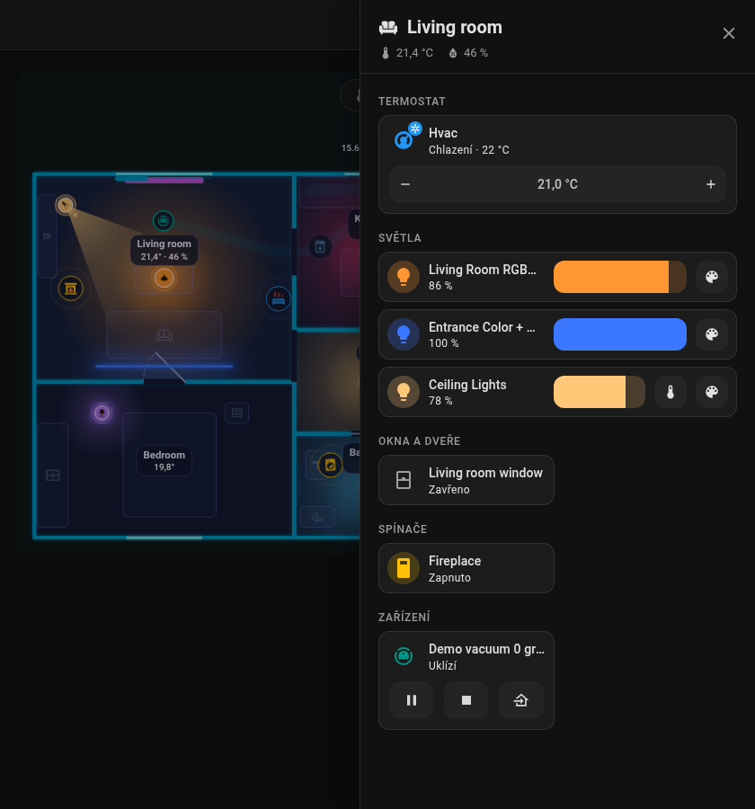
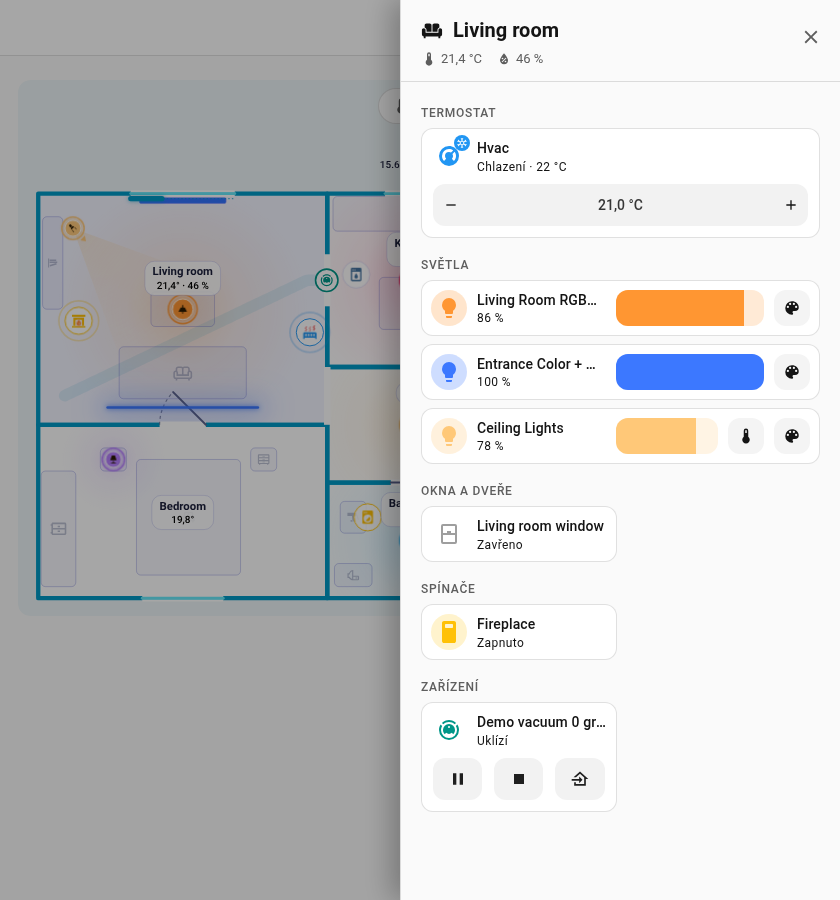
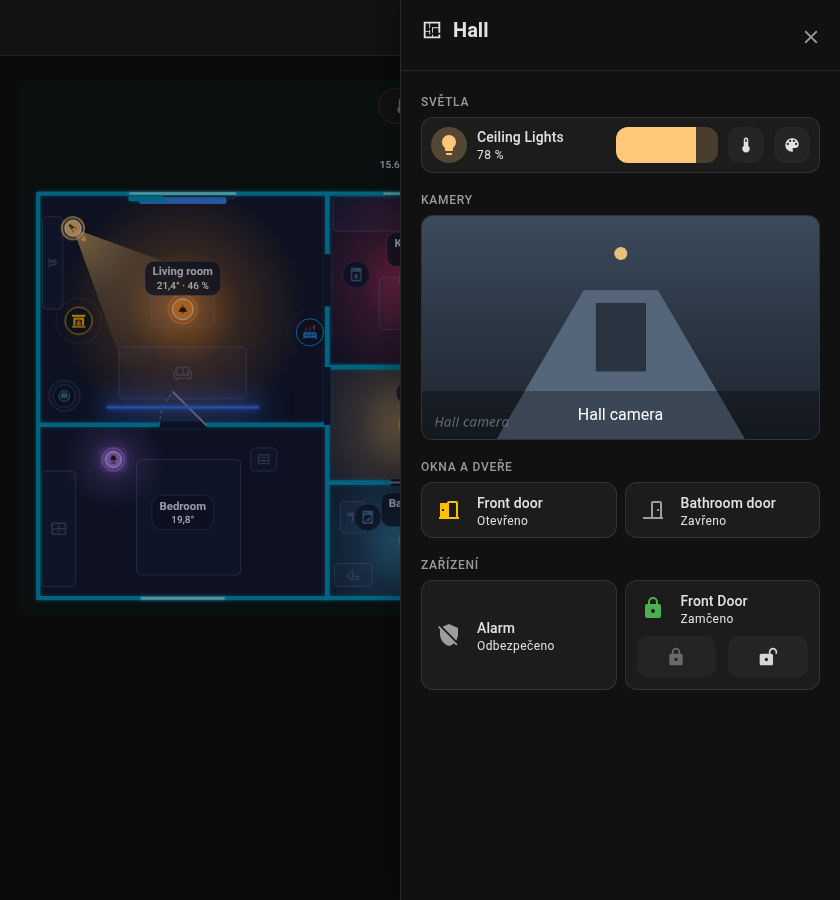

# Panel místnosti

Klepni na místnost na kartě a od pravého okraje obrazovky se vysune **boční panel**. Vypadá jako dashboard oblasti v Home Assistantu: pozadí z motivu, hlavička s ikonou místnosti, názvem, teplotou a vlhkostí a karty Home Assistantu ve dvou sloupcích. Zavřeš ho křížkem, ++esc++ nebo klepnutím mimo něj.

| Tmavý motiv | Světlý motiv |
|---|---|
| { loading=lazy } | { loading=lazy } |

{ loading=lazy }

{ loading=lazy }

*Otevření panelu, nastavení jasu světla a zavření.*

## Sekce

Panel je postavený z vlastních karet Home Assistantu, každá je vložená jako na dashboardu, takže je styluje i tvůj motiv (včetně motivů card-mod / UIX). Každá sekce má nadpisovou kartu s ikonou ve stylu podtitulku nadpisů sekcí na dashboardu. Klepnutí na kartu otevře detail, ikona přepíná to, co jde přepnout. Termostaty, světla s ovládáním, kamery a rolety zabírají celou šířku, zbytek je po dvou v řadě.

| Sekce | Co v ní je |
|-------|-----------|
| **Termostat** | Entity `climate` jako dlaždice s ovládáním cílové teploty |
| **Světla** | Světla umístěná v místnosti. Dlaždice s lištou jasu vedle názvu; světlo s teplotou barvy nebo barvou má pod tím teplotu a oblíbené barvy; klepnutí na ikonu světlo přepne |
| **Kamery** | Kamery místnosti jako náhled přes celou šířku panelu (snímek obnovovaný po pár sekundách); klepnutí otevře živý obraz v detailu |
| **Okna a dveře** | Otvory místnosti s kontaktem a jejich rolety (i rolety z dalších entit) s tlačítky otevřít / stop / zavřít vedle názvu a posuvníkem polohy pod nimi; kontakt ukazuje jen to, kdy se naposledy změnil, ikona ukazuje, jestli je otevřený |
| **Spínače** | `switch` a `input_boolean` |
| **Média** | Přehrávače médií a ovladače (televize, reproduktory, přehrávače); přehrávač s nastavitelnou hlasitostí má posuvník hlasitosti vedle názvu; dlaždice zabírá celou šířku |
| **Roboti** | Robotické vysavače se spuštěním / zastavením / návratem do doku, robotické sekačky; dlaždice zabírá celou šířku, tlačítka jsou vedle názvu |
| **Zařízení** | Spotřebiče (zámek dostane příkazy zámku) |
| **Senzory** | Senzory místnosti, včetně v ní umístěných senzorů pohybu (PIR) a úniku vody; binární senzory (přítomnost, pohyb, únik) ukazují jen čas poslední změny, stav ukazuje ikona |
| **Ostatní** | Všechno ostatní |

Zobrazí se jen položky, které jsou **umístěné v místnosti**, a entity ze `sheet_extra`. Oblasti Home Assistantu se automaticky nepřidávají. Robotický vysavač se objeví v místnosti, ve které má dok.

## Výběr toho, co se zobrazí

- `sheet_extra`: další entity místnosti (pole ve formuláři místnosti, jedna na řádek, úvodní `- ` nevadí; **Přidat entitu** pod polem jednu vybere). Záznam může být i šablona, která vypíše id entit, viz [Místnosti](editor/rooms.md). Každá entita dostane kartu své sekce výše (světlo kartu světla, kamera obraz, roleta ovládání rolety, ostatní dlaždici).
- `sheet_hide: true` u jakékoli položky (světlo, spotřebič, okno, dveře, zámek, robot) ji vynechá.
- Ikona místnosti `icon` se zobrazí v hlavičce.

```yaml
rooms:
  - id: living_room
    name: Obývací pokoj
    icon: mdi:sofa
    temperature: sensor.living_room_temperature
    sheet_extra:
      - climate.living_room
      - camera.living_room
      - switch.tv_plug
```

Zpět na [Kartu](card.md).
