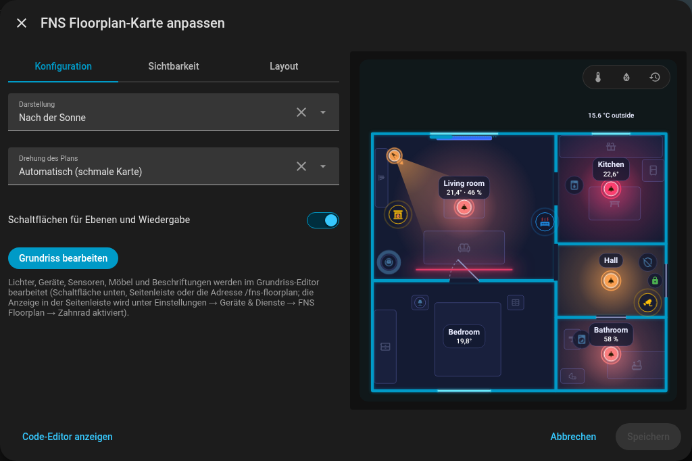
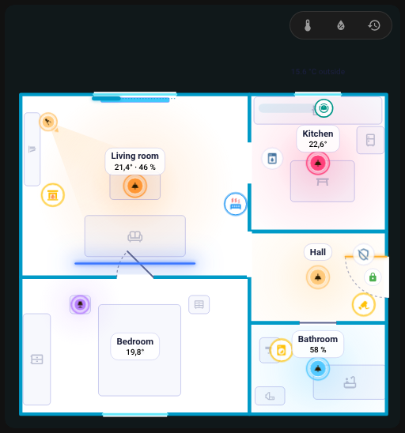
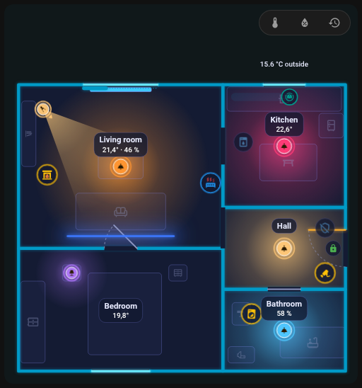
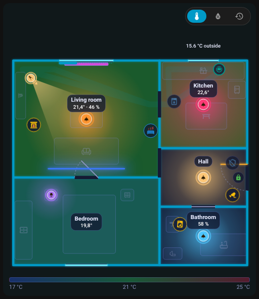
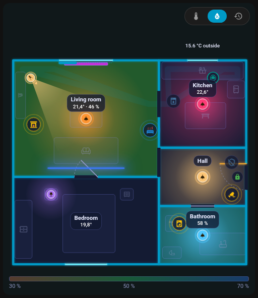
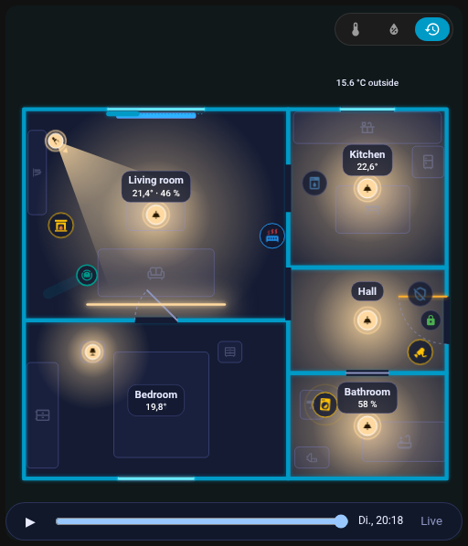

# Karte

## Die Karte hinzufügen

Bearbeite ein Dashboard, **Karte hinzufügen**, und suche nach **FNS Floorplan**; oder in YAML:

```yaml
type: custom:fns-floorplan-card
```

Die Karte zeigt den im Editor gespeicherten Plan und zeichnet sich nach jedem Speichern von selbst neu (sie abonniert den Plan über den Websocket und abonniert ihn nach einem Neustart von Home Assistant erneut).

{ loading=lazy }

## Optionen

| Option | Werte | Standard | Beschreibung |
|--------|-------|----------|--------------|
| `mode` | `auto`, `ha`, `day`, `night` | `auto` | Aussehen der Karte |
| `rotate` | `auto`, `true`, `false` | `auto` | Drehung des Plans um 90 Grad |
| `level` | Etagen-ID | erste Etage | Standardetage; wird nur gespeichert, wenn es nicht die erste ist |
| `tools` | `true`, `false` | `true` | `false` blendet die Schaltflächen für Ebenen und Wiedergabe aus |

```yaml
type: custom:fns-floorplan-card
mode: ha
rotate: auto
level: upstairs
tools: false
```

Der visuelle Karteneditor hat dieselben Felder (Darstellung, Drehung des Plans, Standardetage, Schaltflächen für Ebenen und Wiedergabe) und eine Schaltfläche **Grundriss bearbeiten**, die den Editor öffnet.

### mode

- `auto`: Tag, wenn `sun.sun` über dem Horizont steht, sonst Nacht,
- `ha`: folgt dem hellen oder dunklen Design von Home Assistant,
- `day`, `night`: immer ein Aussehen.

### rotate

- `auto`: Eine Karte, die schmaler als 600 px ist, dreht einen breiten Plan um 90 Grad, aber nur, wenn der Plan mehr als 1,25-mal so breit wie hoch ist,
- `true`: immer drehen, `false`: nie.

## Hell und dunkel { #light-and-dark }

Die Karte sieht in beiden Designs gut aus. Mit `mode: ha` folgt sie dem hellen oder dunklen Design von Home Assistant, mit `auto` entscheidet die Sonne, und `day` oder `night` legt ein Aussehen fest (siehe [mode](#mode)).

| Dunkles Design | Helles Design |
|---|---|
| { loading=lazy } | { loading=lazy } |

Das Aussehen der Karte selbst lässt sich auch unabhängig vom Design einstellen:

| Modus `day` | Modus `night` |
|---|---|
| { loading=lazy } | { loading=lazy } |

{ loading=lazy }

*Die Karte wechselt vom dunklen zum hellen Aussehen und zurück.*

## Aussehen

- Wände und Leuchten übernehmen die `--primary-color` deines Designs; der Kartenhintergrund hat dieselbe Farbe mit 5 % Deckkraft. Gerätefarben stammen aus den Zustandsfarben des Designs.
- Beschriftungen und Symbole behalten auf dem Bildschirm etwa dieselbe Größe (Text etwa 11 px): Auf einer kleinen Karte wachsen sie (Beschriftungen bis 2,2-fach, Symbole 1,5-fach), auf einer riesigen schrumpfen sie (0,5-fach).
- Der Plan ist höchstens 85 % der Fensterhöhe hoch; auf einer sehr breiten Karte bleibt er in der Mitte.
- Bei mehreren Etagen sitzen oben links Etagen-Tabs.

## Ebenen: Temperatur, Luftfeuchtigkeit und Wiedergabe

Sofern nicht `tools: false` gesetzt ist, bietet eine Reihe von Badges über dem Plan:

- **Temperatur** (Grad C): Räume werden nach Temperatur eingefärbt (17 bis 25 Grad C),
- **Luftfeuchtigkeit** (%): Räume werden nach Luftfeuchtigkeit eingefärbt (30 bis 70 %),
- **Wiedergabe** (Uhrsymbol): die **Tageswiedergabe-Leiste**.

Bei eingeschalteter Temperatur oder Luftfeuchtigkeit erscheint unter dem Plan eine Farblegende. Die Auswahl wird im Browser gespeichert. Die Raumbeschriftung zeigt normalerweise die Temperatur, Luftfeuchtigkeit und andere Werte nachts weiß und tagsüber schwarz; eine kalte oder warme Temperatur ist blau oder rot. Der Chip mit der Außentemperatur stammt aus dem als `outdoor` festgelegten Raum.

{ loading=lazy }

{ loading=lazy }

{ loading=lazy }

*Die Temperaturebene ein- und ausschalten.*

## Tageswiedergabe

Die Uhr-Schaltfläche öffnet eine Leiste **unter dem Plan**, die ihn nicht verdeckt. Sie spielt die **letzten 24 Stunden** aus dem Verlauf von Home Assistant ab: Lichter, Türen und Geräte gehen in der Zeit zurück. Regelvorlagen bleiben während der Wiedergabe live.

{ loading=lazy }

## Verhalten beim Tippen

| Element | Tippen | Halten |
|---------|--------|--------|
| Licht | umschalten | Details |
| Gerät, Staubsauger, Tür, Fenster | Details | Details |
| Szene, Taste, Skript | aktivieren | |
| Raum | öffnet das [Raum-Panel](room-panel.md) | |

Alles lässt sich pro Element mit [Aktionen](editor/items.md#actions) ändern. Tooltips listen auf, was Tippen, Doppeltippen und Halten bewirken.

## Animationen { #animations }

Was die Karte zeigt, wenn sich Entitäten ändern:

{ loading=lazy }

*Die Haustür öffnet und schließt sich, das Türblatt schwingt.*

{ loading=lazy }

*Ein Fenster öffnet und schließt sich.*

{ loading=lazy }

*Ein Rollo wird entlang seines Fensters zugezogen.*

{ loading=lazy }

*Lichter gehen nacheinander an, jeder Raum leuchtet in der Farbe seines Lichts.*

{ loading=lazy }

*Ein Licht wechselt die Farbe.*

{ loading=lazy }

*Ein Bewegungsmelder sendet eine Welle aus und beruhigt sich wieder.*

{ loading=lazy }

*Eine laufende Waschmaschine zeigt einen Ring um ihr Symbol.*

{ loading=lazy }

*Ein Countdown-Ring um die Spülmaschine, solange ihr Timer läuft.*

{ loading=lazy }

*Ein ausgelöster Alarm färbt die ganze Wohnung ein, bis er ausgeschaltet wird.*

{ loading=lazy }

*Die Flamme eines Kamins flackert, solange sein Schalter an ist.*

## Leistung

Animationen laufen nur, solange sich etwas bewegt und die Karte auf dem Bildschirm ist. Nicht sichtbare Karten animieren nicht, und `prefers-reduced-motion` unterdrückt Symbolanimationen.

Weiter: [Raum-Panel](room-panel.md).
