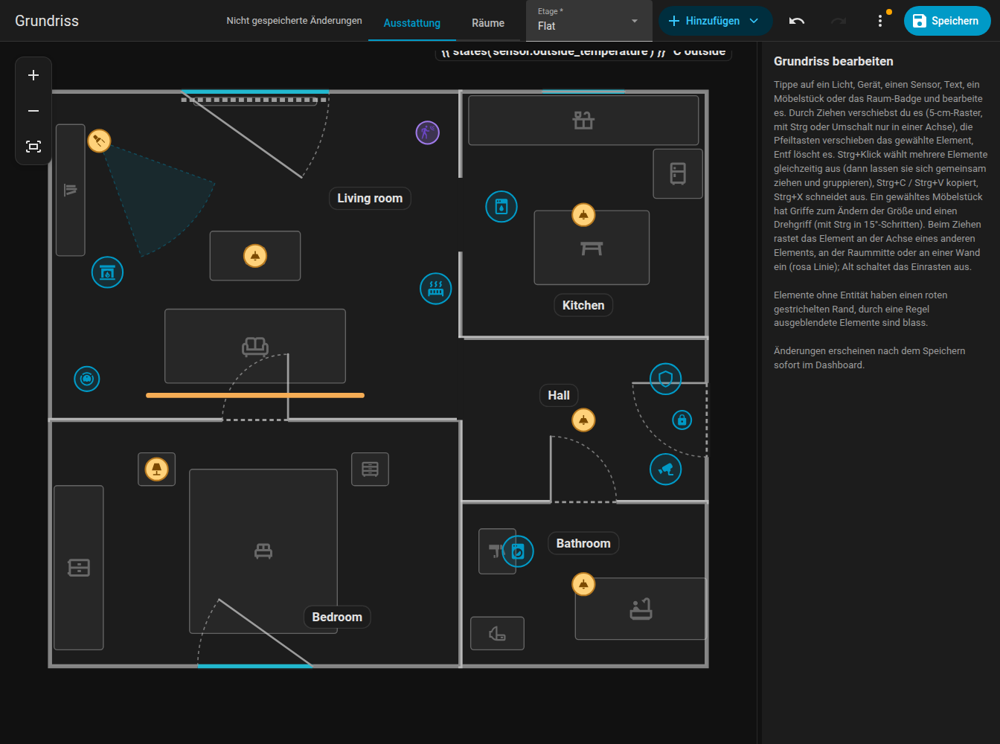
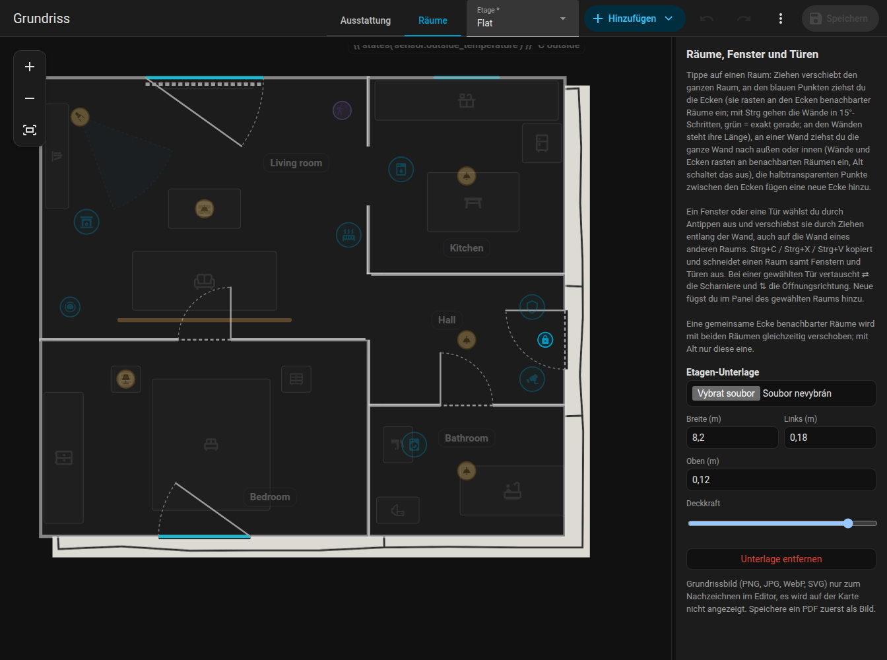

# Editor-Übersicht

Der Editor ist das Seitenleisten-Panel **Grundriss** (URL `/fns-floorplan`, nur für Administratoren). Er bearbeitet denselben Plan, den die Karte zeigt. In Home Assistant ändert sich nichts, bis du **Speichern** drückst.

{ loading=lazy }

## Aufbau

- **Obere Leiste**, ähnlich dem Automatisierungs-Editor von Home Assistant:
    - der Modusschalter **Ausstattung / Räume**,
    - die Etagenauswahl (wenn der Plan mehrere Etagen hat),
    - **Hinzufügen** (ein Menü mit allem, was sich platzieren lässt),
    - Rückgängig und Wiederholen, Zoom-Schaltflächen (+, -, ganzer Plan),
    - **Speichern**,
    - das Dreipunktmenü **Weitere Aktionen** mit **Speicherverlauf**, **Entitätsprüfung**, **Änderungen verwerfen** und der Etagenverwaltung (neu, umbenennen, löschen). Ein Punkt am Menü warnt, wenn die Prüfung Probleme gefunden hat.
- **Der Plan** in der Mitte. Mit dem Mausrad zoomst du um den Cursor, durch Ziehen einer leeren Stelle verschiebst du den Plan, auf dem Touchscreen zoomst du mit zwei Fingern.
- **Das Seitenpanel** rechts zeigt das Formular des ausgewählten Elements. Zieh den Streifen zwischen Plan und Panel, um dessen Breite zu ändern (260 px bis 60 % des Fensters, höchstens 720 px); die Breite wird im Browser gespeichert.

Auf einem Smartphone (schmaler als 800 px) füllt der Plan den Bildschirm und das Formular öffnet sich als unteres Blatt, wenn du ein Element antippst, eines hinzufügst oder Verlauf oder Prüfung öffnest. Beim Ziehen eines Elements öffnet sich das Blatt nicht. Schließe es mit dem Kreuz oder durch Tippen auf den abgedunkelten Plan.

## Modi

| Modus | Was du bearbeitest | Der Rest |
|-------|--------------------|----------|
| **Ausstattung** | Lichter, LED-Streifen, Geräte, Sensoren, Textelemente, Möbel, Raumbeschriftungen | Räume werden angezeigt, sind aber gesperrt |
| **Räume** | Räume (Ecken, Wände, ganze Räume), Türen und Fenster | Elemente sind abgedunkelt und gesperrt |

Siehe [Räume](rooms.md), [Türen und Fenster](openings.md) und [Elemente](items.md).

## Auswählen, Verschieben, Feinjustieren

- Klicke auf ein Element, um es auszuwählen, und zieh es, um es zu verschieben. Das Raster beträgt 5 cm.
- Mit den **Pfeiltasten** verschiebst du die Auswahl um 5 cm, **Entf** löscht sie.
- Mit **Strg+Klick** fügst du Elemente zur Auswahl hinzu. Ausgewählte Elemente werden gemeinsam verschoben, kopiert und gelöscht.
- **Gruppieren** (im Formular einer Mehrfachauswahl) speichert eine `group`, sodass ein Klick auf ein Mitglied immer die ganze Gruppe auswählt.
- **Esc** hebt die Auswahl auf.
- Beim Ziehen zeigen rosafarbene **Fanglinien** die Ausrichtung an anderen Elementen, an der Raummitte und an Wänden.

## Tastenkürzel { #keyboard-shortcuts }

| Kürzel | Aktion |
|--------|--------|
| ++ctrl+z++ | Rückgängig (100 Schritte) |
| ++ctrl+y++ oder ++ctrl+shift+z++ | Wiederholen |
| ++ctrl+c++ / ++ctrl+x++ / ++ctrl+v++ | Elemente oder Räume kopieren / ausschneiden / einfügen. Beim Einfügen auf derselben Etage wird die Kopie um 30 / 50 cm versetzt, auf einer anderen Etage landet sie an derselben Stelle. Ein Raum wird samt Türen und Fenstern kopiert. |
| ++ctrl++ + Klick | Zur Auswahl hinzufügen |
| ++delete++ | Auswahl löschen (eine ausgewählte Raumecke wird gelöscht, mindestens 3 Ecken bleiben) |
| Pfeiltasten | Um 5 cm verschieben |
| ++alt++ beim Ziehen | Schaltet Einrasten und Fanglinien aus |
| ++ctrl++ beim Ziehen | Hält die Bewegung auf einer Achse (bestimmt durch die ersten 5 cm der Bewegung). Beim Ziehen einer Raumecke mit Strg rasten stattdessen die Wände in 15-Grad-Schritten ein, siehe [Räume](rooms.md#angles-and-lengths). |
| ++ctrl++ beim Drehen | Dreht in 15-Grad-Schritten statt in 1-Grad-Schritten |
| ++esc++ | Hebt die Auswahl auf |

Auf macOS verwendest du ++cmd++ statt ++ctrl++.

## Rückgängig, Wiederholen und Speichern

Jede Änderung landet auf dem Rückgängig-Stapel (100 Schritte). Die Revision wird nie zurückgesetzt. Der Editor warnt dich, wenn du mit nicht gespeicherten Änderungen gehst.

**Speichern** schreibt den gesamten Plan. Jedes Speichern erhöht die Revision `rev` des Plans. Der Editor sendet die Revision, die er geladen hat, und wenn inzwischen jemand einen neueren Plan gespeichert hat, wird das Speichern mit einer Konfliktmeldung abgelehnt: Wähle **Änderungen verwerfen**, um neu zu laden und deine Änderungen zu wiederholen. Siehe [Websocket-API](../reference/websocket-api.md#revisions-and-conflicts).

Gespeicherte Pläne bleiben erhalten: siehe [Verlauf und Prüfung](../history.md).

## Etagen { #levels-floors }

Ein Plan ohne Etagen hat eine Etage. Im Dreipunktmenü **Weitere Aktionen** kannst du mit **Neue Etage…**, **Etage umbenennen…** und **Etage löschen…** eine Etage hinzufügen, umbenennen oder löschen (eine gelöschte Etage nimmt ihre Räume und Elemente mit; die erste Etage lässt sich nicht löschen). Eine neue Etage startet im Modus **Räume**.

Räume und Elemente gehören über den Schlüssel `level` zu einer Etage; ohne ihn gehören sie zur ersten Etage. Türen und Fenster folgen ihrem Raum. Die Etagenauswahl oben schaltet die bearbeitete Etage um, und die Karte zeigt Etagen-Tabs. Siehe das [Planformat](../reference/plan-format.md#levels).

## Vorlagenbild zum Nachzeichnen { #tracing-image }

Um über eine vorhandene Zeichnung zu zeichnen, lade ein Bild unter einer Etage hoch: Etagenverwaltung, **Etagen-Unterlage**. Du kannst es verschieben, in der Größe ändern und seine Deckkraft einstellen. Das Bild ist nur im Editor sichtbar, nie auf der Karte. Erlaubte Formate sind PNG, JPG, WEBP und SVG bis 15 MB. Die Datei wird in `www/fns_floorplan/` deiner Konfiguration gespeichert (ausgeliefert als `/local/fns_floorplan/...`).

{ loading=lazy }

## Native Felder von Home Assistant

Die Formulare nutzen die eigenen Auswahlfelder von Home Assistant (Entitätsauswahl, Zahl, Auswahlliste, Schalter, Farbwähler, Symbolauswahl) in einklappbaren Abschnitten (Grundlagen, Wenn aktiv, Aussehen, Position, Aktionen, Regeln). Welche Abschnitte geöffnet sind, wird gemerkt. Die Entitätsauswahl sucht auch nach dem Namen.

Elemente ohne Entität haben einen roten gestrichelten Rahmen, sodass du unfertige Arbeit auf einen Blick erkennst.
