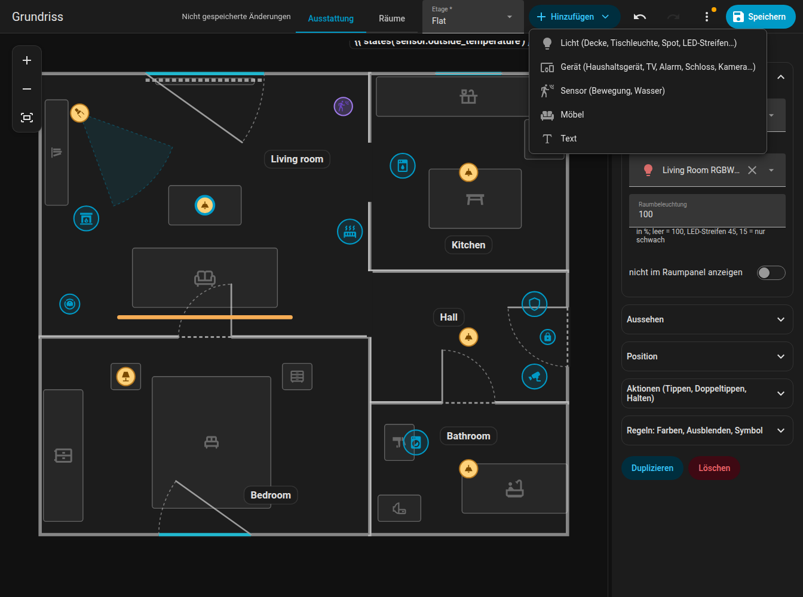
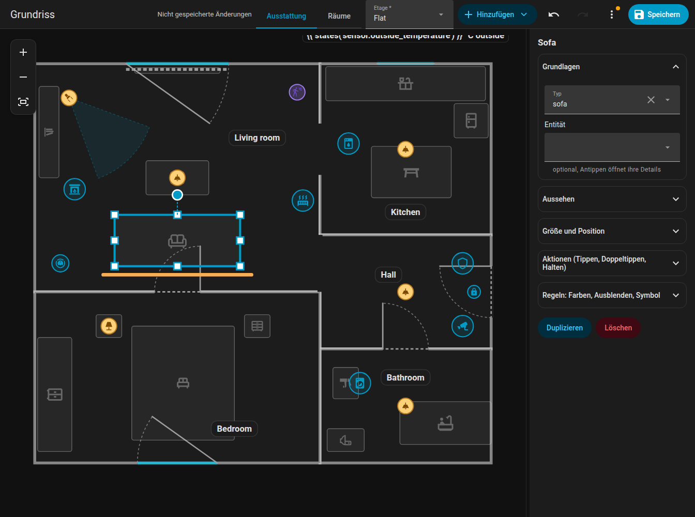

# Elemente

Elemente sind alles auf dem Plan, was keine Wand ist: Lichter, Geräte, Sensoren, Textelemente, Möbel und Raumbeschriftungen. Du bearbeitest sie im Modus **Ausstattung**. **Hinzufügen** fügt ein neues ein; jedes Element lässt sich **duplizieren** und **löschen**.

{ loading=lazy }

## Gemeinsame Einstellungen

| Einstellung | Schlüssel | Bedeutung |
|-------------|-----------|-----------|
| Entität | `entity` | Wird aus allen Entitäten deines Home Assistant gewählt (die Auswahl sucht auch nach dem Namen) |
| Position | `x`, `z` | In Metern; oder ziehen |
| Größe | `size` | `xs`, `s`, `m` (Standard), `l`, `xl`, `xxl` (0,6- bis 2-fach); für Lichter, Geräte, die Station und Texte |
| Symbol | `icon` | Jedes `mdi:`-Symbol; Schaltflächen **Kein Symbol** (`icon: none`) und **Standard wiederherstellen** |
| Reihenfolge | `layer` | Stapelreihenfolge unter Elementen derselben Art: **In den Vordergrund**, **Nach vorn**, **Nach hinten**, **In den Hintergrund** |
| Tippen / Doppeltippen / Halten | `tap_action` ... | [Aktionen](#actions) |
| Regeln | `rules` | Siehe [Regeln](rules.md) |
| Nicht im Raumpanel anzeigen | `sheet_hide` | Lässt das Element im [Raum-Panel](../room-panel.md) weg |

Schnelles Platzieren: Wenn du ein Element zu einem ausgewählten Raum hinzufügst, landet es auf einer Position in einem 3-mal-3-Raster im Inneren, mit Abstand zu den Wänden.

## Lichter

Füge eine **Deckenleuchte**, **Pendelleuchte**, ein **Panel**, eine **Tischleuchte**, **Wandleuchte**, einen **Spot (gerichtet)** oder einen **LED-Streifen** hinzu. Weise eine `light`-Entität zu.

- Das Licht folgt seiner Farbe (`rgb_color`) oder seiner Farbtemperatur (`color_temp_kelvin`), sonst einem warmen Weiß. Die Helligkeit verkleinert und dämpft das Leuchten und hellt das Badge oder den Streifen auf.
- **Leuchten eines Lichts in einem Raum sind im Editor ein Element**, genau wie auf der Karte: Du ziehst die ganze Gruppe, und Änderungen und Löschen gelten für alle. Deckenspots eines Raums sind ein Element.
- `room_light` legt fest, wie viel des Raums leuchtet, wenn das Licht an ist (ein Anteil, `1` = 100 %, `false` = fast nichts).
- **Spot** (`lamp_spot`): ein Lichtkegel in Richtung `rotation` (0 = rechts, 90 = unten), `beam` Grad breit (Standard 40), vom Raum beschnitten. Er wird nie mit anderen Leuchten desselben Lichts zusammengelegt.
- **LED-Streifen** (`led_strip`): eine Linie mit der Länge `w`; er leuchtet in der echten Farbe des Lichts. Mit `glow_side` strahlt er nur zu einer Seite (`1` = rechts von der Streifenrichtung, `-1` = zur anderen Seite, ohne Wert = rundum).
- Ein ausgeschaltetes Licht hat sein Symbol in gedämpfter Farbe, ohne den äußeren Ring. Der Streifen hat zum Antippen einen unsichtbaren Bereich von 16 px.

## Geräte und andere Geräte

**Hinzufügen, Gerät** (und die konkreten Typen) erzeugt ein `device` einer Art `kind`:

| Art | Sieht aus wie |
|-----|---------------|
| `fan`, `purifier`, `dishwasher`, `dryer` | Animierte Symbole (der Trockner rüttelt, der Geschirrspüler hüpft) |
| `boiler` | Warmwasserspeicher |
| `radiator` | Wärmewellen steigen auf, solange er animiert ist (Farbe über `wave`) |
| `alarm` | Schild nach Zustand; die Wohnung pulsiert bei Auslösung rot, beim Scharfschalten orange |
| `media` | TV-, Lautsprecher- oder Kodi-Symbol, Schallwellen und Titel bei der Wiedergabe, Cover im Badge (`cover: false` schaltet es aus) |
| `aquarium` | Blasen |
| `camera`, `fridge`, `lock` | Symbol mit Zustandsfarbe |
| `fireplace` | Eine Flamme, die beim Brennen flackert |
| `generic` | „Anderes Gerät“: das eigene Symbol der Entität, Verhalten nach Domain (unten) |

Einstellungen: `name`, `entity`, `active` (eine Liste von Zuständen oder `{"above": n}`, die als „läuft“ zählen), `text` (immer unter dem Symbol angezeigt), `text_on` (angezeigt, solange es läuft; beide können Vorlagen wie `{{ states('sensor.washer_time') }}` sein), `color` / `color_on` (Farbe im Ruhezustand / beim Laufen; ohne sie wird die Zustandsfarbe des Designs deines Home Assistant verwendet), `fx` (die Ringanimation: `ring`, `radar`, `comet`, `countdown`, `spin`, `orbit`, `breath`, `blink`, `heartbeat`, `shake`, `none`).

Textbeschriftungen unter dem Symbol haben einen Hintergrund im Stil des Raum-Badges (tagsüber hell, nachts dunkel).

### Anderes Gerät nach Domain

Ein `generic`-Gerät verhält sich sinnvoll nach der Domain seiner Entität. Deine eigenen Einstellungen und Regeln haben Vorrang vor diesen Standards.

| Domain | Läuft, wenn | Text | Ring | Tippen |
|--------|-------------|------|------|--------|
| `fan` | an | Geschwindigkeit in % | spin | Details |
| `siren` | an | keiner | blink | Details |
| `input_boolean`, `switch`, `binary_sensor` | an | keiner | ring | Details |
| `humidifier` | an | Luftfeuchtigkeit in % | breath | Details |
| `water_heater` | nicht aus | Temperatur | breath | Details |
| `climate` | `hvac_action` ist heating / cooling / ..., ohne sie ist der Zustand nicht aus | aktuelle → Zieltemperatur | breath | Details |
| `valve`, `cover` | open, opening, closing | Position in % | spin bei Bewegung, sonst ring | Details |
| `lawn_mower` | mowing | keiner | comet | Details |
| `vacuum` | cleaning, returning | keiner | comet | Details |
| `camera` | recording, streaming | keiner | radar | Details |
| `person`, `device_tracker` | zuhause | Zonenname, wenn unterwegs | ring | Details; das Avatarfoto im Badge, unterwegs grau |
| `script` | an | keiner | spin | führt das Skript aus |
| `scene`, `button`, `input_button` | nie | keiner | kurzes Blinken, wenn sich die Zeit ändert | aktiviert die Szene / drückt die Taste |
| `input_select`, `select` | nie | der Zustand | keiner | Details |
| `number`, `input_number`, `counter`, `sensor` | nie | Wert mit Einheit | keiner | Details |
| `weather` | nie | Temperatur | keiner | Details |
| `sun` | über dem Horizont | keiner | ring | Details |
| `timer` | active | keiner | countdown vom Timer selbst | Details |

Ein generisches Element mit einer Entität `alarm_control_panel.*` oder `lock.*` verhält sich wie die eigene Art alarm oder lock.

### Symbolanimationen

Ein Gerät ohne eigenes animiertes Symbol (generic, camera, fridge, lock, alarm) erhält nach dem Symbolnamen eine CSS-Animation, solange sein Zustand an ist: Ventilator und Zahnrad drehen sich, Waschmaschine und Trockner rütteln, der Geschirrspüler hüpft, Feuer flackert, Lautsprecher pulsieren, Garagentore und Rollläden bewegen nur die Lamellen, Dampf steigt auf, ladende Batterien leuchten ihre Zellen nacheinander auf und so weiter. Symbole, die auf `-off` enden, werden nie animiert. Eine Regel mit `animate: false` schaltet die Animation aus, und `prefers-reduced-motion` unterdrückt sie.

## Sensoren

**Hinzufügen, Sensor** platziert einen Binärsensor über `entity`. Seine `device_class` entscheidet, was er auf der Karte tut:

- `motion`, `occupancy`, `presence`: weiche **Wellen**, solange er an ist,
- `moisture`: der Raum pulsiert rot und ein Chip „Wasserleck“ erscheint.

Auf der Karte wird ein Sensor nur als Wellen oder als Raumpulsieren gezeichnet; der Editor zeigt ihn mit einem Symbol nach seiner Klasse. Auch Sensoren haben eine `layer`, die im Editor aber nur unter Sensoren eine Rolle spielt.

## Textelemente

**Hinzufügen, Text** platziert freien Text: `text` (einfach oder eine `{{ }}`-Vorlage) oder eine `entity`, deren Zustand angezeigt wird. Einstellungen: `x`, `z`, `rotation`, `size`, `color`, `background` (`none` für keinen Hintergrund). Stil: wie ein Raum-Badge.

```yaml
texts:
  - id: t_outside
    text: "Draußen {{ states('sensor.outdoor_temperature') }} °C"
    x: 4.2
    z: 0.3
    size: l
    background: none
```

## Möbel { #furniture }

**Hinzufügen, Möbel** fügt einen dieser Typen hinzu (in der Auswahl nach Namen sortiert, mit Suche; „Sonstiges“ steht zuletzt):

| Typ | Bedeutung | Typ | Bedeutung |
|-----|-----------|-----|-----------|
| `bed` | Bett | `bunk_bed` | Etagenbett |
| `nightstand` | Nachttisch | `wardrobe` | Kleiderschrank |
| `dresser` | Kommode | `shelf` | Regal, Bücherregal |
| `tall_cabinet` | Hochschrank | `sideboard` | Sideboard |
| `sofa` | Sofa | `sofa_corner` | Ecksofa (L-Form) |
| `coffee_table` | Couchtisch | `table` | Tisch |
| `chair` | Stuhl | `desk` | Schreibtisch |
| `office_chair` | Bürostuhl | `bench` | Bank |
| `coat_rack` | Garderobe | `tv_board` | TV-Board |
| `tv_wall` | Wandfernseher (spielt Farben ab, wenn er einen Mediaplayer hat) | `kitchen` | Küchenzeile |
| `kitchen_wall` | Hängeschränke | `kitchen_tall` | Küchenhochschrank |
| `fridge` | Kühlschrank | `sink` | Spüle |
| `stove` | Herd | `dishwasher` | Geschirrspüler |
| `washer` | Waschmaschine | `dryer` | Trockner |
| `bathtub` | Badewanne | `shower` | Dusche |
| `washbasin` | Waschbecken | `wc` | WC |
| `radiator` | Heizkörper | `robot_vacuum` | Station des Saugroboters, siehe [Saugroboter](../robot-vacuum.md) |
| `other` | Sonstiges | | |

- Ein ausgewähltes Stück hat Griffe an den Ecken und Seiten zum **Ändern der Größe** (die gegenüberliegende Seite bleibt, Raster von 5 cm) und ein Rad zum **Drehen** in 1-Grad-Schritten (++ctrl++ für 15 Grad). Das Symbol dreht sich mit dem Möbelstück.
- Das **Ecksofa** ist L-förmig; die Sitzfläche beträgt 40 % der kürzeren Seite.
- `color` legt die Standardfarbe eines Stücks fest; eine Regel hat Vorrang.
- Möbel sind im Editor abgedunkelt, damit sie nicht die Aufmerksamkeit stehlen.

{ loading=lazy }

## Reihenfolge

Die Stapelreihenfolge wird nur unter Elementen derselben Art verglichen. Nutze **In den Vordergrund / Nach vorn / Nach hinten / In den Hintergrund** im Formular. Der Saugroboter hat eigene Regeln, siehe [Saugroboter](../robot-vacuum.md#layer-and-stacking).

## Gruppen und Mehrfachauswahl

Wähle mit Strg+Klick mehrere Elemente aus. Drücke im Formular der Auswahl auf **Gruppieren**: Eine `group` wird gespeichert, und ein Klick auf ein beliebiges Mitglied wählt die ganze Gruppe aus. Ausgewählte Elemente lassen sich gemeinsam ziehen, verschieben, kopieren (++ctrl+c++, ++ctrl+v++), ausschneiden (++ctrl+x++) und löschen. Siehe die [Kürzel](index.md#keyboard-shortcuts).

## Aktionen { #actions }

Jedes Element (auch Türen und Fenster) akzeptiert `tap_action`, `double_tap_action` und `hold_action` im Format von Home Assistant:

| `action` | Bedeutung |
|----------|-----------|
| `toggle` | Schaltet die Entität um |
| `more-info` | Öffnet die Entitätsdetails |
| `perform-action` | Ruft eine Aktion auf: `perform_action` und `data` |
| `navigate` | Wechselt zu `navigation_path` |
| `url` | Öffnet `url_path` |
| `none` | Tut nichts |

Standards: Ein Licht schaltet beim Tippen um und zeigt beim Halten die Details; ein Gerät, ein Staubsauger, eine Tür und ein Fenster zeigen die Details. Ein Doppeltippen verzögert das einfache Tippen um 250 ms, aber nur, wenn eine Doppeltipp-Aktion gesetzt ist. Fährst du mit der Maus über ein Element, erscheint ein Tooltip: der Name und was Tippen, Doppeltippen und Halten bewirken.

```yaml
tap_action:
  action: perform-action
  perform_action: scene.turn_on
  data:
    entity_id: scene.movie_night
hold_action:
  action: more-info
```

Weiter: [Regeln](rules.md).
