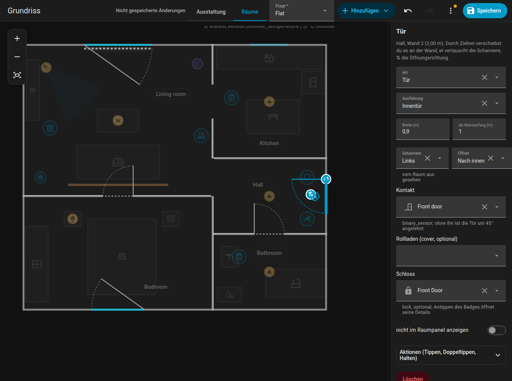

# Türen und Fenster

Türen und Fenster („Öffnungen“) gehören zu einer Wand eines Raums. Du bearbeitest sie im Modus **Räume**.

{ loading=lazy }

## Hinzufügen und Verschieben

1. Wähle einen Raum und im Seitenpanel die Wand (oder wähle den Raum und nutze die Schaltflächen **+ Tür** / **+ Fenster** an der gewählten Wand).
2. An dieser Wand erscheint eine neue Tür oder ein neues Fenster.
3. **Klicke** darauf, um es auszuwählen, und **zieh** es an der Wand entlang, um es zu verschieben. Mit den Pfeiltasten verschiebst du es um 5 cm.
4. Zieh es an die Wand eines **anderen Raums**, und es wandert dorthin (die nächstgelegene Wand der Etage gewinnt).

Das Hinzufügen oder Entfernen einer Raumecke verschiebt eine Öffnung nie von ihrer Stelle.

{ loading=lazy }

*Eine Tür entlang der Wand schieben und auf die Wand eines anderen Raums ziehen.*

{ loading=lazy }

*Die zwei Griffe einer ausgewählten Tür vertauschen die Scharnierseite und die Öffnungsrichtung.*

## Einstellungen

| Einstellung | Schlüssel | Bedeutung |
|-------------|-----------|-----------|
| Typ | `type` | `door` oder `window` |
| Ausführung der Tür | `style` | Eine normale Tür (Innentür, Haustür, verglast) oder `passage` = nur eine Öffnung ohne Türblatt |
| Breite | `width` | In Metern |
| Ab Wandanfang | `offset` | Abstand der Öffnungsmitte vom Wandanfang |
| Scharniere | `hinge` | `left` oder `right`, vom Raum aus gesehen |
| Öffnet | `swing` | `in` oder `out` |
| Kontakt | `contact` | Ein Binärsensor (Tür- / Fensterkontakt) |
| Schloss | `lock` | Eine `lock`-Entität, die an der Tür angezeigt wird |
| Rollladen | `blind` | Eine `cover`-Entität, die als Balken am Fenster entlang gezeichnet wird |

Türblatt und Bogen zeigen Scharniere und Öffnungsrichtung. Bei ausgewählter Öffnung spiegelt die Schaltfläche **Scharniere auf die andere Seite** die Scharnierseite und **In die andere Richtung öffnen** die Öffnungsrichtung, direkt auf dem Plan.

## Kontaktsensor

Mit einem `contact` öffnet sich die Öffnung animiert (Türen schwingen bis 90 Grad auf), leuchtet orange, solange sie offen ist, und pulsiert in den ersten 6 Sekunden nach dem Öffnen. Ohne Kontakt gilt:

- eine **Tür** wird um 45 Grad angelehnt gezeichnet,
- ein **Fenster** oder eine verglaste Balkontür bleibt geschlossen.

Das Antippen einer Öffnung auf der Karte öffnet die Details des Kontakts (more-info). Auch für Öffnungen kannst du [Tippaktionen](items.md#actions) festlegen.

## Schlösser

`lock` nimmt eine Schloss-Entität und zeichnet an der Tür, innerhalb des Raums, ein kleines Schloss-Badge. Es ist grün bei verriegelt, orange bei entriegelt, rot bei blockiert und blau mit einem Ring beim Ver- oder Entriegeln. Das Antippen öffnet nur die Details, eine Tür wird also nie versehentlich entriegelt. Die Größe steht in `lock_size` (Standard S).

## Rollläden

`blind` ist eine `cover`-Entität (ein Rollladen oder eine Jalousie). Sie wird als Balken am Fenster entlang gezeichnet, der beim Schließen länger wird, auf einer gepunkteten Spur über die ganze Fensterbreite: 50 % geschlossen füllt die Hälfte. Solange sich der Rollladen bewegt, wird der Balken animiert. Das Antippen des Rollladens öffnet seine Details.

| Schlüssel | Wirkung |
|-----------|---------|
| `blind_side: out` | Zeichnet den Rollladen außerhalb der Wand statt innen |
| `blind_invert: true` | Für Rollläden, die für „geschlossen“ 100 melden |

Die Position stammt aus `current_position` der Entität, ohne sie aus `closed`.

## Beispiel

```yaml
openings:
  - id: d_front
    room_id: hall
    edge: 0
    offset: 1.1
    width: 0.9
    type: door
    hinge: left
    swing: in
    contact: binary_sensor.front_door
    lock: lock.front_door
  - id: w_living
    room_id: living_room
    edge: 2
    offset: 1.8
    width: 1.4
    type: window
    contact: binary_sensor.living_room_window
    blind: cover.living_room_blind
    blind_side: out
```

Weiter: [Elemente](items.md). Referenz: [Planformat](../reference/plan-format.md#openings).
