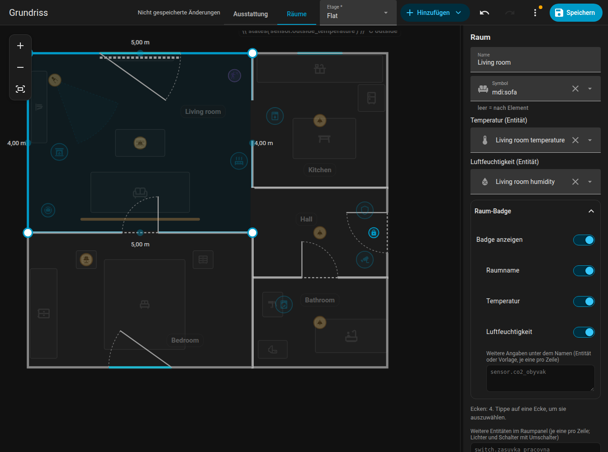
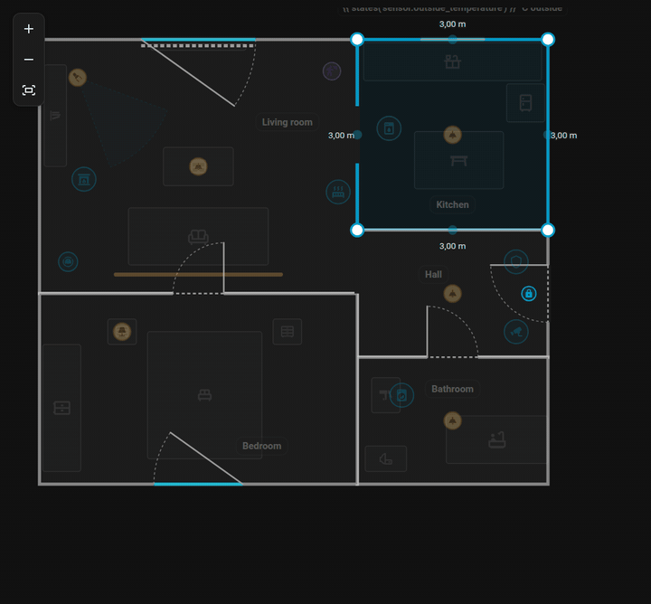
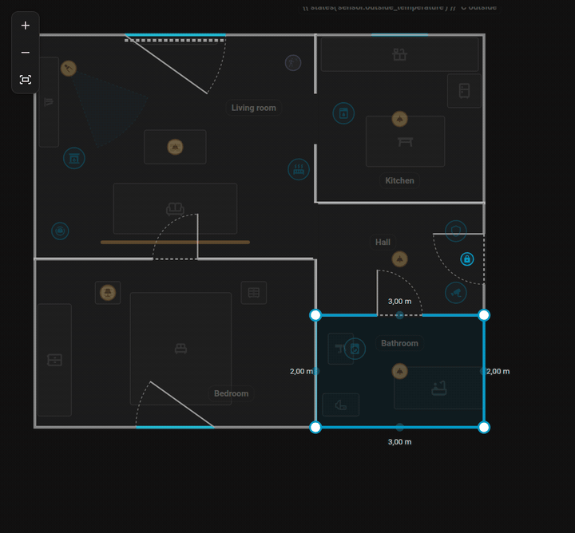
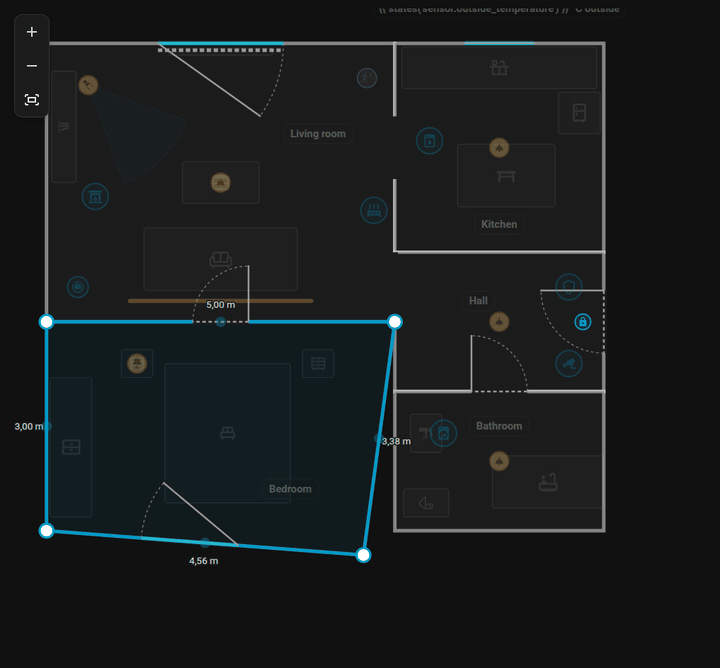
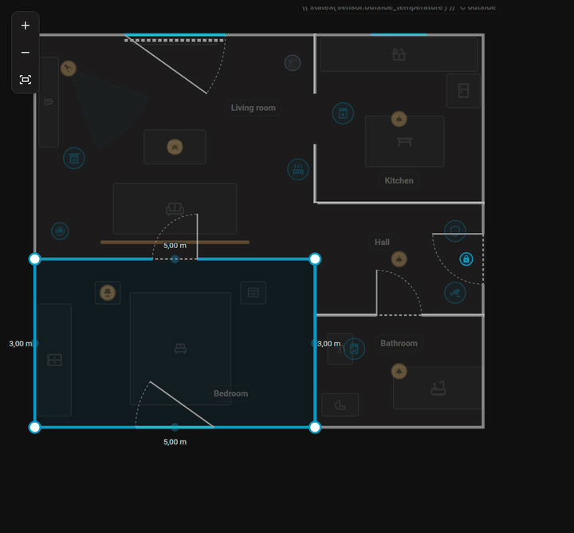

# Räume

Wechsle den Editor zu **Räume**, um die Form der Wohnung zu bearbeiten. Alles andere ist in diesem Modus abgedunkelt und gesperrt.

{ loading=lazy }

## Einen Raum hinzufügen

**Hinzufügen, Raum** fügt ein Quadrat von 2 mal 2 Metern ein. Jeder Raum ist ein eigenes Polygon mit `id`, `name` und `points` in Metern (`x` nach rechts, `z` nach unten).

## Ecken

- Klicke auf einen Raum, um ihn auszuwählen. Die **blauen Punkte** sind seine Ecken; zieh sie. Die halbtransparenten Punkte zwischen den Ecken fügen beim Ziehen eine neue Ecke hinzu.
- Wähle eine Ecke aus und drücke **Entf** (oder die Schaltfläche im Seitenpanel), um sie zu entfernen. Ein Raum braucht mindestens drei Ecken.
- Das Seitenpanel zeigt die Koordinaten der ausgewählten Ecke und lässt dich sie eintippen.
- Beim Hinzufügen oder Entfernen einer Ecke bleiben die Türen und Fenster des Raums, wo sie sind.

## Wände und ganze Räume

- Zieh eine **ganze Wand** des ausgewählten Raums: Beide Ecken bewegen sich senkrecht zur Wand. Eine Ecke, die mit einem Nachbarn geteilt wird, geht mit.
- Zieh den Raum selbst, um den **ganzen Raum zu verschieben**.
- Mit den Pfeiltasten verschiebst du den ausgewählten Raum, die Ecke oder die Wand um 5 cm.

{ loading=lazy }

*Eine ganze Wand ziehen: die Längen der benachbarten Wände werden angepasst.*

{ loading=lazy }

*Einen ganzen Raum verschieben, indem man den Boden zieht.*

## Einrasten an Nachbarn

Ecken, Wände und ganze Räume rasten bis 15 cm Abstand an Ecken und Wänden anderer Räume derselben Etage ein, angezeigt durch eine rosafarbene Fanglinie. Halte ++alt++, um das Einrasten auszuschalten. Sonst gilt das Raster von 5 cm.

{ loading=lazy }

*Eine Ecke rastet an der Ecke des Nachbarraums ein.*

## Gemeinsame Wände

Jeder Raum hat sein eigenes Polygon, eine Wand zwischen zwei Räumen sind also zwei übereinanderliegende Wände. Wenn du eine Ecke ziehst, die genau auf der Ecke eines anderen Raums liegt, **bewegen sich beide gemeinsam** (mit Alt nur eine). Beim Ziehen einer Wand bewegen sich auch Ecken anderer Räume mit, die irgendwo auf ihr liegen. Wenn du sie absichtlich trennen willst, halte Alt.

## Winkel und Längen { #angles-and-lengths }

- Der ausgewählte Raum zeigt die **Länge jeder Wand** (außerhalb des Raums), live beim Ziehen.
- Halte ++ctrl++ beim Ziehen einer Ecke: Die Wand zur benachbarten Ecke rastet in **15-Grad-Schritten** ein, die Länge auf 5 cm. Nahe am Schnittpunkt der beiden Wände springt die Ecke dorthin, was einen rechten Winkel ergibt.
- Die Wände der ausgewählten Ecke sind markiert: eine grüne Markierung **gerade**, wenn eine Wand genau waagerecht oder senkrecht ist, sonst eine orange Markierung mit dem Winkel.

{ loading=lazy }

*Eine Ecke mit gedrückter Strg-Taste ziehen: 15-Grad-Schritte und die grüne Markierung „gerade“.*

## Name, Symbol und Klima

| Feld | Bedeutung |
|------|-----------|
| Name | Wird auf der Raumbeschriftung und im Raum-Panel angezeigt |
| Symbol | Wird in der Kopfzeile des [Raum-Panels](../room-panel.md) angezeigt (`icon`) |
| Temperatur | Ein Temperatursensor (`temperature`) |
| Luftfeuchtigkeit | Ein Feuchtigkeitssensor (`humidity`) |
| Weitere Entitäten | Entitäten für das Raum-Panel (`sheet_extra`), eine pro Zeile; **Entität hinzufügen** unter dem Feld wählt eine aus Home Assistant |

Beide Listen (weitere Entitäten und die Angaben der Beschriftung) nehmen einen Eintrag pro Zeile, mit oder ohne vorangestelltes `- `. Sie nehmen auch eine **Vorlage**, die Entitäts-IDs ausgibt – eine pro Zeile, als Liste oder durch Kommas getrennt. Eine Vorlage über mehrere Zeilen ist ein Eintrag:

```jinja

- light.terrace
- switch.blinds

- light.night_lamp

```

## Raumbeschriftung

Jeder Raum zeigt eine **Beschriftung** (ein Badge) mit seinem Namen und den Werten. Optionen:

| Schlüssel | Wirkung |
|-----------|---------|
| `label_info` | Eine Liste dessen, was angezeigt wird: `temperature`, `humidity`, Entitäts-IDs oder Vorlagen. Standard: Temperatur und Luftfeuchtigkeit. Im Formular fügt **Entität hinzufügen** eine Entität als neue Zeile hinzu |
| `label_name: false` | Blendet den Namen aus, behält die Werte |
| `label_hidden: true` | Blendet die ganze Beschriftung aus |
| `label_rotation` | Dreht die Beschriftung (in Grad) |
| `label_size` | Größe der Beschriftung: `xs`, `s`, `l`, `xl` oder `xxl` (Standard `m`) |

Im Modus **Ausstattung** kannst du eine Beschriftung an eine neue Stelle ziehen; die Position wird in `labels` gespeichert. Räume nehmen auch [Regeln](rules.md): `tint` färbt den Boden ein, `hide` blendet die Beschriftung aus.

## Löschen

**Raum löschen** im Seitenpanel entfernt den Raum samt seinen Türen, Fenstern und seiner Beschriftung.

Weiter: [Türen und Fenster](openings.md).
