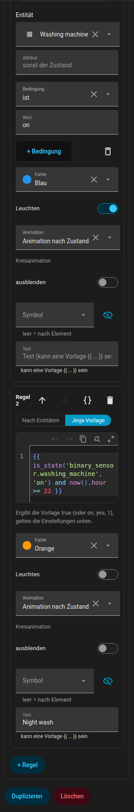

# Regeln

Mit Regeln reagiert ein Element auf mehr als nur seinen eigenen Zustand. Es gibt sie bei jeder Art von Element: Lichtern, LED-Streifen, Geräten, der Station des Saugroboters, Möbeln, Textelementen und Räumen.

{ loading=lazy }

## Wie Regeln ausgewertet werden

`rules` ist eine geordnete Liste. Jede Regel hat Bedingungen (`if`) und Ausgaben. **Für jedes Ausgabefeld gewinnt die erste Regel, deren Bedingungen alle zutreffen und die dieses Feld setzt.** Eine Regel ohne `if` ist der Standard.

```yaml
rules:
  - if: [ ... ]        # alle Bedingungen müssen zutreffen (UND)
    color: red
  - color: blue        # kein "if": gilt, wenn keine frühere Regel eine Farbe gesetzt hat
```

## Bedingungen

Bedingungen kannst du in zwei Modi schreiben. Jede Regel hat einen Schalter **Nach Entitäten / Jinja-Vorlage**; beim Wechsel von Entitäten zu Jinja werden die vorhandenen Bedingungen umgewandelt.

=== "Nach Entitäten"

    Eine Bedingung ist `{entity, attribute?, state | state_not | above | below}`. `state` und `state_not` dürfen eine Liste sein. `{any: [Bedingungen]}` ist eine ODER-Gruppe.

    ```yaml
    if:
      - entity: climate.living_room
        attribute: hvac_action
        state: heating
      - entity: sensor.outdoor_temperature
        below: 5
      - any:
          - entity: binary_sensor.window
            state: "on"
          - entity: binary_sensor.door
            state: "on"
    ```

    Im Formular hat jede Bedingung eine Entität (mit der Abkürzung **diese Entität**), ein optionales Attribut, und der Operator lautet ist / ist nicht / größer als / kleiner als / Vorlage. Neue Bedingungen werden mit der Entität des Elements vorausgefüllt (ein Raum nimmt seinen Temperatursensor).

=== "Jinja-Vorlage"

    Eine einzelne Bedingung `{template: "{{ ... }}"}`. Home Assistant rendert sie live, und sie ist wahr bei `true`, `on`, `yes`, `1` oder einer Zahl ungleich null.

    ```yaml
    if:
      - template: "{{ is_state('binary_sensor.front_door', 'on') and states('sensor.outdoor_temperature') | float(0) < 0 }}"
    ```

Eine `text`-Ausgabe, die `{{ }}` enthält, ist ebenfalls eine Vorlage.

## Ausgaben

| Ausgabe | Wirkung |
|---------|---------|
| `color` | Färbt das Symbol und den Badge-Rand ein; bei Möbeln Umriss und Füllung; bei einem Licht überschreibt sie die Lampenfarbe (Badge, Leuchten, Streifen); beim Roboter ersetzt sie die Designfarbe, auch in der Station |
| `glow` | Fügt ein Leuchten um das Element hinzu |
| `animate` | Überschreibt `active` eines Geräts: `true` / `false`. `animate: false` stoppt auch die Symbolanimation |
| `wave` | Farbe der Wärmewellen des Heizkörpers |
| `text` | Ersetzt den Text unter dem Symbol (einfach oder eine Vorlage) |
| `tint` (oder `color`) | Bei einem Raum: färbt den Boden ein; `opacity` legt die Stärke fest (Standard 0,14) |
| `hide` | Blendet das Element aus (bei einem Raum: seine Beschriftung) |
| `icon` | Tauscht das Symbol aus (Geräte, Lichter, Möbel, die Station). `none` entfernt es; wähle es mit der Symbolauswahl |
| `background` | Hintergrund eines Textelements |
| `fx` | Ringanimation: `ring`, `radar`, `comet`, `countdown`, `spin`, `orbit`, `breath`, `blink`, `heartbeat`, `shake`, `none` |
| `progress` | Eine Entität, die einen `countdown` antreibt (siehe unten) |
| `progress_total` | Eine Länge in Minuten für einen `countdown` |

Farben: `red`, `orange`, `yellow`, `green`, `blue`, `purple`, `pink`, `white`, `black`, jeder im Formular gewählte Farbname des Designs (unter dem Namen gespeichert, zum Beispiel `teal`) oder jede CSS-Farbe (Hex, `rgb(...)`, `var(...)`).

Lichter, LED-Streifen, die Station und Möbel haben keine eigene Ringanimation, der Ring erscheint also nur, wenn eine Regel `fx` setzt. Der Ring eines LED-Streifens sitzt in der Mitte des Streifens, bei Möbeln in der Mitte des Rechtecks.

Für die Ausgabe eines Rings gilt die Priorität: Regel, dann die eigene Einstellung des Geräts, dann der Alarm-Standard nach Zustand.

### Countdown { #countdown }

`fx: countdown` zeichnet einen schrumpfenden Bogen. Woher er seinen Fortschritt bekommt:

- `progress: timer.kitchen`: ein `timer` (aktiv oder pausiert),
- `progress: sensor.dryer_remaining` mit `device_class: duration` (Sekunden, Minuten oder Stunden; die Gesamtdauer ist `progress_total`, sonst der bisher höchste gesehene Wert),
- `progress: sensor.dryer_end` mit `device_class: timestamp` (die Endzeit; der Start ist das `last_changed` des laufenden Geräts, sonst `progress_total`),
- `progress: sensor.dryer_progress` in `%`: der Ring **füllt sich wie ein Akku** (0 % leer, 100 % voll),
- `progress_total: 45` ohne Entität: ein Countdown dieser Länge in Minuten, gemessen ab der Änderung der Bedingungsentität der Regel (bei einem Gerät ab dem Moment, in dem es zu laufen beginnt).

Ohne eine dieser Angaben ist der Countdown ein dekorativer Zyklus von 4 Sekunden.

## Regeln als YAML

Jede Regel hat in ihrer Kopfzeile eine Schaltfläche **{ }**, die nur diese Regel als YAML im Code-Editor von Home Assistant öffnet (Syntaxfarben, Zeilennummern, Vorschläge für Entitäten und Symbole). Die Änderung wird übernommen, wenn du den Editor verlässt. Dasselbe YAML siehst du im [Planformat](../reference/plan-format.md#rules).

## KI-Assistent (AI Task)

Wenn dein Home Assistant eine `ai_task.*`-Entität hat, die Datengenerierung unterstützt, zeigt der Abschnitt Regeln **Mit KI vorschlagen**. Beschreibe in einem Satz, was du willst. Der Editor sendet die Beschreibung zusammen mit dem Regelformat, den für dieses Element erlaubten Ausgaben, seiner Entität (Zustand und Attribute), den aktuellen Regeln und einer Liste deiner Entitäten (bis zu 1500, ohne update-, event-, scene- und script-Entitäten) an `ai_task.generate_data`. Die Antwort kommt als YAML und öffnet sich als **Entwurf**; erst **Vorschlag übernehmen** ersetzt die Regeln. Lässt sich die Anfrage nicht erfüllen, antwortet der Assistent mit einem Satz, den du als Meldung siehst.

## Beispiele

### Waschmaschine fertig

```yaml
devices:
  - id: washer
    kind: generic
    name: Waschmaschine
    entity: sensor.washer_state
    icon: mdi:washing-machine
    x: 1.2
    z: 3.4
    rules:
      - if:
          - entity: sensor.washer_state
            state: running
        color: blue
        animate: true
        fx: countdown
        progress: sensor.washer_finish_time   # device_class: timestamp
      - if:
          - entity: sensor.washer_state
            state: finished
        color: green
        fx: blink
        text: Fertig
```

### Tür bleibt offen

Eine Vorlage mit `now()` wird jede Minute neu gerendert, die Regel schaltet sich also fünf Minuten nach dem Öffnen der Tür ein.

```yaml
rooms:
  - id: hall
    name: Flur
    points: [[0, 0], [3, 0], [3, 2.5], [0, 2.5]]
    rules:
      - if:
          - template: >-
              {{ is_state('binary_sensor.front_door', 'on')
                 and (now() - states.binary_sensor.front_door.last_changed).total_seconds() > 300 }}
        tint: orange
        opacity: 0.3
```

### Leckalarm

```yaml
devices:
  - id: leak
    kind: generic
    name: Leck
    entity: binary_sensor.kitchen_leak
    x: 2.0
    z: 1.0
    rules:
      - if:
          - entity: binary_sensor.kitchen_leak
            state: "on"
        color: red
        glow: true
        fx: blink
        text: Leck!
      - hide: true
```

Die letzte Regel hat keine Bedingung, das Element wird also immer ausgeblendet, wenn es kein Leck gibt.

### Prozent-Ring im Akku-Stil

```yaml
devices:
  - id: phone_battery
    kind: generic
    name: Handy
    entity: sensor.phone_battery_level
    x: 4.0
    z: 2.0
    rules:
      - if:
          - entity: sensor.phone_battery_level
            below: 20
        color: red
        fx: countdown
        progress: sensor.phone_battery_level
      - fx: countdown
        progress: sensor.phone_battery_level
        color: green
```

### Timer-Countdown

Ein Backofen, der ab dem Einschalten 45 Minuten herunterzählt:

```yaml
devices:
  - id: oven
    kind: generic
    name: Backofen
    entity: switch.oven
    x: 3.1
    z: 0.4
    rules:
      - if:
          - entity: switch.oven
            state: "on"
        fx: countdown
        progress_total: 45
        color: orange
```

Und ein Küchentimer als Helfer, der den Ring antreibt:

```yaml
    rules:
      - if:
          - entity: timer.kitchen
            state: active
        fx: countdown
        progress: timer.kitchen
        color: yellow
```

### Heizkörper, der auf Fenster, Boost und Ventil reagiert

```yaml
devices:
  - id: radiator_living
    kind: radiator
    entity: climate.living_room
    x: 4.3
    z: 1.1
    rules:
      - if:
          - entity: switch.boost_living_room
            state: "on"
        color: yellow
      - if:
          - any:
              - entity: binary_sensor.living_room_window
                state: "on"
              - entity: binary_sensor.balcony_door
                state: "on"
        color: blue
      - if:
          - entity: switch.valve_living_room
            state: "on"
        color: orange
        animate: true
        wave: red
      - animate: false
```

Zurück zu [Elemente](items.md) oder zum [Planformat](../reference/plan-format.md#rules).
