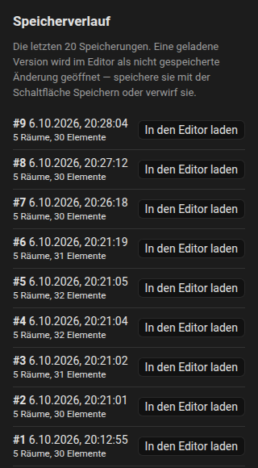
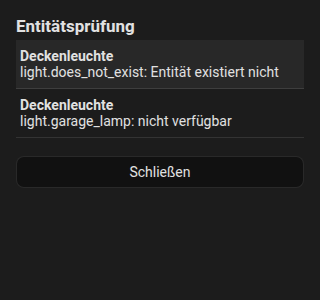

# Verlauf und Prüfung

Beides findest du im Dreipunktmenü **Weitere Aktionen** des [Editors](editor/index.md).

## Verlauf { #history }

Die Integration bewahrt die **letzten 20 gespeicherten Pläne** auf (in `.storage/fns_floorplan.history`). Jedes Speichern schiebt den vorherigen Plan in den Verlauf.

1. Öffne das Menü, **Speicherverlauf**.
2. Die Liste zeigt jede Revision mit Datum sowie der Anzahl der Räume und Elemente.
3. Wähle eine aus: Sie wird als **nicht gespeicherte Änderung** in den Editor geladen, sodass du sie dir ansehen, korrigieren und **Speichern** oder **Verwerfen** kannst.

Das Wiederherstellen berührt den gespeicherten Plan nicht, bis du speicherst. Die Befehle dahinter findest du in der [Websocket-API](reference/websocket-api.md#history).

{ loading=lazy }

## Prüfung

Die **Entitätsprüfung** listet Probleme des Plans auf:

- Entitäten, die **nicht mehr existieren**,
- Entitäten, die **nicht verfügbar** sind,
- Elemente **ohne Entität**,
- dasselbe innerhalb von Regeln,
- Raumnamen des Staubsaugers, die nicht zugeordnet sind.

Klicke auf eine Zeile, um zu diesem Element zu springen. Ein Punkt am Menü zeigt an, wenn es Probleme gibt.

{ loading=lazy }
