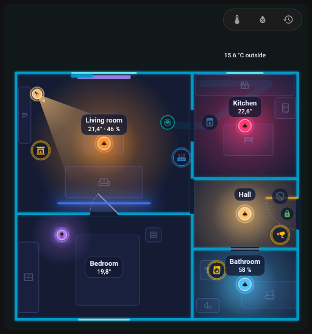
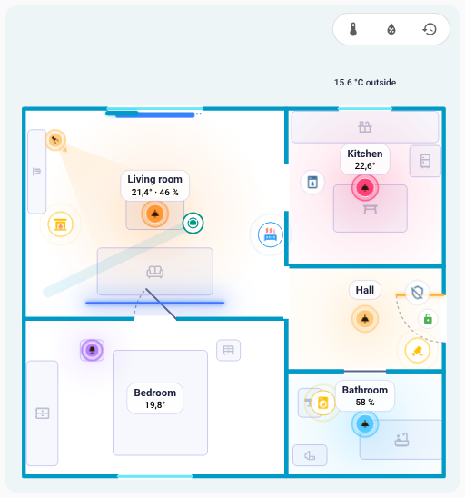

# FNS Floorplan – Hilfe

FNS Floorplan verwandelt dein Home-Assistant-Dashboard in einen lebendigen Grundriss deines Zuhauses: Lichter leuchten in ihrer echten Farbe, Türen und Fenster schwingen auf, und ein Saugroboter fährt durch den Raum, den er meldet. Den Grundriss zeichnest du in einem integrierten Editor, ganz ohne YAML und ohne Bildbearbeitung.

Hier findest du Anleitungen zu Karte und Editor und Lösungen für die häufigsten Probleme. Wenn etwas nicht geht, suche das Symptom, das du siehst.

!!! info "Inspiriert von NeonPlan 3D"
    FNS Floorplan wurde von [NeonPlan 3D](https://github.com/Mastershort/neonplan3d) inspiriert, einer 3D-Grundrisskarte für Home Assistant. Die Idee wird hier in einen animierten 2D-Plan mit eigenem Editor übertragen. [Du kommst von NeonPlan 3D?](quick-start.md#coming-from-neonplan-3d)

!!! tip "Frag auf GitHub"
    Dein Problem ist nicht dabei? [Eröffne ein neues Issue](https://github.com/matata86/fns-floorplan/issues) auf GitHub, oder probiere zuerst die [Live-Demo](https://matata86.github.io/fns-floorplan/demo/) aus, sie führt die echte Karte mit erfundenen Zuständen aus.

!!! example "Gefällt dir FNS Floorplan?"
    Unterstütze es über [Ko-fi](https://ko-fi.com/matata86), [PayPal](https://paypal.me/matata86) oder mit [Bitcoin](support.md).

## Erste Schritte
- [Installation](installation.md)
- [Schnellstart: dein erster Plan in etwa zehn Schritten](quick-start.md)

## Die Karte
- [Karte: hinzufügen und alle Optionen](card.md)
- [Helles und dunkles Aussehen](card.md#light-and-dark)
- [Animationen](card.md#animations)
- [Raum-Panel](room-panel.md)

## Der Editor
- [Editor-Übersicht](editor/index.md)
- [Räume](editor/rooms.md)
- [Türen und Fenster](editor/openings.md)
- [Elemente](editor/items.md)
- [Regeln](editor/rules.md)
- [Verlauf und Prüfung](history.md)

## Saugroboter
- [Saugroboter: Raumsensor, Dock und Fahrweg](robot-vacuum.md)

## Wenn etwas nicht geht
- [Die Karte wird nach der Installation nicht gefunden](help/card-not-found.md)
- [„Custom element doesn't exist“ oder ein Konfigurationsfehler erscheint](help/custom-element-missing.md)
- [Die Karte zeigt nach einem Update die alte Version](help/old-version-after-update.md)
- [Die Karte meldet, dass sie auf die Integration wartet](help/waiting-for-integration.md)
- [Der Plan ist leer](help/plan-empty.md)
- [Der Seitenleisten-Eintrag fehlt](help/sidebar-entry-missing.md)
- [Symbole fehlen](help/icons-missing.md)
- [Beim Speichern heißt es, der Plan habe sich inzwischen geändert (Konflikt)](help/plan-conflict.md)
- [Die Karte ruckelt oder ist langsam](help/performance.md)
- [Ein Licht leuchtet nicht in der erwarteten Farbe](help/light-wrong-colour.md)
- [Eine Regel greift nicht](help/rule-not-applied.md)
- [Einige Texte werden nicht übersetzt](help/languages.md)
- [Etwas anderes funktioniert nicht](help/still-not-working.md)

## Referenz
- [Planformat](reference/plan-format.md)
- [Websocket-API](reference/websocket-api.md)

## Änderungen
- [Was sich in welcher Version geändert hat](changelog.md)

{ loading=lazy }

| Dunkles Design | Helles Design |
|---|---|
| { loading=lazy } | { loading=lazy } |
