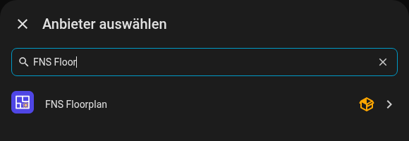

# Installation

## Voraussetzungen

- Home Assistant **2025.1.0** oder neuer.
- [HACS](https://hacs.xyz) für die empfohlene Installation (eine manuelle Installation funktioniert auch).
- Ein Administratorkonto für den Editor. Die Karte selbst funktioniert für jeden Benutzer.

## Installation mit HACS

FNS Floorplan steht nicht in der Standardliste von HACS, du fügst es deshalb als benutzerdefiniertes Repository hinzu.

1. Öffne **HACS** in der Seitenleiste von Home Assistant.
2. Öffne oben rechts das Menü mit den drei Punkten und wähle **Benutzerdefinierte Repositories**.
3. Gib `https://github.com/matata86/fns-floorplan` als Repository ein und wähle die Kategorie **Integration**. Klicke auf **Hinzufügen**.
4. Suche in HACS nach **FNS Floorplan** und klicke auf **Herunterladen**.
5. **Starte Home Assistant neu** (Einstellungen, System, Neu starten).

{ loading=lazy }

## Manuelle Installation

1. Lade die neueste Version von der [Release-Seite](https://github.com/matata86/fns-floorplan/releases) herunter oder klone das Repository.
2. Kopiere den Ordner `custom_components/fns_floorplan` in den Ordner `custom_components` deiner Home-Assistant-Konfiguration, sodass die Datei `custom_components/fns_floorplan/manifest.json` existiert.
3. Starte Home Assistant neu.

## Integration hinzufügen

1. Gehe zu **Einstellungen, Geräte & Dienste, Integration hinzufügen**.
2. Suche nach **FNS Floorplan** und füge die Integration hinzu. Es gibt nichts einzustellen, es kann nur eine Instanz geben.

{ loading=lazy }

Die Integration registriert die Karte selbst, du musst also keine Dashboard-Ressource von Hand hinzufügen.

## Optionen

Klicke bei der Integration auf **Konfigurieren**.

| Option | Standard | Bedeutung |
|--------|----------|-----------|
| Editor in der Seitenleiste anzeigen | an | Fügt den Eintrag **Grundriss** zur Seitenleiste hinzu (nur für Administratoren). |

Der Editor ist immer unter `/fns-floorplan` erreichbar (zum Beispiel `http://homeassistant.local:8123/fns-floorplan`), auch wenn der Seitenleisten-Eintrag ausgeblendet ist. Der Karteneditor im Dashboard hat die Schaltfläche **Grundriss bearbeiten**, die dieselbe Adresse öffnet.

## Aktualisieren

Aktualisiere über HACS wie jede andere Integration und starte Home Assistant neu. Karte und Editor werden mit der Version der Integration in der URL geladen, dein Browser verwirft seinen Cache also von selbst. Siehst du trotzdem noch die alte Version, schau in die [häufigen Fragen](faq.md#the-card-shows-the-old-version-after-an-update).

Dein Grundriss wird von Home Assistant gespeichert (`.storage/fns_floorplan`) und von Updates nicht angetastet.

## Deinstallieren

1. Entferne die Karte aus deinen Dashboards.
2. **Einstellungen, Geräte & Dienste, FNS Floorplan, Dreipunktmenü, Löschen.**
3. Entferne das Repository in HACS (oder lösche den Ordner `custom_components/fns_floorplan`) und starte neu.
4. Optional: Lösche die gespeicherten Plandateien `.storage/fns_floorplan` und `.storage/fns_floorplan.history` sowie die Vorlagenbilder in `www/fns_floorplan/`.

Weiter: [Schnellstart](quick-start.md).
