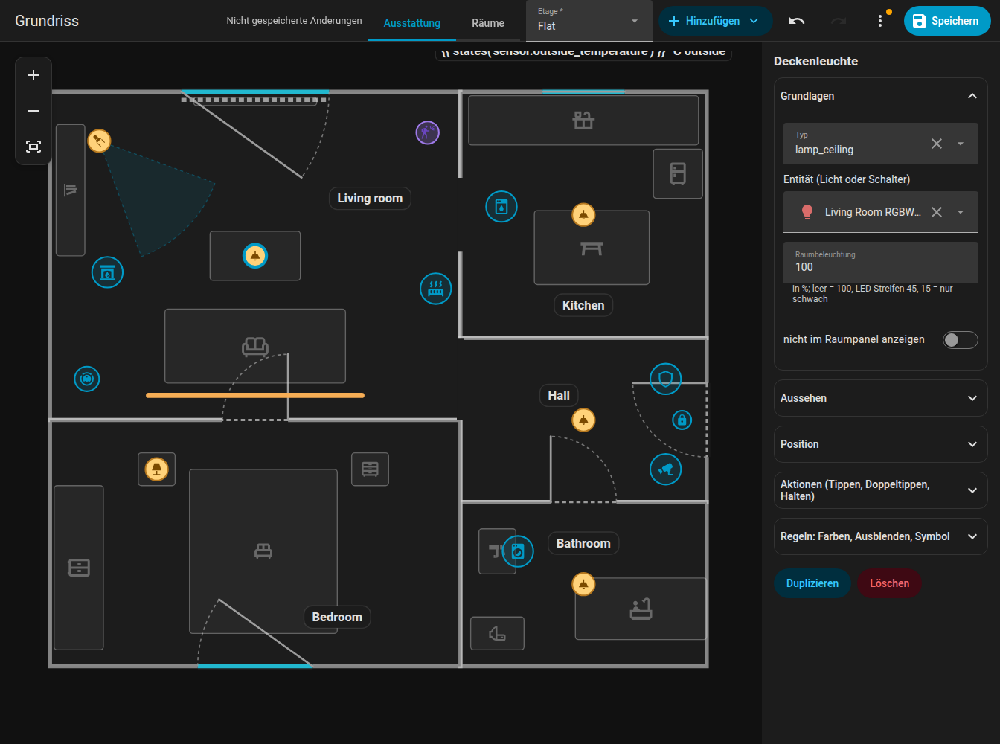

# Schnellstart

Von null zu einem funktionierenden Grundriss in zehn Schritten. Voraussetzung ist, dass die Integration [installiert](installation.md) ist.

1. **Öffne den Editor.** Klicke in der Seitenleiste auf **Grundriss** oder öffne `/fns-floorplan`.
2. **Wechsle zu Räume.** Der Modusschalter oben bietet **Ausstattung** und **Räume**. Wähle **Räume**.
3. **Füge einen Raum hinzu.** Öffne **Hinzufügen** und wähle **Raum**. Es erscheint ein Quadrat von 2 mal 2 Metern. Zieh die blauen Eckpunkte in die Form deines Raums, die halbtransparenten Punkte zwischen den Ecken fügen beim Ziehen eine Ecke hinzu. Details unter [Räume](editor/rooms.md).
4. **Benenne ihn.** Gib im Seitenpanel den Raumnamen ein und optional eine Temperatur- und eine Feuchtigkeitsentität.
5. **Füge weitere Räume hinzu.** Schiebe sie nebeneinander, die Ecken rasten bis 15 cm Abstand an den Ecken der Nachbarn ein.
6. **Füge Türen und Fenster hinzu.** Wähle einen Raum, im Seitenpanel eine Wand und füge eine Tür oder ein Fenster hinzu; zieh es an der Wand entlang. Siehe [Türen und Fenster](editor/openings.md).
7. **Wechsle zu Ausstattung.** Füge mit **Hinzufügen** Lichter, Geräte, Sensoren und Möbel hinzu. Wähle für jedes eine Entität. Siehe [Elemente](editor/items.md).
8. **Speichere.** Klicke auf **Speichern**. Der Grundriss wird in Home Assistant gespeichert und jede geöffnete Karte zeichnet sich von selbst neu.
9. **Füge die Karte hinzu.** Bearbeite ein Dashboard, **Karte hinzufügen**, suche nach **FNS Floorplan** oder nutze YAML:

    ```yaml
    type: custom:fns-floorplan-card
    mode: auto
    rotate: auto
    ```

10. **Probier es aus.** Schalte ein Licht ein, öffne einen Türkontakt, starte den Geschirrspüler. Tippe auf einen Raum, um das [Raum-Panel](room-panel.md) zu öffnen.

{ loading=lazy }

## Du kommst von NeonPlan 3D? { #coming-from-neonplan-3d }

FNS Floorplan wurde von [NeonPlan 3D](https://github.com/Mastershort/neonplan3d) inspiriert. Wenn du dein Zuhause dort schon gezeichnet hast, kannst du es einmalig umwandeln, statt von vorn anzufangen:

1. Hole das Gebäude aus NeonPlan mit dem Websocket-Befehl `neonplan3d/building/get` und speichere das Ergebnis als `building.json`.
2. Wandle es um:

    ```bash
    python3 tools/import_neonplan.py building.json > plan.json
    ```

    Eine optionale zweite Datei (`extras.json`) ergänzt, was NeonPlan nicht kennt: Geräte, Positionen von Beschriftungen und Regeln. Siehe den Kommentar am Anfang des Skripts.

3. Speichere `plan.json` mit `fns_floorplan/plan/save` (siehe [Websocket-API](reference/websocket-api.md)) und feile das Ergebnis im Editor nach.

!!! warning "Achtung"
    Der Import ersetzt den gesamten Plan. Führe ihn einmal am Anfang aus, nicht erst, nachdem du den Plan bearbeitet hast.

## Gute nächste Schritte

- Lass ein Gerät mit [Regeln](editor/rules.md) auf mehr als nur seinen Zustand reagieren.
- Füge einen Saugroboter hinzu: [Saugroboter](robot-vacuum.md).
- Lege ein Grundrissbild unter den Plan und zeichne es nach: [Editor-Übersicht](editor/index.md#tracing-image).
- Mehrere Etagen: [Editor-Übersicht](editor/index.md#levels-floors).
