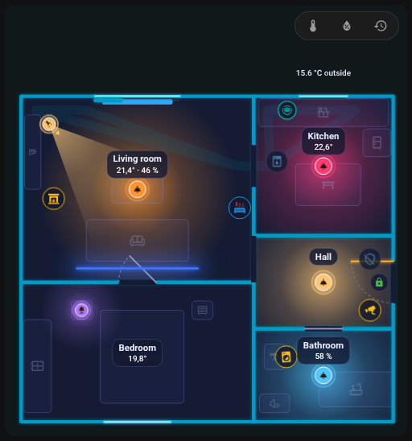
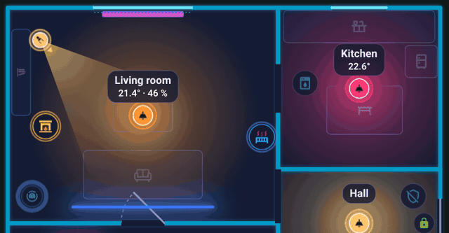

# Saugroboter

Der Saugroboter wird als kleiner Roboter gezeichnet, der in seiner **Station** wohnt und beim Saugen durch den Raum fährt, den er meldet.

{ loading=lazy }

## Das Element Station

Füge einen **Saugroboter** hinzu (Möbeltyp `robot_vacuum`) und platziere ihn dort, wo die Station steht. Sein Formular enthält:

| Feld | Schlüssel | Bedeutung |
|------|-----------|-----------|
| Entität | `entity` | Die `vacuum`-Entität |
| Raumsensor | `room_sensor` | Ein Sensor, dessen Zustand der Name des Raums ist, in dem sich der Staubsauger befindet (bei Roborock `sensor.*_current_room`) |
| Raumzuordnung | `room_map` | `{ "<Raumname im Staubsauger>": "<Raum-ID im Plan>" }` |
| Akku | `battery` | Akkusensor; leer = der `battery`-Sensor des Staubsaugergeräts |
| Abschnitt Wenn aktiv (saugt) | `color_on`, `fx`, `progress`, `progress_total` | Aussehen beim Saugen |
| Reihenfolge bei Überlappung | `layer` | Siehe [unten](#layer-and-stacking) |

Die Station nimmt auch [Regeln](editor/rules.md) (eine Regel-`color` ersetzt die Designfarbe, auch in der Station) und eine Tippaktion; das Standardtippen öffnet die Details.

## Raumsensor und room_map

Die Karte muss wissen, welchen Raum des Plans der Staubsauger meldet. Die Tabelle **Raumzuordnung** im Formular der Station listet die Namen aus den `options` des Raumsensors, die Schlüssel, die schon in `room_map` stehen, den aktuellen Zustand und Namen, die du von Hand hinzufügst. Wähle für jeden Namen:

- **automatisch**: derselbe Name oder dieselbe ID wie ein Raum im Plan, ohne Beachtung von Groß- und Kleinschreibung und Akzenten,
- einen **bestimmten Raum**,
- **nicht zuordnen** (`__none`): Der Roboter fährt nicht in diesen Raum.

Die **Prüfung** (siehe [Verlauf und Prüfung](history.md)) meldet Namen aus den Optionen des Sensors, die nicht zugeordnet sind.

```yaml
furniture:
  - id: dock
    type: robot_vacuum
    entity: vacuum.robot
    room_sensor: sensor.robot_current_room
    room_map:
      Wohnzimmer: living_room
      Küche: kitchen
      Flur: __none
    x: 0.4
    z: 3.1
```

Ein älterer Plan mit einem `vacuum`-Schlüssel auf oberster Ebene (`entity`, `room_sensor`) funktioniert weiterhin; der Editor wandelt ihn beim nächsten Speichern in eine Station um.

## Wie er fährt

| Zustand | Was du siehst |
|---------|---------------|
| `cleaning` | Der Roboter fährt in Bahnen durch den Raum aus dem Raumsensor und hinterlässt eine Spur |
| `returning` | Er fährt zur Station; die Spur wird gelöscht |
| `docked`, `charging` | Er sitzt in der Station. Ein **Ring um ihn zeigt den Akku** (bei 100 % voll), er atmet nur, wenn der Akkustand unbekannt ist. Der Roboter hat die Designfarbe des Staubsaugerzustands |
| `idle`, `paused`, `error` | Er steht **in seinem Raum** auf einer freien Stelle und blinkt (der Badge-Rand hat die Zustandsfarbe, Fehler sind rot) |

{ loading=lazy }

*Der Roboter verlässt die Station, fährt durch den Durchgang in die Küche und kehrt zur Station zurück.*

- Zwischen Räumen und zurück zur Station fährt er **durch Türen und Durchgänge** (eine Wegsuche über andere Öffnungen als Fenster; die andere Seite einer Öffnung ist der Raum 35 cm hinter der Wand). Gibt es keinen Weg, fährt er geradeaus.
- Wenn die Seite lädt und der Roboter nicht in der Station ist, erscheint er direkt in seinem Raum, statt aus der Station auszufahren.
- Der Roboter behält beim Fahren die Ausrichtung, die er in der Station hat.
- **Parken an einer freien Stelle:** Ein angehaltener Roboter steht dort, wo er nichts verdeckt: am weitesten vom Badge, von Lichtern und Beschriftungen entfernt. Die Stelle wird berechnet, nachdem die Karte gezeichnet ist.
- **Rundfahrt über die ganze Etage:** Wenn er saugt und der Raum unbekannt ist (kein Sensor oder keine Zuordnung), fährt er **alle Räume der Etage** ab: jeweils den nächsten, durch Türen, Bahn für Bahn, unerreichbare Räume werden übersprungen, dann zurück zur Station.

## Beim Saugen

Der Abschnitt **Wenn aktiv (saugt)** legt fest, was die Station zeigt, während der Roboter saugt: `color_on`, eine Ringanimation `fx` (zum Beispiel `comet`) und für einen Countdown `progress` / `progress_total` (siehe [Regeln](editor/rules.md#countdown)).

## Reihenfolge und Stapelung { #layer-and-stacking }

Beim Fahren wird der Roboter **über Möbeln und Wänden und unter Lichtern, Geräten und Beschriftungen** gezeichnet. Steht er still, behält `layer: 0` dieselbe Reihenfolge; eine `layer` über 0 legt ihn im Stand über Lichter und Geräte.

## Im Raum-Panel ausblenden

Der Roboter erscheint im [Raum-Panel](room-panel.md) des Raums mit seiner Station. Setze das Häkchen bei **nicht im Raumpanel anzeigen** (`sheet_hide: true`), um ihn wegzulassen.

## Ein Staubsauger als gewöhnliches Gerät

Du kannst auch ein `generic`-Gerät mit einer `vacuum.*`-Entität platzieren: Es läuft beim Saugen oder bei der Rückkehr (Ring `comet`) und zeigt in der Station den Akkuring und den Text mit dem Ladestand („lädt 64 %“ oder „100 %“). Der Akku stammt aus der Geräteregistrierung (ein Sensor mit `device_class: battery` und der Binärsensor `battery_charging` am selben Gerät) oder aus dem Attribut `battery_level`.

Zurück zu [Elemente](editor/items.md).
