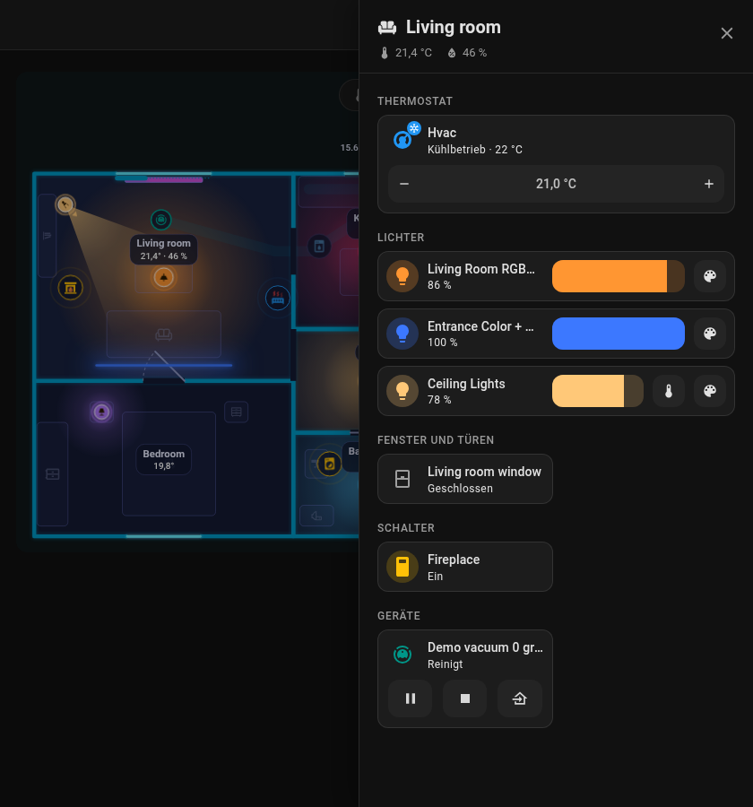
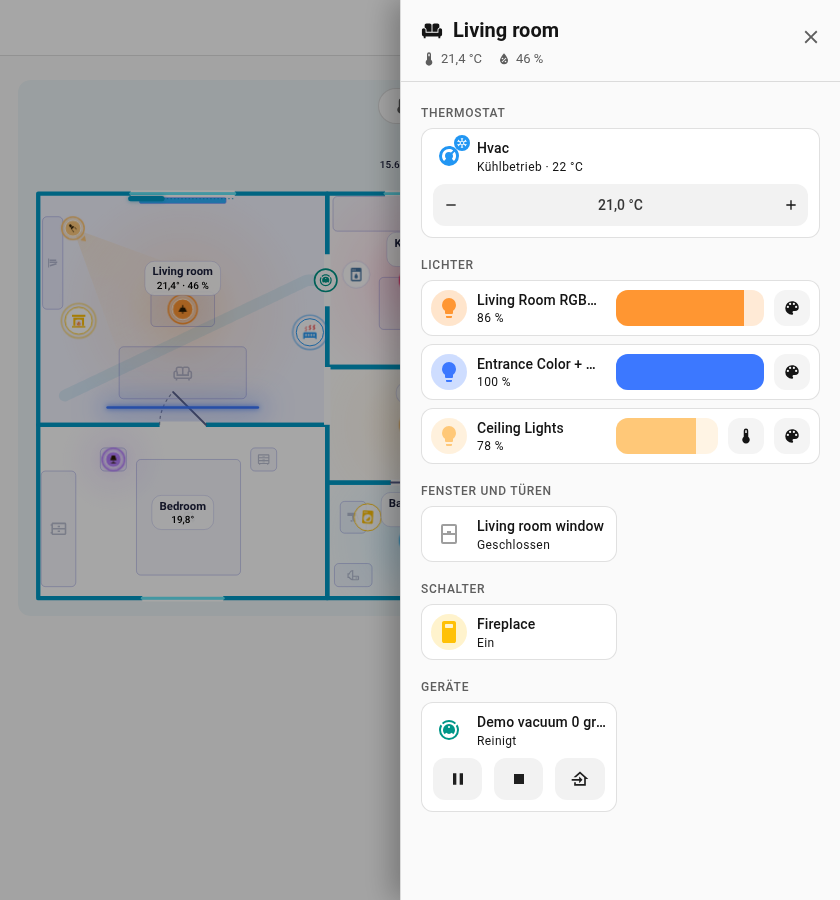
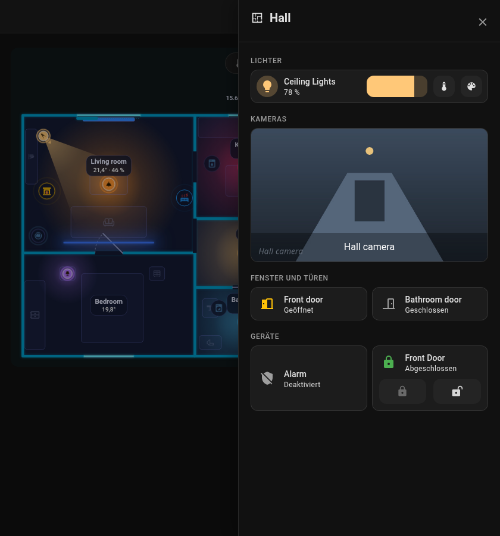
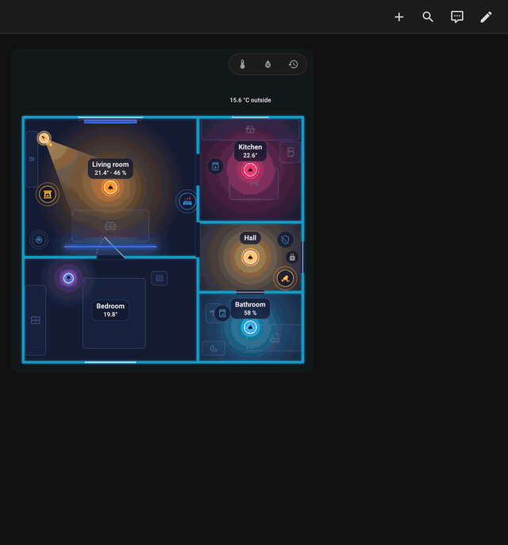

# Raum-Panel

Tippe auf der Karte auf einen Raum, und von der rechten Bildschirmkante fährt ein **seitliches Panel** ein. Es sieht aus wie ein Bereichs-Dashboard von Home Assistant: der Designhintergrund, eine Kopfzeile mit Raumsymbol, Name, Temperatur und Luftfeuchtigkeit und Kacheln in zwei Spalten. Schließe es mit dem Kreuz, ++esc++ oder einem Klick außerhalb.

| Dunkles Design | Helles Design |
|---|---|
| { loading=lazy } | { loading=lazy } |

{ loading=lazy }

{ loading=lazy }

*Das Panel öffnen, die Helligkeit eines Lichts einstellen und das Panel schließen.*

## Abschnitte

Das Panel ist aus den eigenen Kachelkarten von Home Assistant gebaut und sieht daher aus wie der Rest deiner Dashboards. Ein Klick auf eine Kachel öffnet die Details, das Symbol schaltet um, was sich umschalten lässt.

| Abschnitt | Was dort steht |
|-----------|----------------|
| **Thermostat** | `climate`-Entitäten: Zieltemperatur minus und plus (wird nach 0,7 s gesendet), aktuelle Temperatur, Zustand, HVAC-Modi |
| **Lichter** | Im Raum platzierte Lichter, mit der Helligkeit direkt neben dem Namen |
| **Kameras** | Kameras des Raums, das Livebild öffnet sich in den Details |
| **Fenster und Türen** | Öffnungen des Raums mit Kontakt |
| **Schalter** | `switch` und `input_boolean` |
| **Geräte** | Haushaltsgeräte (ein Schloss erhält Schlossbefehle, ein Staubsauger Staubsaugerbefehle) |
| **Sensoren** | Sensoren des Raums |
| **Sonstige** | Alles andere |

Angezeigt werden nur Elemente, die **im Raum platziert** sind, und die Entitäten in `sheet_extra`. Bereiche von Home Assistant werden nicht automatisch hinzugefügt. Der Saugroboter erscheint in dem Raum, in dem seine Station steht.

## Auswählen, was angezeigt wird

- `sheet_extra`: eine Liste zusätzlicher Entitäten eines Raums (ein Feld im Formular des Raums). `light`, `switch`, `fan`, `input_boolean`, `humidifier` und `siren` erhalten einen Schalter, andere Entitäten eine Zeile mit dem Zustand.
- `sheet_hide: true` bei einem beliebigen Element (Licht, Gerät, Fenster, Tür, Schloss, Roboter) lässt es weg.
- Das Raumsymbol `icon` erscheint in der Kopfzeile.

```yaml
rooms:
  - id: living_room
    name: Wohnzimmer
    icon: mdi:sofa
    temperature: sensor.living_room_temperature
    sheet_extra:
      - climate.living_room
      - camera.living_room
      - switch.tv_plug
```

Zurück zur [Karte](card.md).
