# Card

## Adding the card

Edit a dashboard, **Add card**, and search for **FNS Floorplan**; or in YAML:

```yaml
type: custom:fns-floorplan-card
```

The card shows the plan saved in the editor and redraws by itself after each save (it subscribes to the plan over the websocket, and after a Home Assistant restart it subscribes again).

{ loading=lazy }

## Options

| Option | Values | Default | Description |
|--------|--------|---------|-------------|
| `mode` | `auto`, `ha`, `day`, `night` | `auto` | Look of the card |
| `rotate` | `auto`, `true`, `false` | `auto` | Rotation of the plan by 90 degrees |
| `level` | floor id | first floor | Default floor; stored only when it is not the first one |
| `tools` | `true`, `false` | `true` | `false` hides the layer and replay buttons |

```yaml
type: custom:fns-floorplan-card
mode: ha
rotate: auto
level: upstairs
tools: false
```

The visual card editor has the same fields (Appearance, Plan rotation, Default floor, Layer and replay buttons) and a button **Edit floor plan** that opens the editor.

### mode

- `auto`: day when `sun.sun` is above the horizon, night otherwise,
- `ha`: follows the light or dark theme of Home Assistant,
- `day`, `night`: always one look.

### rotate

- `auto`: a card narrower than 600 px turns a wide plan by 90 degrees, but only when the plan is more than 1.25 times wider than tall,
- `true`: always turn, `false`: never.

## Light and dark { #light-and-dark }

The card looks good in both themes. With `mode: ha` it follows the light or dark theme of Home Assistant, with `auto` the sun decides, and `day` or `night` fixes one look (see [mode](#mode)).

| Dark theme | Light theme |
|---|---|
| 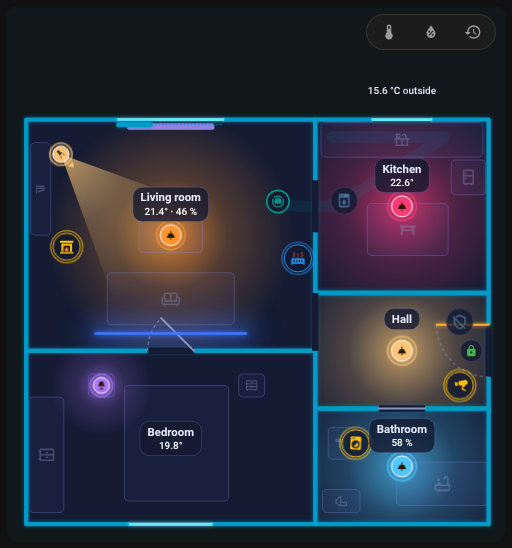{ loading=lazy } | { loading=lazy } |

The look of the card itself can also be set independently of the theme:

| Mode `day` | Mode `night` |
|---|---|
| 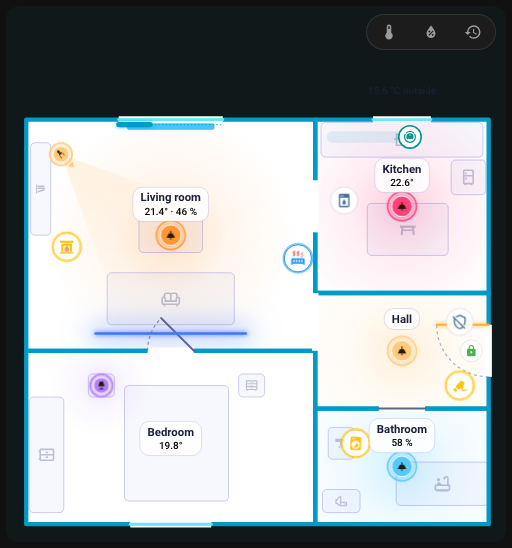{ loading=lazy } | 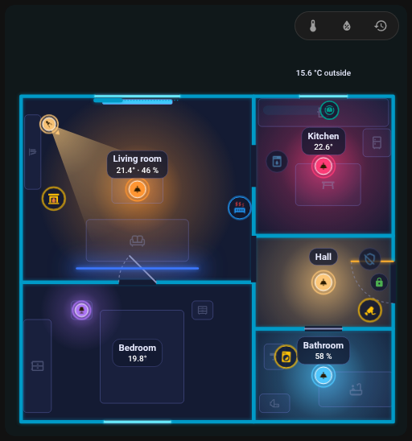{ loading=lazy } |

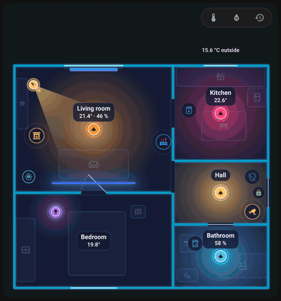{ loading=lazy }

*The card switching from the dark to the light look and back.*

## Look

- Walls and glow take the `--primary-color` of your theme; the card background is the same colour at 5 % opacity. A light that is on, an open door or window and a triggered alarm take the state colours of your theme (`--state-light-active-color`, `--state-binary_sensor-active-color`, `--state-alarm_control_panel-triggered-color`), other devices their own state colours. Any of these can be replaced by your own colours in the editor's [Look](editor/look.md) tab.
- Labels and icons keep roughly the same size on screen (text about 11 px): they grow on a small card (labels up to 2.2 times, icons 1.5 times) and shrink on a huge one (0.5 times).
- The plan is at most 85 % of the window height; on a very wide card it stays in the middle.
- With more floors, floor tabs sit at the top left.

## Layers: temperature, humidity and replay

Unless `tools: false`, a row of badges above the plan offers:

- **temperature** (degrees C): rooms are coloured by temperature (17 to 25 degrees C),
- **humidity** (%): rooms coloured by humidity (30 to 70 %),
- **replay** (clock icon): the **day replay bar**.

With temperature or humidity on, a colour legend appears under the plan. The choice is remembered in the browser. The room label shows temperature normally, and humidity and other values white at night and black by day; a cold or warm temperature is blue or red. The outside temperature chip comes from the room set as `outdoor`.

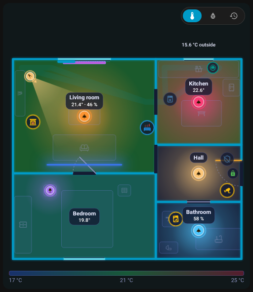{ loading=lazy }

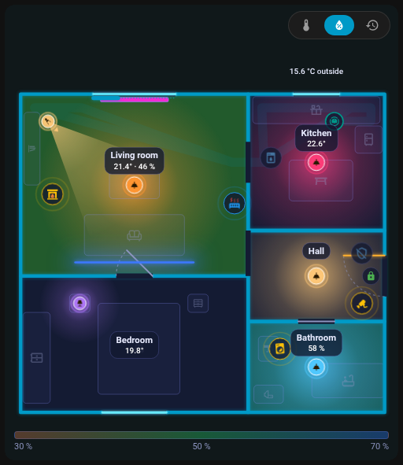{ loading=lazy }

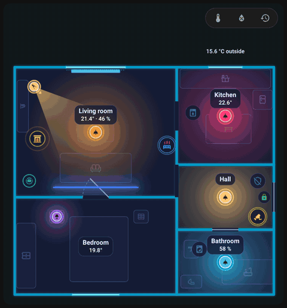{ loading=lazy }

*Toggling the temperature layer.*

## Day replay

The clock button opens a bar **under the plan**, which does not cover it. It replays the **last 24 hours** from the Home Assistant history: lights, doors and devices go back in time. Rule templates stay live during the replay.

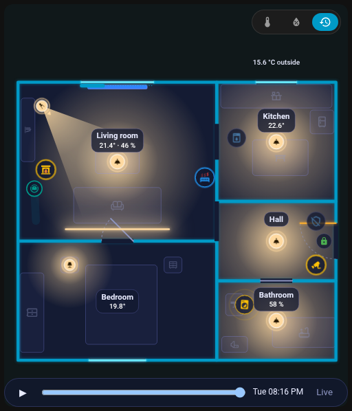{ loading=lazy }

## Tap behaviour

| Item | Tap | Hold |
|------|-----|------|
| Light | toggle | details |
| Appliance, vacuum, door, window | details | details |
| Scene, button, script | activate | |
| Room | opens the [room panel](room-panel.md) | |

Everything can be changed per item with [actions](editor/items.md#actions). Tooltips list what tap, double tap and hold do.

## Animations { #animations }

What the card shows when the entities change:

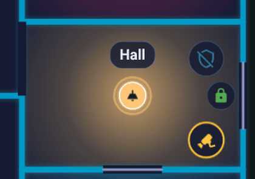{ loading=lazy }

*The front door opens and closes, the door leaf swings.*

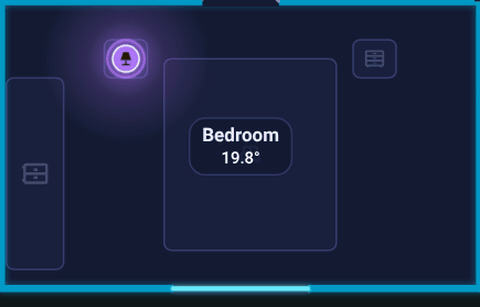{ loading=lazy }

*A window opens and closes.*

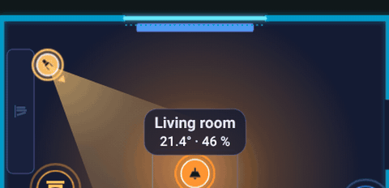{ loading=lazy }

*A blind is drawn along its window.*

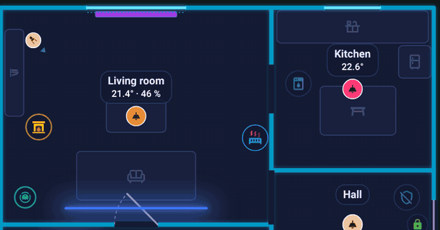{ loading=lazy }

*Lights turn on one after another, each room glows in the colour of its light.*

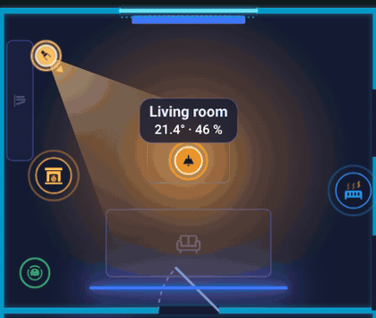{ loading=lazy }

*A light changes colour.*

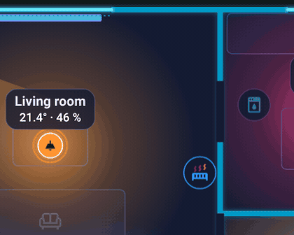{ loading=lazy }

*A motion sensor sends out a ripple, then calms down.*

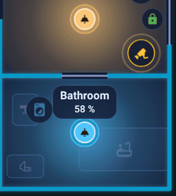{ loading=lazy }

*A running washing machine shows a ring around its icon.*

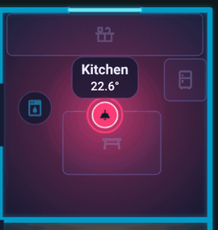{ loading=lazy }

*A countdown ring around the dishwasher while its timer runs.*

{ loading=lazy }

*A triggered alarm tints the whole flat until it is disarmed.*

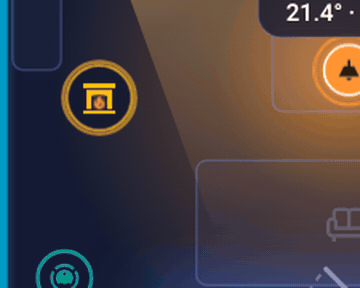{ loading=lazy }

*The flame of a fireplace flickers while its switch is on.*

## Performance

Animations run only while something moves and while the card is on the screen. Cards that are not visible do not animate, and `prefers-reduced-motion` suppresses icon animations.

Next: [Room panel](room-panel.md).
