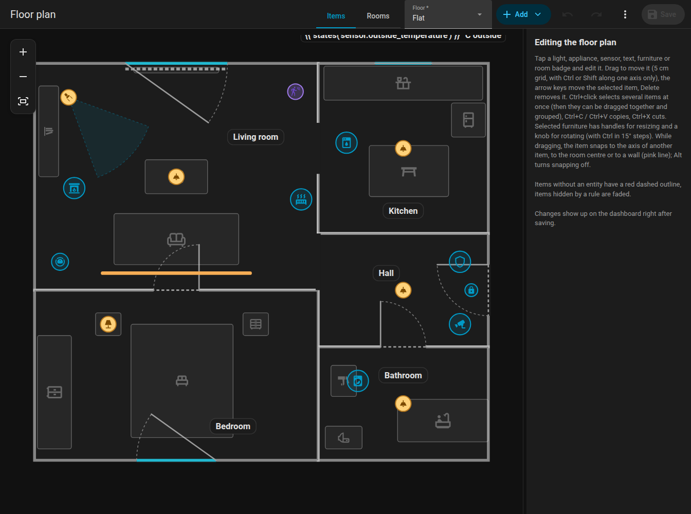
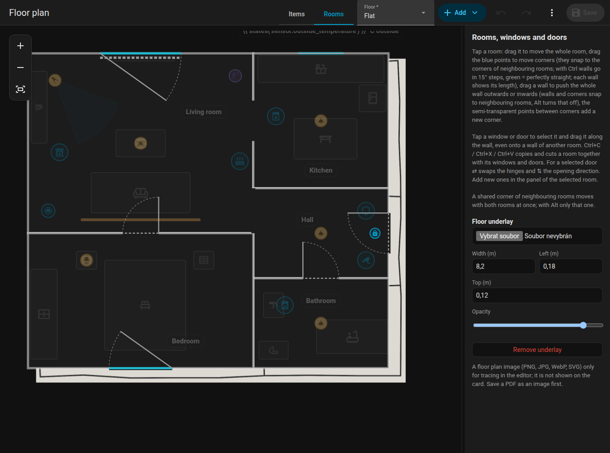

# Editor overview

The editor is the sidebar panel **Floor plan** (URL `/fns-floorplan`, administrators only). It edits the same plan the card shows. Nothing is changed in Home Assistant until you press **Save**.

{ loading=lazy }

## Layout

- **Top bar**, similar to the automation editor of Home Assistant:
    - the mode switch **Items / Rooms**,
    - the floor selector (when the plan has more floors),
    - **Add** (a menu of everything that can be placed),
    - undo and redo, zoom buttons (+, -, fit the whole plan),
    - **Save**,
    - the three-dot menu with **History**, **Check**, **Discard changes** and the floor management (new, rename, delete). A dot on the menu warns when the check found problems.
- **The plan** in the middle. Scroll the wheel to zoom around the cursor, drag an empty spot to pan, pinch with two fingers on a touch screen.
- **The side panel** on the right shows the form of the selected item. Drag the strip between the plan and the panel to change its width (260 px to 60 % of the window, at most 720 px); the width is remembered in the browser.

On a phone (narrower than 800 px) the plan fills the screen and the form opens as a bottom sheet when you tap an item, add one or open History or Check. Dragging an item does not open the sheet. Close it with the cross or by tapping the dimmed plan.

## Modes

| Mode | What you edit | The rest |
|------|---------------|----------|
| **Items** | Lights, LED strips, appliances, sensors, text items, furniture, room labels | Rooms are shown, but locked |
| **Rooms** | Rooms (corners, walls, whole rooms), doors and windows | Items are dimmed and locked |

See [Rooms](rooms.md), [Doors and windows](openings.md) and [Items](items.md).

## Selecting, moving, nudging

- Click an item to select it, drag it to move it. The grid is 5 cm.
- **Arrow keys** nudge the selection by 5 cm, **Delete** removes it.
- **Ctrl+click** adds items to the selection. Selected items move, nudge, copy and delete together.
- **Group** (in the form of a multi-selection) stores a `group`, so clicking one member always selects the whole group.
- **Esc** clears the selection.
- While dragging, pink **snap guides** show alignment with other items, the centre of a room and walls.

## Keyboard shortcuts

| Shortcut | Action |
|----------|--------|
| ++ctrl+z++ | Undo (100 steps) |
| ++ctrl+y++ or ++ctrl+shift+z++ | Redo |
| ++ctrl+c++ / ++ctrl+x++ / ++ctrl+v++ | Copy / cut / paste items or rooms. Pasting on the same floor offsets by 30 / 50 cm, on another floor the copy lands at the same place. A room is copied with its doors and windows. |
| ++ctrl++ + click | Add to the selection |
| ++delete++ | Delete the selection (a selected room corner is deleted, minimum 3 corners) |
| Arrow keys | Nudge by 5 cm |
| ++alt++ while dragging | Turn snapping and guides off |
| ++ctrl++ while dragging | Keep the movement on one axis (chosen by the first 5 cm of the move). Dragging a room corner with Ctrl instead snaps the walls to 15 degree steps, see [Rooms](rooms.md#angles-and-lengths). |
| ++ctrl++ while rotating | Rotate in steps of 15 degrees instead of 1 degree |
| ++esc++ | Clear the selection |

On macOS use ++cmd++ instead of ++ctrl++.

## Undo, redo and saving

Every change goes on the undo stack (100 steps). The revision is never undone. The editor warns when you leave with unsaved changes.

**Save** writes the whole plan. Every save increases the plan's revision `rev`. The editor sends the revision it loaded, and if someone else saved a newer plan meanwhile, the save is refused with a conflict message: choose **Discard changes** to reload and repeat your edits. See [Websocket API](../reference/websocket-api.md#revisions-and-conflicts).

Saved plans are kept: see [History and check](../history.md).

## Levels (floors)

A plan without levels has one floor. In the three-dot menu choose **Floors** to add a floor, rename it or delete it (a deleted floor takes its rooms and items with it; the first floor cannot be deleted). A new floor starts in the **Rooms** mode.

Rooms and items belong to a floor with the `level` key; ones without it belong to the first floor. Doors and windows follow their room. The floor selector at the top switches the floor being edited, and the card shows floor tabs. See the [Plan format](../reference/plan-format.md#levels).

## Tracing image

To draw a plan over an existing drawing, upload an image under a floor: floor management, **Tracing image**. Move and resize it, and set its opacity. The image is only visible in the editor, never on the card. Allowed formats are PNG, JPG, WEBP and SVG up to 15 MB. The file is stored in `www/fns_floorplan/` of your configuration (served as `/local/fns_floorplan/...`).

{ loading=lazy }

## Native Home Assistant fields

The forms use Home Assistant's own selectors (entity picker, number, select, switch, colour picker, icon picker) in collapsible sections (Basic, When running, Appearance, Position, Actions, Rules). Which sections are open is remembered. The entity picker also searches by name.

Items without an entity have a red dashed outline, so you find unfinished work at a glance.
