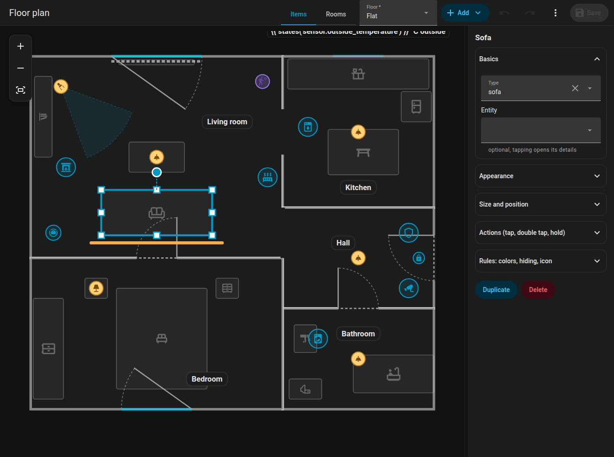

# Items

Items are everything on the plan that is not a wall: lights, appliances, sensors, text items, furniture and room labels. Edit them in the **Items** mode. **Add** inserts a new one; every item can be **duplicated** and **deleted**.

{ loading=lazy }

## Common settings

| Setting | Key | Meaning |
|---------|-----|---------|
| Entity | `entity` | Picked from all entities of your Home Assistant (the picker also searches by name) |
| Position | `x`, `z` | In metres; or drag |
| Size | `size` | `xs`, `s`, `m` (default), `l`, `xl`, `xxl` (0.6 to 2 times); for lights, appliances, the dock and texts |
| Icon | `icon` | Any `mdi:` icon; buttons **No icon** (`icon: none`) and **Reset** |
| Layer | `layer` | Stacking order among items of the same kind: **To front**, **Forward**, **Backward**, **To back** |
| Tap / double tap / hold | `tap_action` ... | [Actions](#actions) |
| Rules | `rules` | See [Rules](rules.md) |
| Hide in room panel | `sheet_hide` | Leaves the item out of the [room panel](../room-panel.md) |

Quick placement: when you add an item to a selected room, it goes to a 3 by 3 grid position inside it, keeping its distance from the walls.

## Lights

Add **Ceiling light**, **Pendant light**, **Panel**, **Table lamp**, **Wall light**, **Spot (directional)** or **LED strip**. Assign a `light` entity.

- The light follows its colour (`rgb_color`) or its colour temperature (`color_temp_kelvin`), otherwise a warm white. Brightness shrinks and fades the glow and brightens the badge or the strip.
- **Fixtures of one light in one room are one item** in the editor, as on the card: you drag the whole group, and changes and deletion apply to all of them. Ceiling spots of one room are one item.
- `room_light` sets how much of the room glows when the light is on (a share, `1` = 100 %, `false` = almost none).
- **Spot** (`lamp_spot`): a cone of light towards `rotation` (0 = right, 90 = down), `beam` degrees wide (default 40), clipped by the room. It is never merged with other fixtures of the same light.
- **LED strip** (`led_strip`): a line with `w` as its length; it glows in the real colour of the light. `glow_side` lets it shine only to one side (`1` = to the right of the strip direction, `-1` = the other side, none = all around).
- A light that is off has its icon in a dimmed colour, without the outer ring. The strip has an invisible 16 px area for tapping.

## Appliances and other devices

**Add, Appliance** (and the specific types) creates a `device` of a `kind`:

| Kind | Looks like |
|------|-----------|
| `fan`, `purifier`, `dishwasher`, `dryer` | Animated icons (the dryer shakes, the dishwasher bounces) |
| `boiler` | Water boiler |
| `radiator` | Heat waves rise while it animates (colour set by `wave`) |
| `alarm` | Shield by state; the flat pulses red when triggered, orange while arming |
| `media` | TV, speaker or Kodi icon, sound waves and the title while playing, cover art in the badge (`cover: false` turns it off) |
| `aquarium` | Bubbles |
| `camera`, `fridge`, `lock` | Icon with state colour |
| `fireplace` | A flame that flickers while burning |
| `generic` | "Other device": the entity's own icon, behaviour by domain (below) |

Settings: `name`, `entity`, `active` (a list of states or `{"above": n}` that count as "running"), `text` (always shown under the icon), `text_on` (shown while running; both may be templates such as `{{ states('sensor.washer_time') }}`), `color` / `color_on` (idle / running colour; without them the state colour of your Home Assistant theme is used), `fx` (the ring animation: `ring`, `radar`, `comet`, `countdown`, `spin`, `orbit`, `breath`, `blink`, `heartbeat`, `shake`, `none`).

Text labels under the icon have a background in the style of the room badge (light by day, dark at night).

### Other device by domain

A `generic` device behaves sensibly by the domain of its entity. Your own settings and rules win over these defaults.

| Domain | Runs when | Text | Ring | Tap |
|--------|-----------|------|------|-----|
| `fan` | on | speed in % | spin | details |
| `siren` | on | none | blink | details |
| `input_boolean`, `switch`, `binary_sensor` | on | none | ring | details |
| `humidifier` | on | humidity % | breath | details |
| `water_heater` | not off | temperature | breath | details |
| `climate` | `hvac_action` is heating / cooling / ..., without it state is not off | current to target temperature | breath | details |
| `valve`, `cover` | open, opening, closing | position % | spin while moving, else ring | details |
| `lawn_mower` | mowing | none | comet | details |
| `vacuum` | cleaning, returning | none | comet | details |
| `camera` | recording, streaming | none | radar | details |
| `person`, `device_tracker` | home | zone name when away | ring | details; the avatar photo in the badge, grey when away |
| `script` | on | none | spin | runs the script |
| `scene`, `button`, `input_button` | never | none | short blink when the time changes | activates the scene / presses the button |
| `input_select`, `select` | never | the state | none | details |
| `number`, `input_number`, `counter`, `sensor` | never | value with unit | none | details |
| `weather` | never | temperature | none | details |
| `sun` | above horizon | none | ring | details |
| `timer` | active | none | countdown from the timer itself | details |

A generic item with an `alarm_control_panel.*` or `lock.*` entity behaves like the dedicated alarm or lock kind.

### Icon animations

An appliance without an animated glyph of its own (generic, camera, fridge, lock, alarm) gets a CSS animation by the icon name while its state is on: fan and cog rotate, washer and dryer shake, dishwasher bounces, fire flickers, speakers pulse, garage doors and shutters move only the slats, steam rises, charging batteries light their cells one by one, and so on. Icons ending in `-off` never animate. A rule with `animate: false` turns the animation off, and `prefers-reduced-motion` suppresses it.

## Sensors

**Add, Sensor** places a binary sensor by `entity`. Its `device_class` decides what it does on the card:

- `motion`, `occupancy`, `presence`: smooth **ripples** while it is on,
- `moisture`: the room pulses red and a "Water leak" chip appears.

On the card a sensor is drawn only as ripples or as the room pulse; the editor shows it with an icon by its class. Sensors have a `layer` too, only relevant among sensors in the editor.

## Text items

**Add, Text** places free text: `text` (plain or a `{{ }}` template), or an `entity` whose state is shown. Settings: `x`, `z`, `rotation`, `size`, `color`, `background` (`none` for no background). Style: like a room badge.

```yaml
texts:
  - id: t_outside
    text: "{{ states('sensor.outdoor_temperature') }} °C outside"
    x: 4.2
    z: 0.3
    size: l
    background: none
```

## Furniture

**Add, Furniture** adds one of these types (sorted by name in the picker, with a search; "Other" is last):

| Type | Meaning | Type | Meaning |
|------|---------|------|---------|
| `bed` | Bed | `bunk_bed` | Bunk bed |
| `nightstand` | Nightstand | `wardrobe` | Wardrobe |
| `dresser` | Dresser | `shelf` | Shelf, bookcase |
| `tall_cabinet` | Tall cabinet | `sideboard` | Sideboard |
| `sofa` | Sofa | `sofa_corner` | Corner sofa (L shape) |
| `coffee_table` | Coffee table | `table` | Table |
| `chair` | Chair | `desk` | Desk |
| `office_chair` | Office chair | `bench` | Bench |
| `coat_rack` | Coat rack | `tv_board` | TV board |
| `tv_wall` | TV on the wall (plays colours when it has a media player) | `kitchen` | Kitchen counter |
| `kitchen_wall` | Wall cabinets | `kitchen_tall` | Tall kitchen cabinet |
| `fridge` | Fridge | `sink` | Sink |
| `stove` | Stove | `dishwasher` | Dishwasher |
| `washer` | Washing machine | `dryer` | Dryer |
| `bathtub` | Bathtub | `shower` | Shower |
| `washbasin` | Washbasin | `wc` | Toilet |
| `radiator` | Radiator | `robot_vacuum` | Robot vacuum dock, see [Robot vacuum](../robot-vacuum.md) |
| `other` | Other | | |

- A selected piece has handles in the corners and on the sides to **resize** (the opposite side stays, grid of 5 cm) and a wheel to **rotate** in steps of 1 degree (++ctrl++ for 15 degrees). The icon turns with the furniture.
- The **corner sofa** is L-shaped; the seat is 40 % of the shorter side.
- `color` sets the default colour of a piece; a rule wins over it.
- Furniture is dimmed in the editor so that it does not steal attention.

{ loading=lazy }

## Layers

The stacking order is only compared among items of the same kind. Use **To front / Forward / Backward / To back** in the form. The robot vacuum has its own rules, see [Robot vacuum](../robot-vacuum.md#layer-and-stacking).

## Groups and multi-selection

Ctrl+click several items to select them. In the form of the selection press **Group**: a `group` is stored and a click on any member selects the whole group. Selected items drag, nudge, copy (++ctrl+c++, ++ctrl+v++), cut (++ctrl+x++) and delete together. See the [shortcuts](index.md#keyboard-shortcuts).

## Actions { #actions }

Every item (also doors and windows) accepts `tap_action`, `double_tap_action` and `hold_action` in the Home Assistant format:

| `action` | Meaning |
|----------|---------|
| `toggle` | Toggle the entity |
| `more-info` | Open the entity details |
| `perform-action` | Call an action: `perform_action` and `data` |
| `navigate` | Go to `navigation_path` |
| `url` | Open `url_path` |
| `none` | Do nothing |

Defaults: a light toggles on tap and shows details on hold; an appliance, a vacuum, a door and a window show details. A double tap delays a single tap by 250 ms, but only when a double tap action is set. Hovering an item with the mouse shows a tooltip: the name and what tap, double tap and hold do.

```yaml
tap_action:
  action: perform-action
  perform_action: scene.turn_on
  data:
    entity_id: scene.movie_night
hold_action:
  action: more-info
```

Next: [Rules](rules.md).
