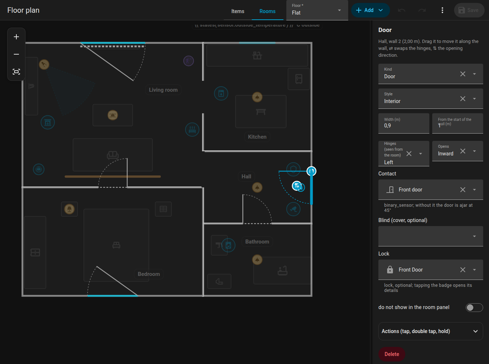

# Doors and windows

Doors and windows ("openings") belong to a wall of a room. Edit them in the **Rooms** mode.

{ loading=lazy }

## Adding and moving

1. Select a room and choose the wall in the side panel (or select the room and use the add buttons for door / window on the chosen wall).
2. A new door or window appears on that wall.
3. **Click** it to select it and **drag** it along the wall to slide it. Arrow keys nudge it by 5 cm.
4. Drag it to the wall of **another room** and it moves there (the nearest wall on the floor wins).

Adding or removing a room corner never moves an opening away from where it was.

## Settings

| Setting | Key | Meaning |
|---------|-----|---------|
| Type | `type` | `door` or `window` |
| Door style | `style` | A normal door (interior, entrance, glazed) or `passage` = only an opening without a leaf |
| Width | `width` | In metres |
| Offset | `offset` | Distance of the opening's centre from the start of the wall |
| Hinge | `hinge` | `left` or `right`, seen from inside the room |
| Swing | `swing` | `in` or `out` |
| Contact | `contact` | A binary sensor (door / window contact) |
| Lock | `lock` | A `lock` entity shown at the door |
| Blind | `blind` | A `cover` entity drawn as a bar along the window |

The leaf and the arc show the hinge and the swing. With the opening selected, the button **flip hinge** mirrors the hinge side and **flip swing** the opening direction, right on the plan.

## Contact sensor

With a `contact`, the opening animates open (doors swing to 90 degrees), glows orange while open, and pulses for the first 6 seconds after opening. Without a contact:

- a **door** is drawn ajar at 45 degrees,
- a **window** or glazed balcony door stays closed.

Tapping an opening on the card opens the contact's details (more-info). You can set [tap actions](items.md#actions) on openings too.

## Locks

`lock` takes a lock entity and draws a small lock badge at the door, inside the room. It is green when locked, orange when unlocked, red when jammed and blue with a ring while locking or unlocking. Tapping it only opens the details, so a door is never unlocked by accident. The size is `lock_size` (default S).

## Blinds

`blind` is a `cover` entity (a roller shutter or blind). It is drawn as a bar along the window that gets longer as the blind closes, on a dotted track along the whole width of the window: 50 % closed fills half of it. While the cover is moving the bar animates. Tapping the blind opens its details.

| Key | Effect |
|-----|--------|
| `blind_side: out` | Draws the blind outside the wall instead of inside |
| `blind_invert: true` | For blinds that report 100 for "closed" |

The position comes from the cover's `current_position`, without it from `closed`.

## Example

```yaml
openings:
  - id: d_front
    room_id: hall
    edge: 0
    offset: 1.1
    width: 0.9
    type: door
    hinge: left
    swing: in
    contact: binary_sensor.front_door
    lock: lock.front_door
  - id: w_living
    room_id: living_room
    edge: 2
    offset: 1.8
    width: 1.4
    type: window
    contact: binary_sensor.living_room_window
    blind: cover.living_room_blind
    blind_side: out
```

Next: [Items](items.md). Reference: [Plan format](../reference/plan-format.md#openings).
