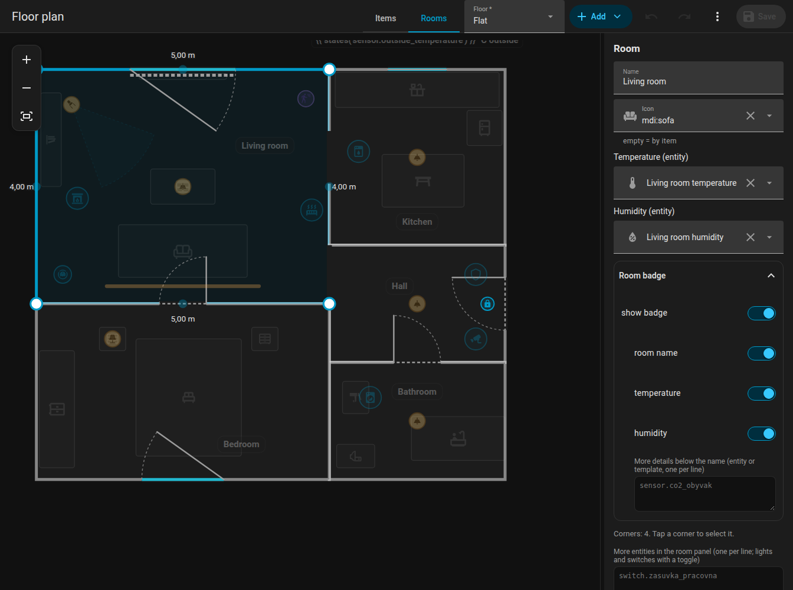

# Rooms

Switch the editor to **Rooms** to edit the shape of the flat. Everything else is dimmed and locked in this mode.

{ loading=lazy }

## Adding a room

**Add, Room** inserts a square of 2 by 2 metres. Every room is its own polygon with `id`, `name` and `points` in metres (`x` right, `z` down).

## Corners

- Click a room to select it. The **blue points** are its corners; drag them. The half-transparent points between corners add a new corner when you drag them.
- Select a corner and press **Delete** (or use the button in the side panel) to remove it. A room needs at least three corners.
- The side panel shows the coordinates of the selected corner and lets you type them.
- Adding or removing a corner keeps the doors and windows of the room where they are.

## Walls and whole rooms

- Drag a **whole wall** of the selected room: both its corners move perpendicular to the wall. A corner shared with a neighbour goes with it.
- Drag the room itself to **move the whole room**.
- Arrow keys nudge the selected room, corner or wall by 5 cm.

{ loading=lazy }

*Dragging a whole wall: the lengths of the neighbouring walls update.*

{ loading=lazy }

*Moving a whole room by dragging its floor.*

## Snapping to neighbours

Corners, walls and whole rooms snap to corners and walls of other rooms on the same floor within 15 cm, shown by a pink guide line. Hold ++alt++ to turn snapping off. Otherwise the grid of 5 cm applies.

{ loading=lazy }

*A corner snaps to the corner of the neighbouring room.*

## Shared walls

Each room has its own polygon, so a wall between two rooms is two walls on top of each other. When you drag a corner that sits on top of another room's corner, **both move together** (Alt moves only one). Dragging a wall also moves corners of other rooms that lie anywhere on it. If you need to separate them on purpose, hold Alt.

## Angles and lengths { #angles-and-lengths }

- The selected room shows the **length of every wall** (outside the room), live while dragging.
- Hold ++ctrl++ while dragging a corner: the wall to the neighbouring corner snaps to **15 degree steps**, the length to 5 cm. Near the intersection of the two walls the corner jumps to it, which gives a right angle.
- The walls of the selected corner are marked: a green **straight** marker when a wall is exactly horizontal or vertical, otherwise an orange marker with the angle.

{ loading=lazy }

*Dragging a corner with Ctrl held: 15 degree steps and the green "straight" marker.*

## Name, icon and climate

| Field | Meaning |
|-------|---------|
| Name | Shown in the room label and in the room panel |
| Icon | Shown in the header of the [room panel](../room-panel.md) (`icon`) |
| Temperature | A temperature sensor (`temperature`) |
| Humidity | A humidity sensor (`humidity`) |
| Extra entities | Entities for the room panel (`sheet_extra`), one per line; **Add an entity** below the field picks one from Home Assistant |

Both lists (extra entities and the label's details) also take a **template** that renders entity ids, one per line, as a list or separated by commas. A template over several lines is one entry:

```jinja

- light.terrace
- switch.blinds

- light.night_lamp

```

## Room label

Every room shows a **label** (a badge) with its name and the values. Options:

| Key | Effect |
|-----|--------|
| `label_info` | A list of what to show: `temperature`, `humidity`, entity ids or templates. Default: temperature and humidity. In the form, **Add an entity** adds an entity as a new line |
| `label_name: false` | Hides the name, keeps the values |
| `label_hidden: true` | Hides the whole label |
| `label_rotation` | Rotates the label (degrees) |

In the **Items** mode you can drag a label to a new place; the position is stored in `labels`. Rooms also take [rules](rules.md): `tint` colours the floor, `hide` hides the label.

## Deleting

**Delete room** in the side panel removes the room with its doors, windows and label.

Next: [Doors and windows](openings.md).
