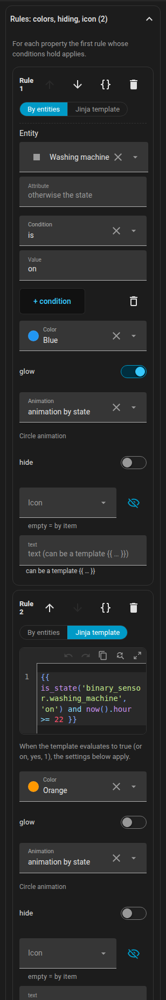
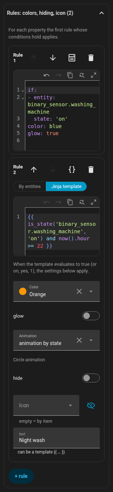

# Rules

Rules make an item react to more than its own state. They exist on every kind of item: lights, LED strips, appliances, the robot vacuum dock, furniture, text items and rooms.

{ loading=lazy }

## How rules are evaluated

`rules` is an ordered list. Each rule has conditions (`if`) and outputs. **For each output field, the first rule whose conditions all hold and which sets that field wins.** A rule without `if` is the default.

```yaml
rules:
  - if: [ ... ]        # all conditions must hold (AND)
    color: red
  - color: blue        # no "if": applies when no earlier rule set a colour
```

## Conditions

You can write conditions in two modes. Every rule has a switch **By entities / Jinja template**; switching from entities to Jinja converts the existing conditions.

=== "By entities"

    A condition is `{entity, attribute?, state | state_not | above | below}`. `state` and `state_not` may be a list. `{any: [conditions]}` is an OR group.

    ```yaml
    if:
      - entity: climate.living_room
        attribute: hvac_action
        state: heating
      - entity: sensor.outdoor_temperature
        below: 5
      - any:
          - entity: binary_sensor.window
            state: "on"
          - entity: binary_sensor.door
            state: "on"
    ```

    In the form, each condition has an entity (with a **this entity** shortcut), an optional attribute, and the operator is / is not / above / below / template. New conditions are prefilled with the entity of the item (a room uses its temperature sensor).

=== "Jinja template"

    A single condition `{template: "{{ ... }}"}`. Home Assistant renders it live, and it is true for `true`, `on`, `yes`, `1` or a non-zero number.

    ```yaml
    if:
      - template: "{{ is_state('binary_sensor.front_door', 'on') and states('sensor.outdoor_temperature') | float(0) < 0 }}"
    ```

A `text` output that contains `{{ }}` is a template as well.

## Outputs

| Output | Effect |
|--------|--------|
| `color` | Tints the icon and the badge border; on furniture the outline and fill; on a light it overrides the bulb colour (badge, glow, strip); on the robot it replaces the theme colour, also in the dock |
| `glow` | Adds a glow around the item |
| `animate` | Overrides `active` of an appliance: `true` / `false`. `animate: false` also stops the icon animation |
| `wave` | Colour of the radiator's heat waves |
| `text` | Replaces the text under the icon (plain or a template) |
| `tint` (or `color`) | On a room: shades the floor; `opacity` sets its strength (default 0.14) |
| `hide` | Hides the item (on a room: its label) |
| `icon` | Swaps the icon (appliances, lights, furniture, the dock). `none` removes it; pick it with the icon picker |
| `background` | Background of a text item |
| `fx` | Ring animation: `ring`, `radar`, `comet`, `countdown`, `spin`, `orbit`, `breath`, `blink`, `heartbeat`, `shake`, `none` |
| `progress` | An entity that drives a `countdown` (see below) |
| `progress_total` | A length in minutes for a `countdown` |

Colours: `red`, `orange`, `yellow`, `green`, `blue`, `purple`, `pink`, `white`, `black`, any theme colour name picked in the form (stored by name, for example `teal`), or any CSS colour (hex, `rgb(...)`, `var(...)`).

Lights, LED strips, the dock and furniture have no ring animation of their own, so the ring appears only when a rule sets `fx`. The ring of a LED strip is in the middle of the strip, on furniture in the middle of the rectangle.

For an output of a ring the priority is: rule, then the appliance's own setting, then the alarm default by state.

### Countdown

`fx: countdown` draws a shrinking arc. Where it gets its progress:

- `progress: timer.kitchen`: a `timer` (active or paused),
- `progress: sensor.dryer_remaining` with `device_class: duration` (seconds, minutes or hours; the total is `progress_total`, otherwise the highest value seen so far),
- `progress: sensor.dryer_end` with `device_class: timestamp` (the end time; the start is the `last_changed` of the running device, otherwise `progress_total`),
- `progress: sensor.dryer_progress` in `%`: the ring **fills like a battery** (0 % empty, 100 % full),
- `progress_total: 45` without an entity: a countdown of that length in minutes, measured from the change of the rule's condition entity (for an appliance from the moment it starts running).

Without any of these the countdown is a decorative 4 second cycle.

## Rules as YAML

Every rule has a **{ }** button in its header that opens just that rule as YAML in the Home Assistant code editor (syntax colours, line numbers, suggestions for entities and icons). The change is committed when you leave the editor. The same YAML is what you see in the [plan format](../reference/plan-format.md#rules).

{ loading=lazy }

## AI Task assistant

If your Home Assistant has an `ai_task.*` entity that supports data generation, the Rules section shows **Suggest with AI**. Describe in a sentence what you want. The editor sends the description to `ai_task.generate_data` together with the rules format, the outputs allowed for this item, its entity (state and attributes), the current rules and a list of your entities (up to 1500, without update, event, scene and script entities). The answer arrives as YAML and opens as a **draft**; only **Use draft** replaces the rules. If the request cannot be fulfilled, the assistant answers with one sentence that you see as a message.

## Examples

### Washing machine finishing

```yaml
devices:
  - id: washer
    kind: generic
    name: Washer
    entity: sensor.washer_state
    icon: mdi:washing-machine
    x: 1.2
    z: 3.4
    rules:
      - if:
          - entity: sensor.washer_state
            state: running
        color: blue
        animate: true
        fx: countdown
        progress: sensor.washer_finish_time   # device_class: timestamp
      - if:
          - entity: sensor.washer_state
            state: finished
        color: green
        fx: blink
        text: Done
```

### Door left open

A template with `now()` is re-rendered every minute, so the rule turns on five minutes after the door opened.

```yaml
rooms:
  - id: hall
    name: Hall
    points: [[0, 0], [3, 0], [3, 2.5], [0, 2.5]]
    rules:
      - if:
          - template: >-
              {{ is_state('binary_sensor.front_door', 'on')
                 and (now() - states.binary_sensor.front_door.last_changed).total_seconds() > 300 }}
        tint: orange
        opacity: 0.3
```

### Leak alarm

```yaml
devices:
  - id: leak
    kind: generic
    name: Leak
    entity: binary_sensor.kitchen_leak
    x: 2.0
    z: 1.0
    rules:
      - if:
          - entity: binary_sensor.kitchen_leak
            state: "on"
        color: red
        glow: true
        fx: blink
        text: Leak!
      - hide: true
```

The last rule has no condition, so the item is hidden whenever there is no leak.

### Battery-style percentage ring

```yaml
devices:
  - id: phone_battery
    kind: generic
    name: Phone
    entity: sensor.phone_battery_level
    x: 4.0
    z: 2.0
    rules:
      - if:
          - entity: sensor.phone_battery_level
            below: 20
        color: red
        fx: countdown
        progress: sensor.phone_battery_level
      - fx: countdown
        progress: sensor.phone_battery_level
        color: green
```

### Timer countdown

An oven that counts down 45 minutes from the moment it is switched on:

```yaml
devices:
  - id: oven
    kind: generic
    name: Oven
    entity: switch.oven
    x: 3.1
    z: 0.4
    rules:
      - if:
          - entity: switch.oven
            state: "on"
        fx: countdown
        progress_total: 45
        color: orange
```

And a kitchen timer helper that drives the ring:

```yaml
    rules:
      - if:
          - entity: timer.kitchen
            state: active
        fx: countdown
        progress: timer.kitchen
        color: yellow
```

### Radiator that reacts to window, boost and valve

```yaml
devices:
  - id: radiator_living
    kind: radiator
    entity: climate.living_room
    x: 4.3
    z: 1.1
    rules:
      - if:
          - entity: switch.boost_living_room
            state: "on"
        color: yellow
      - if:
          - any:
              - entity: binary_sensor.living_room_window
                state: "on"
              - entity: binary_sensor.balcony_door
                state: "on"
        color: blue
      - if:
          - entity: switch.valve_living_room
            state: "on"
        color: orange
        animate: true
        wave: red
      - animate: false
```

Back to [Items](items.md), or see the [Plan format](../reference/plan-format.md#rules).
