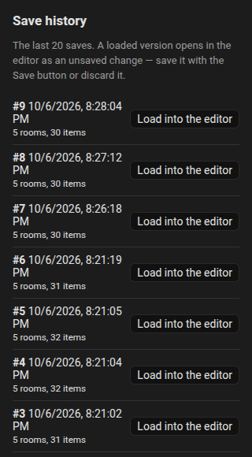
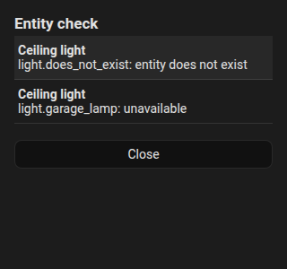

# History and check

Both are in the three-dot menu of the [editor](editor/index.md).

## History

The integration keeps the **last 20 saved plans** (in `.storage/fns_floorplan.history`). Every save pushes the previous plan to the history.

1. Open the menu, **History**.
2. The list shows each revision with the date, the number of rooms and items.
3. Choose one: it loads into the editor as an **unsaved change**, so you can look at it, correct it and **Save**, or **Discard** it.

Restoring never touches the stored plan until you save. See [Websocket API](reference/websocket-api.md#history) for the commands behind it.

{ loading=lazy }

## Check

**Check** lists problems of the plan:

- entities that **do not exist** any more,
- entities that are **unavailable**,
- items **without an entity**,
- the same inside rules,
- vacuum room names that are not paired.

Click a row to jump to that item. A dot on the menu shows when there are problems.

{ loading=lazy }
