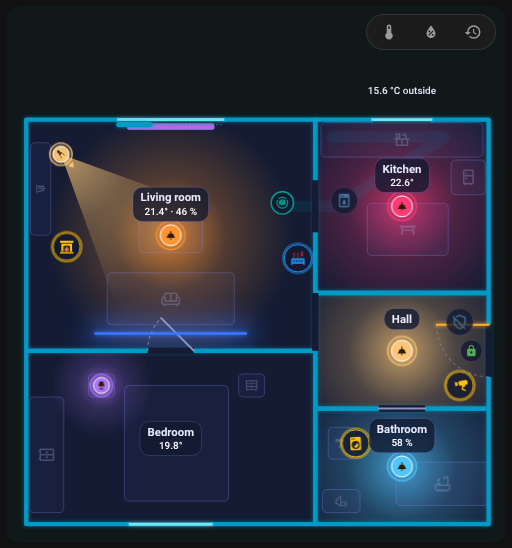

# FNS Floorplan – help

FNS Floorplan turns your Home Assistant dashboard into a living floor plan: lights glow in their real colour, doors and windows swing open and a robot vacuum drives through the room it reports. You draw the plan in a built-in editor, with no YAML and no image editing.

Here you will find guides to the card and the editor and solutions to the most common problems. When something does not work, look for the symptom you see.

!!! info "Inspired by NeonPlan 3D"
    FNS Floorplan was inspired by [NeonPlan 3D](https://github.com/Mastershort/neonplan3d), a 3D floor plan card for Home Assistant. It takes the idea to an animated 2D plan with its own editor. [Coming from NeonPlan 3D?](quick-start.md#coming-from-neonplan-3d)

!!! tip "Ask on GitHub"
    Did not find your problem? [Open a new issue](https://github.com/matata86/fns-floorplan/issues) on GitHub, or try the [live demo](https://matata86.github.io/fns-floorplan/demo/) first, it runs the real card with fake states.

!!! example "Like FNS Floorplan?"
    Support it on [Ko-fi](https://ko-fi.com/matata86), with [PayPal](https://paypal.me/matata86) or with [Bitcoin](support.md).

## Getting started
- [Installation](installation.md)
- [Quick start: your first plan in about ten steps](quick-start.md)

## The card
- [Card: adding it and all options](card.md)
- [Light and dark appearance](card.md#light-and-dark)
- [Animations](card.md#animations)
- [Room panel](room-panel.md)

## The editor
- [Editor overview](editor/index.md)
- [Rooms](editor/rooms.md)
- [Doors and windows](editor/openings.md)
- [Items](editor/items.md)
- [Rules](editor/rules.md)
- [History and check](history.md)

## Robot vacuum
- [Robot vacuum: room sensor, dock and driving](robot-vacuum.md)

## When something doesn't work
- [The card is not found after the installation](help/card-not-found.md)
- ["Custom element doesn't exist" or a configuration error appears](help/custom-element-missing.md)
- [The card shows the old version after an update](help/old-version-after-update.md)
- [The card says it is waiting for the integration](help/waiting-for-integration.md)
- [The plan is empty](help/plan-empty.md)
- [The sidebar entry is missing](help/sidebar-entry-missing.md)
- [Icons are missing](help/icons-missing.md)
- [Saving says the plan changed meanwhile (conflict)](help/plan-conflict.md)
- [The card is slow or choppy](help/performance.md)
- [A light does not glow in the colour I expect](help/light-wrong-colour.md)
- [A rule does not apply](help/rule-not-applied.md)
- [Some texts are not translated](help/languages.md)
- [Something else does not work](help/still-not-working.md)

## Reference
- [Plan format](reference/plan-format.md)
- [Websocket API](reference/websocket-api.md)

## Changelog
- [What changed in which version](changelog.md)

{ loading=lazy }

| Dark theme | Light theme |
|---|---|
| { loading=lazy } | { loading=lazy } |
