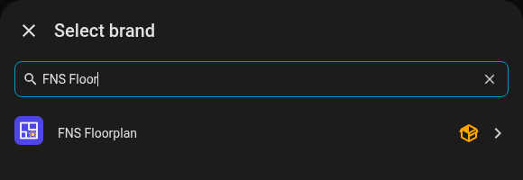
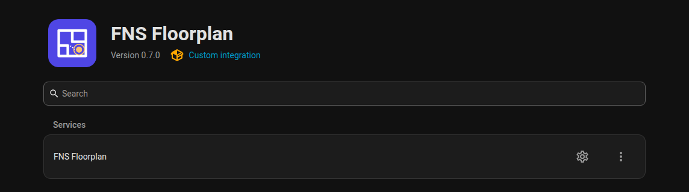
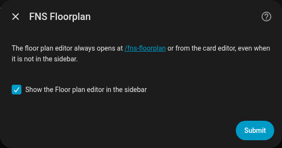
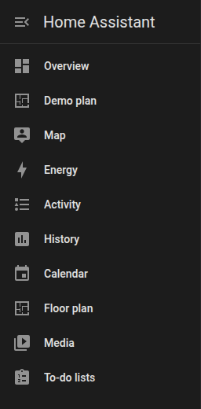
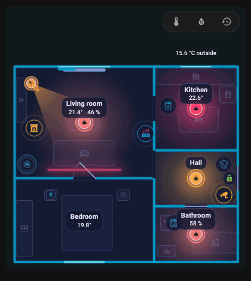

# Installation

## Requirements

- Home Assistant **2025.1.0** or newer.
- [HACS](https://hacs.xyz) for the recommended installation (manual installation works too).
- An admin account for the editor. The card itself works for every user.

## Install with HACS

FNS Floorplan is not in the default HACS list, so you add it as a custom repository.

1. Open **HACS** in the Home Assistant sidebar.
2. Open the three-dot menu in the top right corner and choose **Custom repositories**.
3. Enter `https://github.com/matata86/fns-floorplan` as the repository and choose the category **Integration**. Click **Add**.
4. Search for **FNS Floorplan** in HACS and click **Download**.
5. **Restart Home Assistant** (Settings, System, Restart).

Or open it in HACS directly with this button:

## Install manually

1. Download the latest release from the [releases page](https://github.com/matata86/fns-floorplan/releases) or clone the repository.
2. Copy the folder `custom_components/fns_floorplan` into the `custom_components` folder of your Home Assistant configuration, so that `custom_components/fns_floorplan/manifest.json` exists.
3. Restart Home Assistant.

## Add the integration

1. Go to **Settings, Devices & services, Add integration**.
2. Search for **FNS Floorplan** and add it. There is nothing to configure, only one instance can exist.

Or start it with this button:

{ loading=lazy }

{ loading=lazy }

The integration registers the card, so you do not have to add a dashboard resource by hand.

## Options

Click **Configure** on the integration card.

| Option | Default | Meaning |
|--------|---------|---------|
| Show the editor in the sidebar | on | Adds the **Floor plan** entry to the sidebar (admins only). |

The editor is always reachable at `/fns-floorplan` (for example `http://homeassistant.local:8123/fns-floorplan`), even with the sidebar entry hidden. The card editor in the dashboard has an **Edit floor plan** button that opens the same address.

{ loading=lazy }

{ loading=lazy }

## Add the card

In dashboard edit mode choose **Add card**, search for "floor" and pick **FNS Floorplan**. The visual editor offers the options below and the **Edit floor plan** button; **Show code editor** switches to YAML.

{ loading=lazy }

{ loading=lazy }

{ loading=lazy }

{ loading=lazy }

With `rotate` the plan turns by 90 degrees on a narrow card, shown here switching `rotate` between `true` and `false`.

## Update

Update through HACS like any other integration and restart Home Assistant. The card and the editor are loaded with the integration version in the URL, so your browser drops its cache by itself. If you still see the old version, see the [FAQ](help/old-version-after-update.md).

Your plan is stored by Home Assistant (`.storage/fns_floorplan`) and is not touched by updates.

## Uninstall

1. Remove the card from your dashboards.
2. **Settings, Devices & services, FNS Floorplan, three-dot menu, Delete.**
3. Remove the repository in HACS (or delete the folder `custom_components/fns_floorplan`) and restart.
4. Optional: delete the stored plan files `.storage/fns_floorplan` and `.storage/fns_floorplan.history`, and the tracing images in `www/fns_floorplan/`.

Next: [Quick start](quick-start.md).
