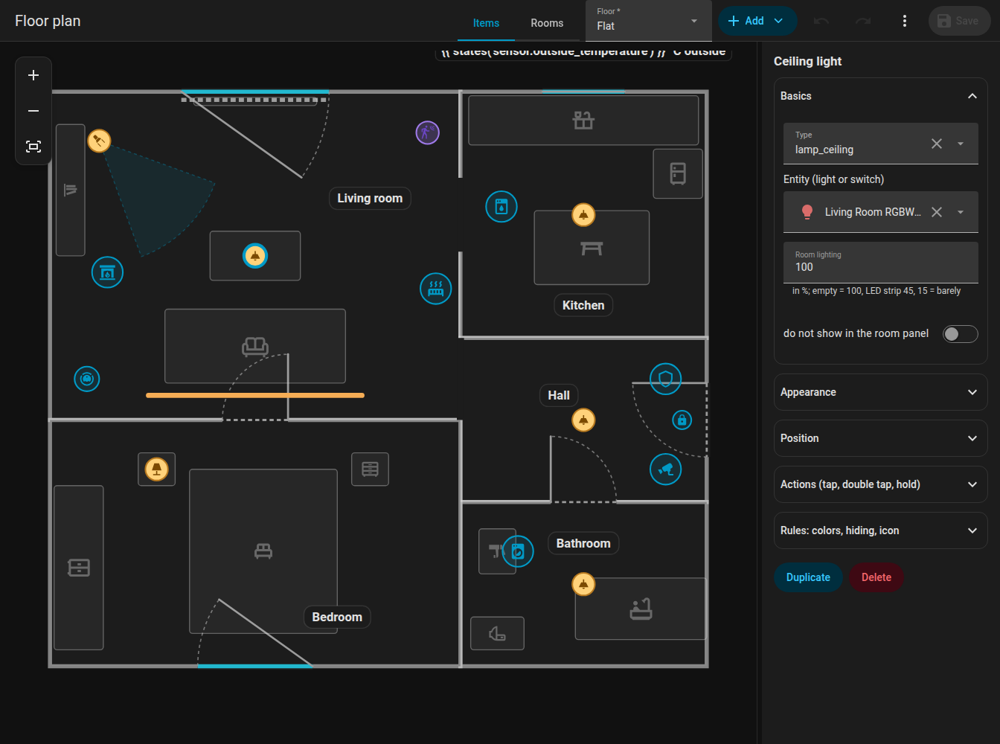

# Quick start

From zero to a working plan in ten steps. It assumes the integration is [installed](installation.md).

1. **Open the editor.** Click **Floor plan** in the sidebar, or open `/fns-floorplan`.
2. **Switch to Rooms.** The tabs at the top are **Items**, **Rooms** and **Look**. Choose **Rooms**.
3. **Add a room.** Open **Add** and choose **Room**. A square of 2 by 2 metres appears. Drag its blue corner points to the shape of your room, drag the half-transparent points between corners to add a corner. Details in [Rooms](editor/rooms.md).
4. **Name it.** In the side panel enter the room name, and optionally a temperature and a humidity entity.
5. **Add more rooms.** Drag them next to each other, corners snap to the corners of neighbours within 15 cm.
6. **Add doors and windows.** Select a room, choose a wall in the side panel and add a door or a window; slide it along the wall. See [Doors and windows](editor/openings.md).
7. **Switch to Items.** Add lights, appliances, sensors and furniture with **Add**. Pick an entity for each. See [Items](editor/items.md).
8. **Save.** Click **Save**. The plan is stored in Home Assistant and every open card redraws by itself.
9. **Add the card.** Edit a dashboard, **Add card**, search for **FNS Floorplan**, or use YAML:

    ```yaml
    type: custom:fns-floorplan-card
    mode: auto
    rotate: auto
    ```

10. **Try it.** Turn a light on, open a door contact, start the dishwasher. Tap a room to open the [room panel](room-panel.md).

{ loading=lazy }

## Coming from NeonPlan 3D?

FNS Floorplan was inspired by [NeonPlan 3D](https://github.com/Mastershort/neonplan3d). If you already drew your home there, you can convert it once instead of starting from scratch:

1. Get the building from NeonPlan with the websocket command `neonplan3d/building/get` and save the result as `building.json`.
2. Convert it:

    ```bash
    python3 tools/import_neonplan.py building.json > plan.json
    ```

    An optional second file (`extras.json`) adds what NeonPlan does not know: devices, label positions and rules. See the comment at the top of the script.

3. Save `plan.json` with `fns_floorplan/plan/save` (see [Websocket API](reference/websocket-api.md)) and fine-tune the result in the editor.

!!! warning
    The import replaces the whole plan. Run it once at the beginning, not after you have edited the plan.

## Good next steps

- Make an appliance react to more than its state with [Rules](editor/rules.md).
- Add a robot vacuum: [Robot vacuum](robot-vacuum.md).
- Put a floor plan image under the plan and trace it: [Editor overview](editor/index.md#tracing-image).
- Several floors: [Editor overview](editor/index.md#levels-floors).
- Change the colours of walls, floors, labels and states in the [Look](editor/look.md) tab.
