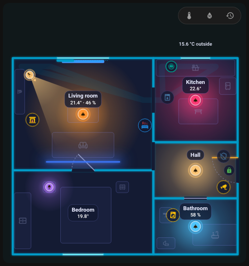

# Robot vacuum

The robot vacuum is drawn as a small robot that lives in its **dock** and drives through the room it reports while it cleans.

{ loading=lazy }

## The dock item

Add **Robot vacuum** (furniture type `robot_vacuum`) and place it where the dock stands. Its form has:

| Field | Key | Meaning |
|-------|-----|---------|
| Entity | `entity` | The `vacuum` entity |
| Room sensor | `room_sensor` | A sensor whose state is the name of the room the vacuum is in (for Roborock `sensor.*_current_room`) |
| Room pairing | `room_map` | `{ "<room name in the vacuum>": "<room id in the plan>" }` |
| Battery | `battery` | Battery sensor; empty = the `battery` sensor of the vacuum's device |
| Running section | `color_on`, `fx`, `progress`, `progress_total` | Look while cleaning |
| Layer | `layer` | See [below](#layer-and-stacking) |

The dock also takes [rules](editor/rules.md) (a rule `color` replaces the theme colour, also in the dock) and a tap action; the default tap opens the details.

## Room sensor and room_map

The card needs to know which plan room the vacuum reports. The **Room pairing** table in the dock's form lists the names from the `options` of the room sensor, the keys already in `room_map`, the current state and names you add by hand. For each name choose:

- **automatic**: the same name or id as a plan room, ignoring case and diacritics,
- a **specific room**,
- **do not pair** (`__none`): the robot does not drive into that room.

The **Check** (see [History and check](history.md)) reports names from the sensor's options that are not paired.

```yaml
furniture:
  - id: dock
    type: robot_vacuum
    entity: vacuum.robot
    room_sensor: sensor.robot_current_room
    room_map:
      Living room: living_room
      Kitchen: kitchen
      Hallway: __none
    x: 0.4
    z: 3.1
```

An older plan with a top-level `vacuum` key (`entity`, `room_sensor`) still works; the editor converts it to a dock on the next save.

## How it drives

| State | What you see |
|-------|--------------|
| `cleaning` | The robot drives in stripes through the room from the room sensor and leaves a trail |
| `returning` | It drives to the dock; the trail is cleared |
| `docked`, `charging` | It sits in the dock. A **ring around it shows the battery** (full at 100 %), it only breathes when the battery is unknown. The robot has the theme colour of the vacuum state |
| `idle`, `paused`, `error` | It stands **in its room** on a free spot and blinks (the badge border has the state colour, errors are red) |

- Between rooms and back to the dock it drives **through doors and passages** (a path search over openings other than windows; the other side of an opening is the room 35 cm behind the wall). With no path it drives straight.
- When the page loads and the robot is not in the dock, it appears directly in its room instead of driving out of the dock.
- The robot keeps the orientation it has in the dock while driving.
- **Parking on a free spot:** a stopped robot stands where it covers nothing: farthest from the badge, lights and labels. The spot is computed after the card is drawn.
- **Whole-floor tour:** when it cleans and the room is unknown (no sensor, or no pairing), it tours **all rooms of the floor**: the nearest next one, through doors, stripe by stripe, skipping unreachable rooms, then back to the dock.

## While cleaning

The section **While running (cleaning)** sets what the dock shows while the robot cleans: `color_on`, a ring `fx` (for example `comet`) and, for a countdown, `progress` / `progress_total` (see [Rules](editor/rules.md#countdown)).

## Layer and stacking { #layer-and-stacking }

While it drives the robot is drawn **above furniture and walls and below lights, appliances and labels**. When it stands still, `layer: 0` keeps the same order; a `layer` above 0 puts it above lights and appliances while it stands.

## Hiding it from the room panel

The robot appears in the [room panel](room-panel.md) of the room with its dock. Tick **do not show in room panel** (`sheet_hide: true`) to leave it out.

## A vacuum as an ordinary device

You can also place a `generic` appliance with a `vacuum.*` entity: it runs while cleaning or returning (ring `comet`), and in the dock it shows the battery ring and the text with the charge ("charging 64 %" or "100 %"). The battery comes from the device registry (a sensor with `device_class: battery` and the `battery_charging` binary sensor on the same device) or the `battery_level` attribute.

Back to [Items](editor/items.md).
