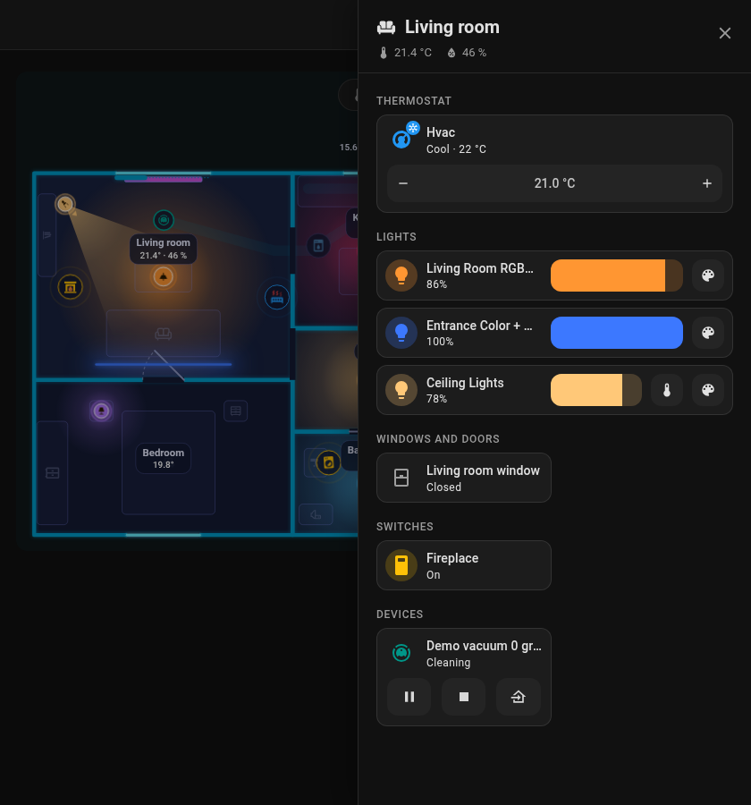
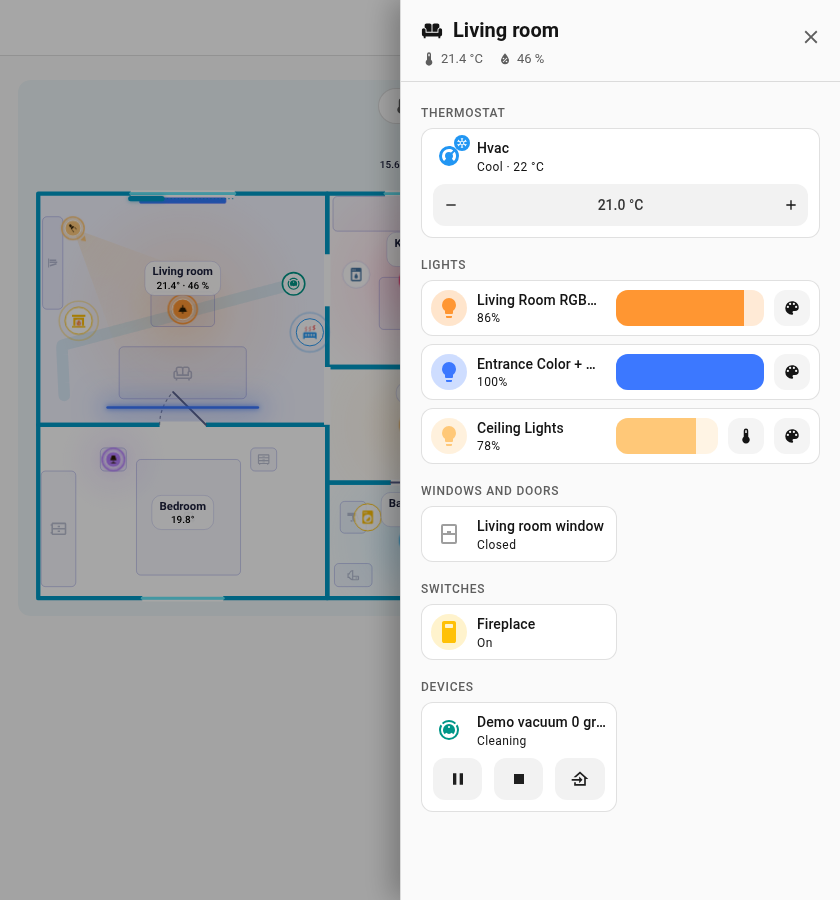
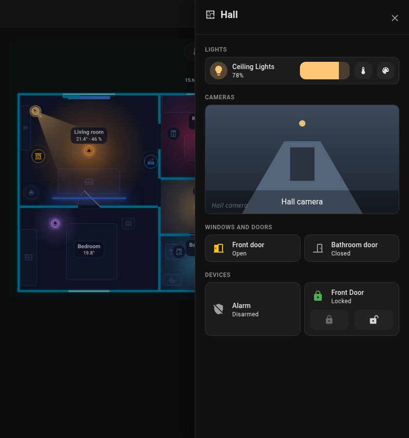

# Room panel

Tap a room on the card and an **off-canvas panel** slides in from the right edge of the screen. It looks like an area dashboard of Home Assistant: the theme background, a header with the room icon, name, temperature and humidity, and Home Assistant cards in two columns. Close it with the cross, ++esc++ or a click outside.

| Dark theme | Light theme |
|---|---|
| { loading=lazy } | { loading=lazy } |

{ loading=lazy }

{ loading=lazy }

*Opening the panel, setting a light's brightness and closing it.*

## Sections

The panel is built from Home Assistant's own cards, each placed like on a dashboard, so your theme styles them as well (including card-mod / UIX themes). Every section has a heading card with an icon, in the subtitle style of dashboard section headings. A tap on a card opens the details, the icon toggles what can be toggled. Thermostats, lights with controls, cameras and blinds take the full width, the rest sits two in a row.

| Section | What goes there |
|---------|-----------------|
| **Thermostat** | `climate` entities as a tile with the target temperature control |
| **Lights** | Lights placed in the room. With the [Mushroom](https://github.com/piitaya/lovelace-mushroom) cards installed: a Mushroom light card with the brightness bar in the light's colour and buttons for colour temperature and colour (when the light has them); a tap on the icon switches the light. Without Mushroom: a tile with the brightness bar next to the name |
| **Cameras** | Cameras of the room as a picture across the panel (a snapshot refreshed every few seconds); a tap opens the live picture in their details |
| **Windows & doors** | Openings of the room with a contact, and their blinds (and covers among the extra entities) with open / stop / close next to the name and a position slider below |
| **Switches** | `switch` and `input_boolean` |
| **Media** | Media players and remotes (TVs, speakers, players); a player that can set its volume gets a volume slider |
| **Robots** | Robot vacuums with start / stop / home, lawn mowers |
| **Devices** | Appliances (a lock gets lock commands) |
| **Sensors** | Sensors of the room |
| **Other** | Everything else |

Only items that are **placed in the room** and the entities in `sheet_extra` are shown. Home Assistant areas are not added automatically. The robot vacuum appears in the room with its dock.

## Choosing what shows

- `sheet_extra`: extra entities of a room (a field in the room's form, one per line, a leading `- ` is fine; **Add an entity** under the field picks one). An entry can also be a template that lists entity ids, see [Rooms](editor/rooms.md). Each entity gets the card of its section above (a light its light card, a camera its picture, a cover the blind controls, the rest a tile).
- `sheet_hide: true` on any item (light, appliance, window, door, lock, robot) leaves it out.
- The room `icon` appears in the header.

```yaml
rooms:
  - id: living_room
    name: Living room
    icon: mdi:sofa
    temperature: sensor.living_room_temperature
    sheet_extra:
      - climate.living_room
      - camera.living_room
      - switch.tv_plug
```

Back to [Card](card.md).
