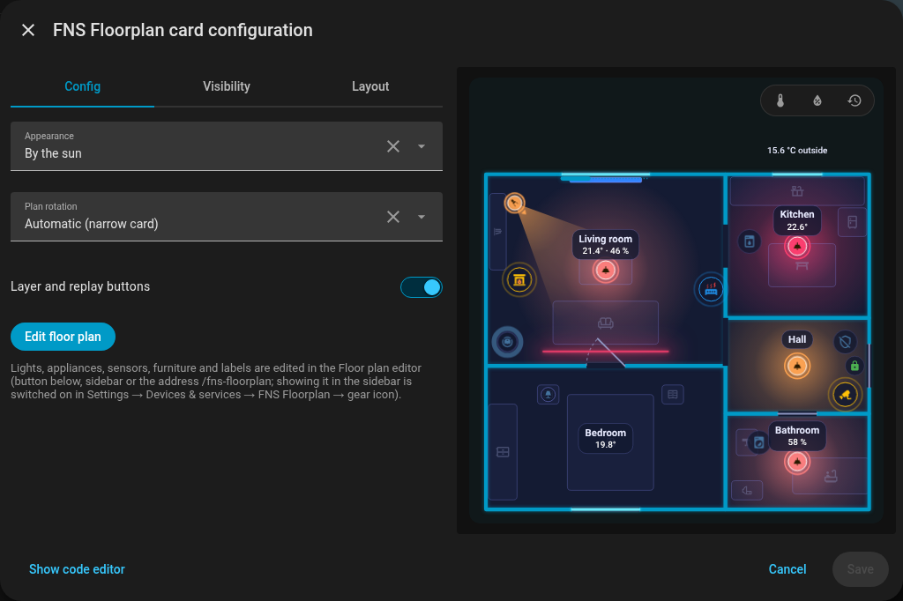
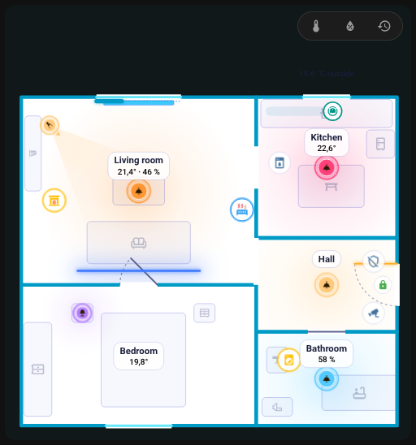
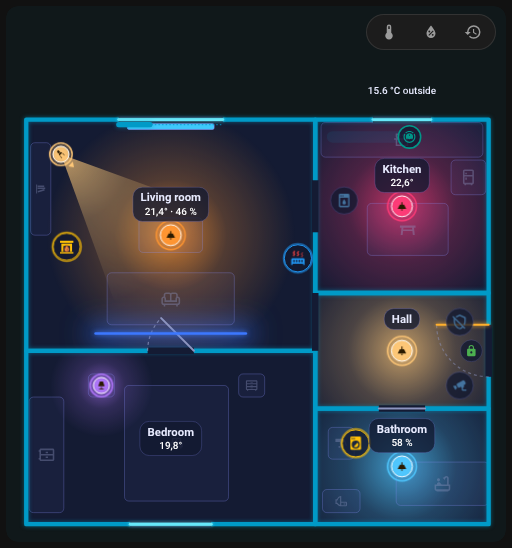
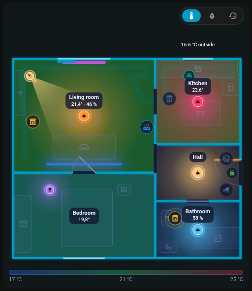
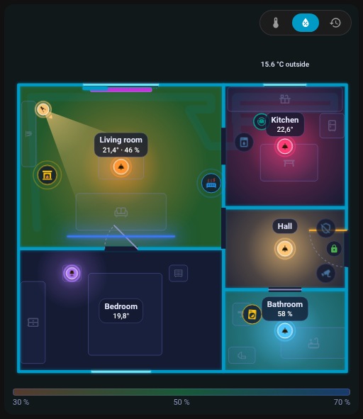
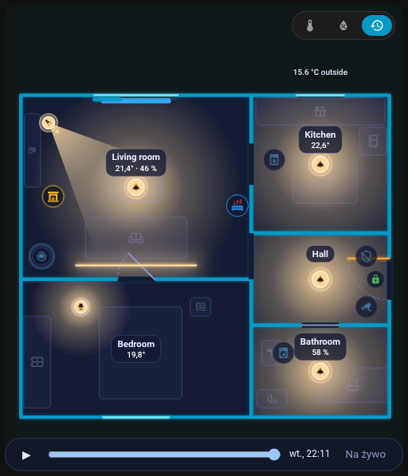

# Karta

## Dodawanie karty

Edytuj pulpit, **Dodaj kartę** i wyszukaj **FNS Floorplan**; albo w YAML:

```yaml
type: custom:fns-floorplan-card
```

Karta pokazuje plan zapisany w edytorze i sama się przerysowuje po każdym zapisie (subskrybuje plan przez websocket, a po restarcie Home Assistanta subskrybuje go ponownie).

{ loading=lazy }

## Opcje

| Opcja | Wartości | Domyślnie | Opis |
|--------|--------|---------|-------------|
| `mode` | `auto`, `ha`, `day`, `night` | `auto` | Wygląd karty |
| `rotate` | `auto`, `true`, `false` | `auto` | Obrót planu o 90 stopni |
| `level` | id piętra | pierwsze piętro | Domyślne piętro; zapisywane tylko wtedy, gdy nie jest pierwsze |
| `tools` | `true`, `false` | `true` | `false` ukrywa przyciski warstw i odtwarzania |

```yaml
type: custom:fns-floorplan-card
mode: ha
rotate: auto
level: upstairs
tools: false
```

Wizualny edytor karty ma te same pola (Wygląd, Obrót planu, Domyślne piętro, Przyciski warstw i odtwarzania) oraz przycisk **Edytuj plan piętra**, który otwiera edytor.

### mode

- `auto`: dzień, gdy `sun.sun` jest nad horyzontem, w przeciwnym razie noc,
- `ha`: podąża za jasnym lub ciemnym motywem Home Assistanta,
- `day`, `night`: zawsze jeden wygląd.

### rotate

- `auto`: karta węższa niż 600 px obraca szeroki plan o 90 stopni, ale tylko gdy plan jest ponad 1,25 raza szerszy niż wysoki,
- `true`: zawsze obracaj, `false`: nigdy.

## Jasny i ciemny wygląd { #light-and-dark }

Karta dobrze wygląda w obu motywach. Z `mode: ha` podąża za jasnym lub ciemnym motywem Home Assistanta, z `auto` decyduje słońce, a `day` lub `night` ustala jeden wygląd (zobacz [mode](#mode)).

| Ciemny motyw | Jasny motyw |
|---|---|
| { loading=lazy } | { loading=lazy } |

Wygląd samej karty można też ustawić niezależnie od motywu:

| Tryb `day` | Tryb `night` |
|---|---|
| { loading=lazy } | { loading=lazy } |

{ loading=lazy }

*Karta przełączająca się z ciemnego wyglądu na jasny i z powrotem.*

## Wygląd

- Ściany i poświata przyjmują `--primary-color` twojego motywu; tło karty to ten sam kolor przy 5 % krycia. Włączone światło, otwarte drzwi lub okno i wywołany alarm przyjmują kolory stanów twojego motywu (`--state-light-active-color`, `--state-binary_sensor-active-color`, `--state-alarm_control_panel-triggered-color`), pozostałe urządzenia własne kolory stanów. Każdy z nich możesz zastąpić własnym kolorem w zakładce [Wygląd](editor/look.md) edytora.
- Etykiety i ikony zachowują mniej więcej ten sam rozmiar na ekranie (tekst około 11 px): na małej karcie rosną (etykiety do 2,2 raza, ikony 1,5 raza), a na ogromnej maleją (0,5 raza).
- Plan ma najwyżej 85 % wysokości okna; na bardzo szerokiej karcie pozostaje na środku.
- Przy kilku piętrach zakładki pięter znajdują się w lewym górnym rogu.

## Warstwy: temperatura, wilgotność i odtwarzanie

O ile nie ustawiono `tools: false`, rząd znaczników nad planem oferuje:

- **temperaturę** (stopnie C): pomieszczenia są kolorowane według temperatury (17 do 25 stopni C),
- **wilgotność** (%): pomieszczenia kolorowane według wilgotności (30 do 70 %),
- **odtwarzanie** (ikona zegara): **pasek odtwarzania dnia**.

Gdy włączona jest temperatura lub wilgotność, pod planem pojawia się legenda kolorów. Wybór jest zapamiętywany w przeglądarce. Etykieta pomieszczenia normalnie pokazuje temperaturę, a wilgotność i inne wartości w nocy na biało, a w dzień na czarno; zimna lub ciepła temperatura jest niebieska lub czerwona. Chip temperatury zewnętrznej pochodzi z pomieszczenia ustawionego jako `outdoor`.

{ loading=lazy }

{ loading=lazy }

{ loading=lazy }

*Przełączanie warstwy temperatury.*

## Odtwarzanie dnia

Przycisk zegara otwiera pasek **pod planem**, który go nie zasłania. Odtwarza **ostatnie 24 godziny** z historii Home Assistanta: światła, drzwi i urządzenia cofają się w czasie. Szablony reguł pozostają podczas odtwarzania aktywne.

{ loading=lazy }

## Zachowanie po dotknięciu

| Element | Dotknięcie | Przytrzymanie |
|------|-----|------|
| Światło | przełącza | szczegóły |
| Urządzenie, odkurzacz, drzwi, okno | szczegóły | szczegóły |
| Scena, przycisk, skrypt | uaktywnia | |
| Pomieszczenie | otwiera [panel pomieszczenia](room-panel.md) | |

Wszystko można zmienić osobno dla każdego elementu za pomocą [akcji](editor/items.md#actions). Podpowiedzi wyświetlają, co robi dotknięcie, podwójne dotknięcie i przytrzymanie.

## Animacje { #animations }

Co karta pokazuje, gdy encje się zmieniają:

{ loading=lazy }

*Drzwi wejściowe otwierają się i zamykają, skrzydło drzwi się obraca.*

{ loading=lazy }

*Okno otwiera się i zamyka.*

{ loading=lazy }

*Roleta zasuwa się wzdłuż okna.*

{ loading=lazy }

*Światła włączają się jedno po drugim, każde pomieszczenie świeci kolorem swojego światła.*

{ loading=lazy }

*Światło zmienia kolor.*

{ loading=lazy }

*Czujnik ruchu wysyła falę, a potem się uspokaja.*

{ loading=lazy }

*Pracująca pralka pokazuje pierścień wokół swojej ikony.*

{ loading=lazy }

*Pierścień odliczania wokół zmywarki, gdy działa jej timer.*

{ loading=lazy }

*Uruchomiony alarm zabarwia całe mieszkanie, dopóki nie zostanie rozbrojony.*

{ loading=lazy }

*Płomień kominka migocze, dopóki jego przełącznik jest włączony.*

## Wydajność

Animacje działają tylko wtedy, gdy coś się porusza i gdy karta jest na ekranie. Karty, które nie są widoczne, nie animują się, a `prefers-reduced-motion` wyłącza animacje ikon.

Dalej: [Panel pomieszczenia](room-panel.md).
