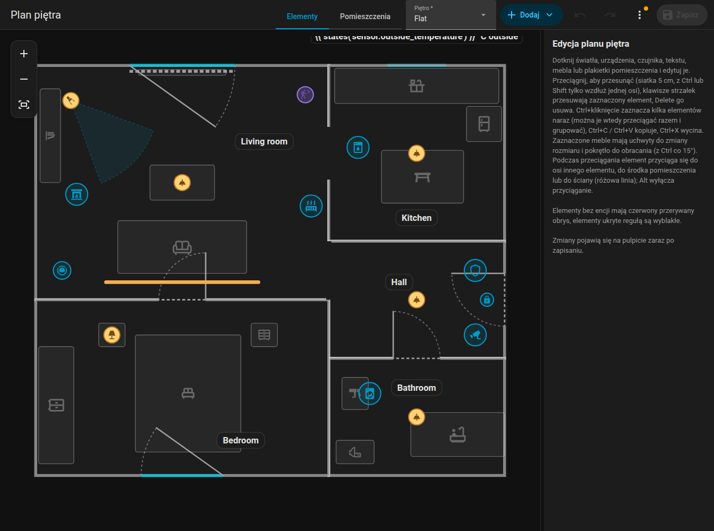
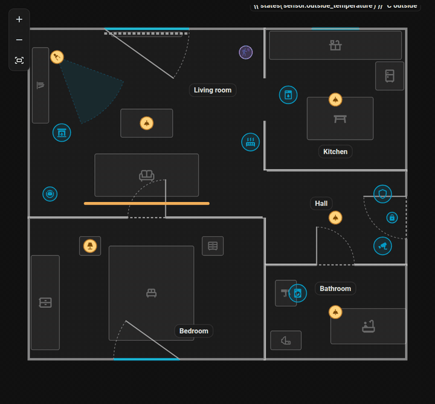
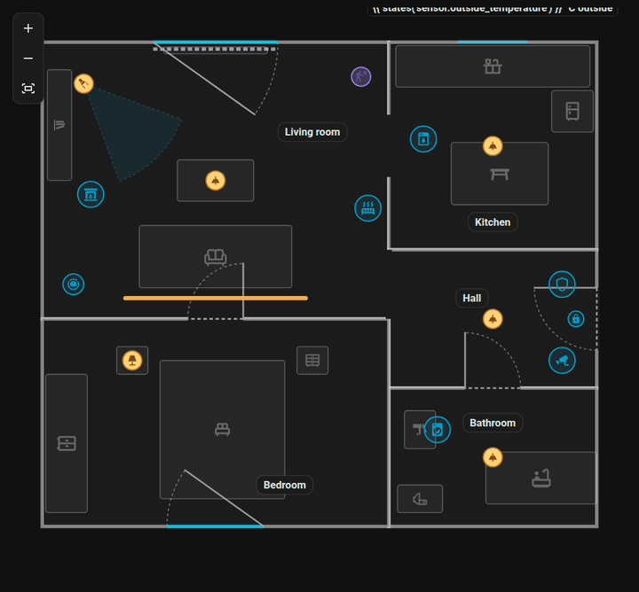
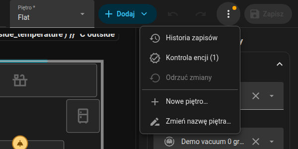

# Przegląd edytora

Edytor to panel boczny **Plan piętra** (adres `/fns-floorplan`, tylko dla administratorów). Edytuje ten sam plan, który pokazuje karta. Nic w Home Assistancie się nie zmienia, dopóki nie naciśniesz **Zapisz**.

{ loading=lazy }

## Układ

- **Górny pasek**, podobny do edytora automatyzacji Home Assistanta:
    - przełącznik trybu **Elementy / Pomieszczenia**,
    - wybór piętra (gdy plan ma więcej pięter),
    - **Dodaj** (menu wszystkiego, co można umieścić),
    - cofnij i ponów, przyciski powiększenia (+, -, dopasuj cały plan),
    - **Zapisz**,
    - menu z trzema kropkami z pozycjami **Historia**, **Kontrola**, **Odrzuć zmiany** oraz zarządzaniem piętrami (nowe, zmień nazwę, usuń). Kropka na menu ostrzega, gdy kontrola znalazła problemy.
- **Plan** pośrodku. Kółkiem myszy powiększasz wokół kursora, przeciągnięciem pustego miejsca przesuwasz widok, na ekranie dotykowym ściskasz dwoma palcami.
- **Panel boczny** po prawej pokazuje formularz zaznaczonego elementu. Przeciągnij pasek między planem a panelem, aby zmienić jego szerokość (od 260 px do 60 % okna, maksymalnie 720 px); szerokość jest zapamiętywana w przeglądarce.

Na telefonie (węższym niż 800 px) plan wypełnia ekran, a formularz otwiera się w arkuszu prawie na całą wysokość, jak okno more-info encji, gdy dotkniesz elementu, dodasz go albo otworzysz Historię lub Kontrolę. Przeciąganie elementu nie otwiera arkusza. Zamkniesz go krzyżykiem.

## Tryby

| Tryb | Co edytujesz | Reszta |
|------|---------------|----------|
| **Elementy** | Światła, taśmy LED, urządzenia, czujniki, elementy tekstowe, meble, etykiety pomieszczeń | Pomieszczenia są widoczne, ale zablokowane |
| **Pomieszczenia** | Pomieszczenia (narożniki, ściany, całe pomieszczenia), drzwi i okna | Elementy są przyciemnione i zablokowane |

Zobacz [Pomieszczenia](rooms.md), [Drzwi i okna](openings.md) oraz [Elementy](items.md).

## Zaznaczanie, przesuwanie, przesuwanie strzałkami

- Kliknij element, aby go zaznaczyć, przeciągnij, aby go przesunąć. Siatka ma 5 cm.
- **Klawisze strzałek** przesuwają zaznaczenie o 5 cm, **Delete** je usuwa.
- **Ctrl+kliknięcie** dodaje elementy do zaznaczenia. Zaznaczone elementy przesuwają się, kopiują i usuwają razem.
- **Grupa** (w formularzu zaznaczenia wielokrotnego) zapisuje `group`, więc kliknięcie jednego członka zawsze zaznacza całą grupę.
- **Esc** czyści zaznaczenie.
- Podczas przeciągania różowe **linie przyciągania** pokazują wyrównanie z innymi elementami, środkiem pomieszczenia i ścianami.

{ loading=lazy }

*Ctrl+kliknięcie zaznacza dwa elementy, potem są przeciągane razem.*

## Skróty klawiszowe { #keyboard-shortcuts }

| Skrót | Akcja |
|----------|--------|
| ++ctrl+z++ | Cofnij (100 kroków) |
| ++ctrl+y++ lub ++ctrl+shift+z++ | Ponów |
| ++ctrl+c++ / ++ctrl+x++ / ++ctrl+v++ | Kopiuj / wytnij / wklej elementy lub pomieszczenia. Wklejenie na tym samym piętrze przesuwa o 30 / 50 cm, na innym piętrze kopia ląduje w tym samym miejscu. Pomieszczenie jest kopiowane z drzwiami i oknami. |
| ++ctrl++ + kliknięcie | Dodaj do zaznaczenia |
| ++delete++ | Usuń zaznaczenie (zaznaczony narożnik pomieszczenia jest usuwany, minimum 3 narożniki) |
| Klawisze strzałek | Przesuń o 5 cm |
| ++alt++ podczas przeciągania | Wyłącz przyciąganie i linie pomocnicze |
| ++ctrl++ podczas przeciągania | Utrzymaj ruch na jednej osi (wybranej według pierwszych 5 cm ruchu). Przeciąganie narożnika pomieszczenia z Ctrl przyciąga natomiast ściany do kroków co 15 stopni, zobacz [Pomieszczenia](rooms.md#angles-and-lengths). |
| ++ctrl++ podczas obracania | Obracaj co 15 stopni zamiast co 1 stopień |
| ++esc++ | Wyczyść zaznaczenie |

W macOS używaj ++cmd++ zamiast ++ctrl++.

{ loading=lazy }

*Ctrl+C i Ctrl+V duplikują element; kopia jest przesunięta i zaznaczona.*

## Cofanie, ponawianie i zapisywanie

Każda zmiana trafia na stos cofania (100 kroków). Rewizja nigdy nie jest cofana. Edytor ostrzega, gdy opuszczasz go z niezapisanymi zmianami.

**Zapisz** zapisuje cały plan. Każdy zapis zwiększa rewizję planu `rev`. Edytor wysyła rewizję, którą załadował, a jeśli w międzyczasie ktoś inny zapisał nowszy plan, zapis zostaje odrzucony komunikatem o konflikcie: wybierz **Odrzuć zmiany**, aby przeładować i powtórzyć edycje. Zobacz [Websocket API](../reference/websocket-api.md#revisions-and-conflicts).

Zapisane plany są przechowywane: zobacz [Historia i kontrola](../history.md).

## Piętra { #levels-floors }

Plan bez pięter ma jedno piętro. W menu z trzema kropkami wybierz **Nowe piętro…**, **Zmień nazwę piętra…** albo **Usuń piętro…** (usunięte piętro zabiera ze sobą swoje pomieszczenia i elementy; pierwszego piętra nie można usunąć). Nowe piętro zaczyna w trybie **Pomieszczenia**.

Pomieszczenia i elementy należą do piętra przez klucz `level`; te bez niego należą do pierwszego piętra. Drzwi i okna podążają za swoim pomieszczeniem. Wybór piętra u góry przełącza edytowane piętro, a karta pokazuje zakładki pięter. Zobacz [Format planu](../reference/plan-format.md#levels).

{ loading=lazy }

## Podkład do obrysowania { #tracing-image }

Aby rysować plan na istniejącym rysunku, wgraj obraz pod piętro: zarządzanie piętrami, **Podkład piętra**. Przesuń go, zmień rozmiar i ustaw jego przezroczystość. Obraz jest widoczny tylko w edytorze, nigdy na karcie. Dozwolone formaty to PNG, JPG, WEBP i SVG do 15 MB. Plik jest przechowywany w `www/fns_floorplan/` twojej konfiguracji (serwowany jako `/local/fns_floorplan/...`).

{ loading=lazy }

## Natywne pola Home Assistanta

Formularze używają własnych selektorów Home Assistanta (wybór encji, liczba, lista, przełącznik, selektor koloru, selektor ikony) w zwijanych sekcjach (Podstawowe, W trakcie pracy, Wygląd, Pozycja, Akcje, Reguły). Które sekcje są otwarte, jest zapamiętywane. Selektor encji wyszukuje także po nazwie.

Elementy bez encji mają czerwony przerywany obrys, więc niedokończoną pracę widać od razu.
