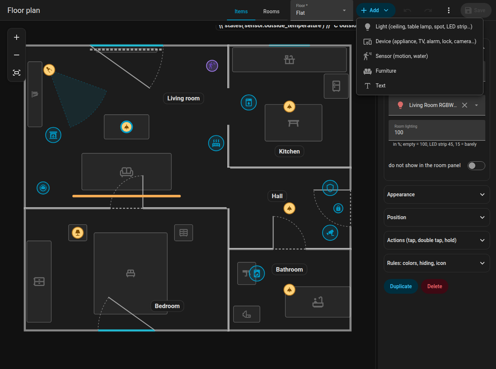
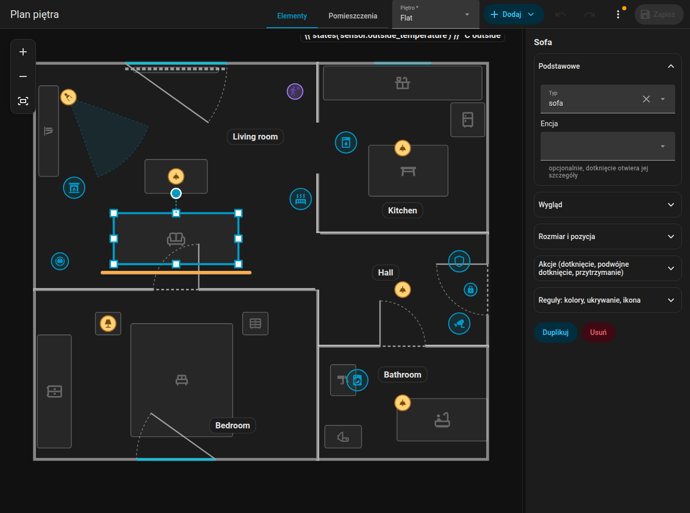
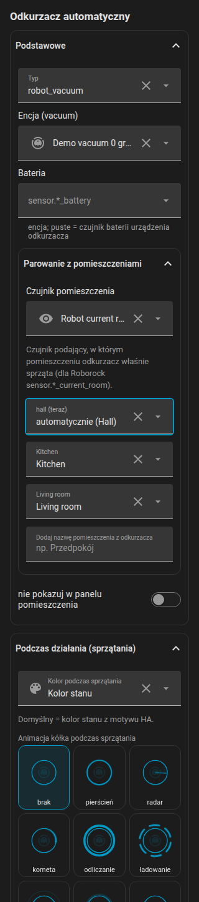
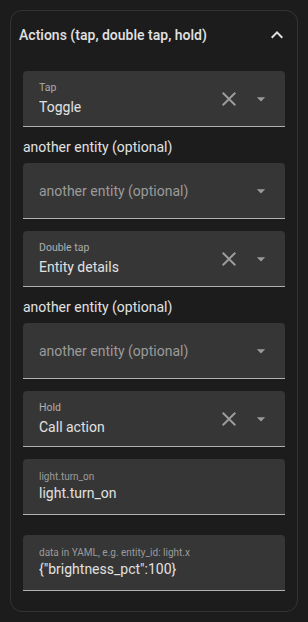

# Elementy

Elementy to wszystko na planie, co nie jest ścianą: światła, urządzenia, czujniki, elementy tekstowe, meble i etykiety pomieszczeń. Edytujesz je w trybie **Elementy**. **Dodaj** wstawia nowy; każdy element można **zduplikować** i **usunąć**.

{ loading=lazy }

{ loading=lazy }

*Dodawanie światła z menu Dodaj i umieszczanie go na planie.*

## Ustawienia wspólne

| Ustawienie | Klucz | Znaczenie |
|---------|-----|---------|
| Encja | `entity` | Wybierana ze wszystkich encji twojego Home Assistanta (selektor wyszukuje także po nazwie) |
| Pozycja | `x`, `z` | W metrach; albo przeciągnij |
| Rozmiar | `size` | `xs`, `s`, `m` (domyślnie), `l`, `xl`, `xxl` (od 0,6 do 2 razy); dla świateł, urządzeń, stacji i tekstów |
| Ikona | `icon` | Dowolna ikona `mdi:`; przyciski **Bez ikony** (`icon: none`) i **Resetuj** |
| Warstwa | `layer` | Kolejność wśród elementów tego samego rodzaju: **Na wierzch**, **Do przodu**, **Do tyłu**, **Na spód** |
| Dotknięcie / podwójne dotknięcie / przytrzymanie | `tap_action` ... | [Akcje](#actions) |
| Reguły | `rules` | Zobacz [Reguły](rules.md) |
| Ukryj w panelu pomieszczenia | `sheet_hide` | Pomija element w [panelu pomieszczenia](../room-panel.md) |

Szybkie umieszczanie: gdy dodajesz element do zaznaczonego pomieszczenia, trafia on na pozycję w siatce 3 na 3 wewnątrz niego, z zachowaniem odległości od ścian.

## Światła

Dodaj **Lampę sufitową**, **Lampę wiszącą**, **Panel**, **Lampkę stołową**, **Kinkiet**, **Reflektor (kierunkowy)** lub **Taśmę LED**. Przypisz encję `light`.

- Światło podąża za swoim kolorem (`rgb_color`) lub temperaturą barwową (`color_temp_kelvin`), w przeciwnym razie jest ciepłą bielą. Jasność zmniejsza i wygasza poświatę oraz rozjaśnia znacznik lub taśmę.
- **Oprawy jednego światła w jednym pomieszczeniu to jeden element** w edytorze, tak samo jak na karcie: przeciągasz całą grupę, a zmiany i usunięcie dotyczą wszystkich. Reflektory sufitowe jednego pomieszczenia to jeden element.
- `room_light` ustawia, jak duża część pomieszczenia świeci, gdy światło jest włączone (ułamek, `1` = 100 %, `false` = prawie nic).
- **Reflektor** (`lamp_spot`): stożek światła w kierunku `rotation` (0 = w prawo, 90 = w dół), szeroki na `beam` stopni (domyślnie 40), przycięty przez pomieszczenie. Nigdy nie jest łączony z innymi oprawami tego samego światła.
- **Taśma LED** (`led_strip`): linia o długości `w`; świeci w prawdziwym kolorze światła. `glow_side` pozwala jej świecić tylko na jedną stronę (`1` = na prawo od kierunku taśmy, `-1` = na drugą stronę, brak = dookoła).
- Wyłączone światło ma ikonę w przygaszonym kolorze, bez zewnętrznego pierścienia. Taśma ma niewidoczny obszar 16 px do dotykania.

## Urządzenia i inne sprzęty

**Dodaj, Urządzenie** (oraz konkretne typy) tworzy `device` o określonym `kind`:

| Rodzaj | Wygląda jak |
|------|-----------|
| `fan`, `purifier`, `dishwasher`, `dryer` | Animowane ikony (suszarka się trzęsie, zmywarka podskakuje) |
| `boiler` | Bojler |
| `radiator` | Fale ciepła unoszą się podczas animacji (kolor ustawia `wave`) |
| `alarm` | Tarcza według stanu; mieszkanie pulsuje na czerwono po uruchomieniu alarmu, na pomarańczowo podczas uzbrajania |
| `media` | Ikona telewizora, głośnika lub Kodi, fale dźwięku i tytuł podczas odtwarzania, okładka w znaczniku (`cover: false` to wyłącza) |
| `aquarium` | Bąbelki |
| `camera`, `fridge`, `lock` | Ikona w kolorze stanu |
| `fireplace` | Płomień migoczący podczas palenia |
| `generic` | „Inne urządzenie”: własna ikona encji, zachowanie według domeny (niżej) |

Ustawienia: `name`, `entity`, `active` (lista stanów lub `{"above": n}`, które liczą się jako „pracuje”), `text` (zawsze wyświetlany pod ikoną), `text_on` (wyświetlany podczas pracy; oba mogą być szablonami, np. `{{ states('sensor.washer_time') }}`), `label_position` (`top`, `left`, `right`, domyślnie pod ikoną) i `label_vertical` (etykieta obrócona o 90 stopni), `color` / `color_on` (kolor w spoczynku / podczas pracy; bez nich używany jest kolor stanu motywu twojego Home Assistanta), `fx` (animacja pierścienia: `ring`, `radar`, `comet`, `countdown`, `spin`, `orbit`, `breath`, `blink`, `heartbeat`, `shake`, `none`).

Etykiety tekstowe pod ikoną mają tło w stylu znacznika pomieszczenia (jasne w dzień, ciemne w nocy).

### Inne urządzenie według domeny

Urządzenie `generic` zachowuje się rozsądnie według domeny swojej encji. Twoje własne ustawienia i reguły mają pierwszeństwo przed tymi domyślnymi.

| Domena | Pracuje, gdy | Tekst | Pierścień | Dotknięcie |
|--------|-----------|------|------|-----|
| `fan` | on | prędkość w % | spin | szczegóły |
| `siren` | on | brak | blink | szczegóły |
| `input_boolean`, `switch`, `binary_sensor` | on | brak | ring | szczegóły |
| `humidifier` | on | wilgotność % | breath | szczegóły |
| `water_heater` | nie off | temperatura | breath | szczegóły |
| `climate` | `hvac_action` to heating / cooling / ..., bez niego stan inny niż off | temperatura bieżąca do docelowej | breath | szczegóły |
| `valve`, `cover` | open, opening, closing | pozycja % | spin w ruchu, poza tym ring | szczegóły |
| `lawn_mower` | mowing | brak | comet | szczegóły |
| `vacuum` | cleaning, returning | brak | comet | szczegóły |
| `camera` | recording, streaming | brak | radar | szczegóły |
| `person`, `device_tracker` | home | nazwa strefy, gdy poza domem | ring | szczegóły; zdjęcie awatara w znaczniku, szare, gdy poza domem |
| `script` | on | brak | spin | uruchamia skrypt |
| `scene`, `button`, `input_button` | nigdy | brak | krótkie mignięcie przy zmianie czasu | aktywuje scenę / naciska przycisk |
| `input_select`, `select` | nigdy | stan | brak | szczegóły |
| `number`, `input_number`, `counter`, `sensor` | nigdy | wartość z jednostką | brak | szczegóły |
| `weather` | nigdy | temperatura | brak | szczegóły |
| `sun` | nad horyzontem | brak | ring | szczegóły |
| `timer` | active | brak | odliczanie z samego timera | szczegóły |

Element generyczny z encją `alarm_control_panel.*` lub `lock.*` zachowuje się jak dedykowany rodzaj alarmu lub zamka.

### Animacje ikon

Urządzenie bez własnego animowanego glifu (generic, camera, fridge, lock, alarm) dostaje animację CSS według nazwy ikony, gdy jego stan jest włączony: wentylator i koło zębate się obracają, pralka i suszarka się trzęsą, zmywarka podskakuje, ogień migocze, głośniki pulsują, bramy garażowe i rolety poruszają tylko listwami, para się unosi, ładujące się baterie zapalają komórki jedna po drugiej i tak dalej. Ikony kończące się na `-off` nigdy się nie animują. Reguła z `animate: false` wyłącza animację, a `prefers-reduced-motion` ją tłumi.

## Czujniki

**Dodaj, Czujnik** umieszcza czujnik binarny według `entity`. Jego `device_class` decyduje, co robi na karcie:

- `motion`, `occupancy`, `presence`: płynne **fale**, gdy jest włączony,
- `moisture`: pomieszczenie pulsuje na czerwono i pojawia się chip „Wyciek wody”.

Na karcie czujnik jest rysowany tylko jako fale lub pulsowanie pomieszczenia; edytor pokazuje go z ikoną według klasy. Czujniki też mają `layer`, istotne tylko wśród czujników w edytorze.

## Elementy tekstowe

**Dodaj, Tekst** umieszcza dowolny tekst: `text` (zwykły lub szablon `{{ }}`) albo `entity`, której stan jest pokazywany. Ustawienia: `x`, `z`, `rotation`, `size`, `color`, `background` (`none` oznacza brak tła). Styl: jak znacznik pomieszczenia.

```yaml
texts:
  - id: t_outside
    text: "{{ states('sensor.outdoor_temperature') }} °C outside"
    x: 4.2
    z: 0.3
    size: l
    background: none
```

## Meble { #furniture }

**Dodaj, Meble** dodaje jeden z tych typów (w selektorze posortowane według nazwy, z wyszukiwarką; „Inne” jest na końcu):

| Typ | Znaczenie | Typ | Znaczenie |
|------|---------|------|---------|
| `bed` | Łóżko | `bunk_bed` | Łóżko piętrowe |
| `nightstand` | Szafka nocna | `wardrobe` | Szafa |
| `dresser` | Komoda | `shelf` | Półka, regał |
| `tall_cabinet` | Wysoka szafka | `sideboard` | Kredens |
| `sofa` | Sofa | `sofa_corner` | Sofa narożna (kształt L) |
| `coffee_table` | Stolik kawowy | `table` | Stół |
| `chair` | Krzesło | `desk` | Biurko |
| `office_chair` | Krzesło biurowe | `bench` | Ławka |
| `coat_rack` | Wieszak na ubrania | `tv_board` | Szafka RTV |
| `tv_wall` | Telewizor na ścianie (odtwarza kolory, gdy ma odtwarzacz multimedialny) | `kitchen` | Blat kuchenny |
| `kitchen_wall` | Szafki wiszące | `kitchen_tall` | Wysoka szafka kuchenna |
| `fridge` | Lodówka | `sink` | Zlew |
| `stove` | Kuchenka | `dishwasher` | Zmywarka |
| `washer` | Pralka | `dryer` | Suszarka |
| `bathtub` | Wanna | `shower` | Prysznic |
| `washbasin` | Umywalka | `wc` | Toaleta |
| `radiator` | Grzejnik | `robot_vacuum` | Stacja dokująca odkurzacza, zobacz [Odkurzacz](../robot-vacuum.md) |
| `other` | Inne | | |

- Zaznaczony mebel ma uchwyty w narożnikach i po bokach do **zmiany rozmiaru** (przeciwna strona zostaje, siatka 5 cm) oraz kółko do **obracania** co 1 stopień (++ctrl++ dla 15 stopni). Ikona obraca się razem z meblem.
- **Sofa narożna** ma kształt litery L; siedzisko to 40 % krótszego boku.
- `color` ustawia domyślny kolor mebla; reguła ma nad nim pierwszeństwo.
- Meble są w edytorze przyciemnione, aby nie odciągały uwagi.

{ loading=lazy }

{ loading=lazy }

*Zmiana rozmiaru sofy uchwytami i jej obracanie (Ctrl = kroki co 15 stopni).*

{ loading=lazy }

## Warstwy

Kolejność jest porównywana tylko wśród elementów tego samego rodzaju. Użyj **Na wierzch / Do przodu / Do tyłu / Na spód** w formularzu. Odkurzacz ma własne zasady, zobacz [Odkurzacz](../robot-vacuum.md#layer-and-stacking).

## Grupy i zaznaczenie wielokrotne

Kliknij z Ctrl kilka elementów, aby je zaznaczyć. W formularzu zaznaczenia naciśnij **Grupuj**: zapisywane jest `group`, a kliknięcie dowolnego członka zaznacza całą grupę. Zaznaczone elementy są razem przeciągane, przesuwane strzałkami, kopiowane (++ctrl+c++, ++ctrl+v++), wycinane (++ctrl+x++) i usuwane. Zobacz [skróty](index.md#keyboard-shortcuts).

## Akcje { #actions }

Każdy element (także drzwi i okna) przyjmuje `tap_action`, `double_tap_action` i `hold_action` w formacie Home Assistanta:

| `action` | Znaczenie |
|----------|---------|
| `toggle` | Przełącz encję |
| `more-info` | Otwórz szczegóły encji |
| `perform-action` | Wywołaj akcję: `perform_action` (wybór spośród akcji znanych Home Assistantowi, z wyszukiwaniem) i `data` jako jedna linia YAML, np. `entity_id: input_button.x` |
| `navigate` | Przejdź do `navigation_path` |
| `url` | Otwórz `url_path` |
| `none` | Nic nie rób |

Domyślnie: światło przełącza się po dotknięciu i pokazuje szczegóły po przytrzymaniu; urządzenie, odkurzacz, drzwi i okno pokazują szczegóły. Podwójne dotknięcie opóźnia pojedyncze o 250 ms, ale tylko wtedy, gdy ustawiono akcję podwójnego dotknięcia. Najechanie myszą na element pokazuje podpowiedź: nazwę i to, co robi dotknięcie, podwójne dotknięcie i przytrzymanie.

{ loading=lazy }

```yaml
tap_action:
  action: perform-action
  perform_action: scene.turn_on
  data:
    entity_id: scene.movie_night
hold_action:
  action: more-info
```

Dalej: [Reguły](rules.md).
