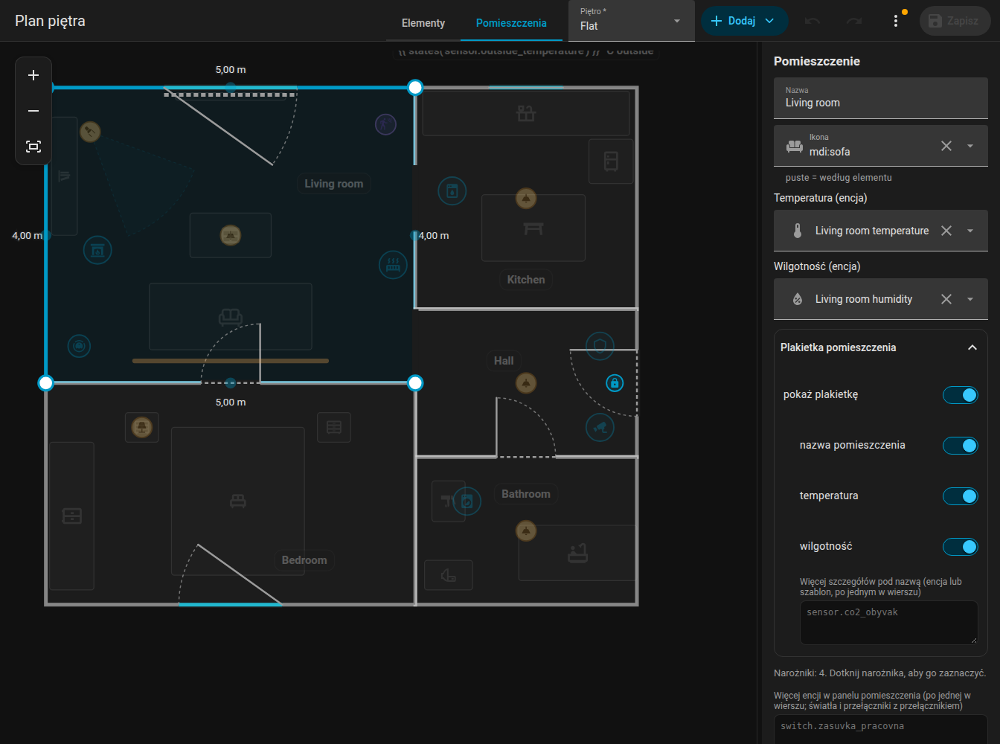

# Pomieszczenia

Przełącz edytor na **Pomieszczenia**, aby edytować kształt mieszkania. W tym trybie wszystko inne jest przyciemnione i zablokowane.

{ loading=lazy }

## Dodawanie pomieszczenia

**Dodaj, Pomieszczenie** wstawia kwadrat 2 na 2 metry. Każde pomieszczenie to osobny wielokąt z `id`, `name` i `points` w metrach (`x` w prawo, `z` w dół).

## Narożniki

- Kliknij pomieszczenie, aby je zaznaczyć. **Niebieskie punkty** to jego narożniki; przeciągaj je. Półprzezroczyste punkty między narożnikami dodają nowy narożnik, gdy je przeciągniesz.
- Zaznacz narożnik i naciśnij **Delete** (albo użyj przycisku w panelu bocznym), aby go usunąć. Pomieszczenie potrzebuje co najmniej trzech narożników.
- Panel boczny pokazuje współrzędne zaznaczonego narożnika i pozwala je wpisać.
- Dodanie lub usunięcie narożnika zachowuje drzwi i okna pomieszczenia tam, gdzie były.

## Ściany i całe pomieszczenia

- Przeciągnij **całą ścianę** zaznaczonego pomieszczenia: oba jej narożniki przesuwają się prostopadle do ściany. Narożnik wspólny z sąsiadem przesuwa się razem z nią.
- Przeciągnij samo pomieszczenie, aby **przesunąć całe pomieszczenie**.
- Klawisze strzałek przesuwają zaznaczone pomieszczenie, narożnik lub ścianę o 5 cm.

{ loading=lazy }

*Przeciąganie całej ściany: długości sąsiednich ścian się aktualizują.*

{ loading=lazy }

*Przesuwanie całego pomieszczenia przez przeciągnięcie jego podłogi.*

## Przyciąganie do sąsiadów

Narożniki, ściany i całe pomieszczenia przyciągają się do narożników i ścian innych pomieszczeń na tym samym piętrze w odległości do 15 cm, co pokazuje różowa linia pomocnicza. Przytrzymaj ++alt++, aby wyłączyć przyciąganie. W przeciwnym razie obowiązuje siatka 5 cm.

{ loading=lazy }

*Narożnik przyciąga się do narożnika sąsiedniego pomieszczenia.*

## Wspólne ściany

Każde pomieszczenie ma własny wielokąt, więc ściana między dwoma pomieszczeniami to dwie ściany jedna na drugiej. Gdy przeciągasz narożnik leżący na narożniku innego pomieszczenia, **oba przesuwają się razem** (Alt przesuwa tylko jeden). Przeciągnięcie ściany przesuwa także narożniki innych pomieszczeń leżące gdziekolwiek na niej. Jeśli chcesz je celowo rozdzielić, przytrzymaj Alt.

## Kąty i długości { #angles-and-lengths }

- Zaznaczone pomieszczenie pokazuje **długość każdej ściany** (na zewnątrz pomieszczenia), na żywo podczas przeciągania.
- Przytrzymaj ++ctrl++ podczas przeciągania narożnika: ściana do sąsiedniego narożnika przyciąga się do **kroków co 15 stopni**, a długość do 5 cm. W pobliżu przecięcia dwóch ścian narożnik do niego przeskakuje, co daje kąt prosty.
- Ściany zaznaczonego narożnika są oznaczone: zielony znacznik **prosta**, gdy ściana jest dokładnie pozioma lub pionowa, w przeciwnym razie pomarańczowy znacznik z kątem.

{ loading=lazy }

*Przeciąganie narożnika z wciśniętym Ctrl: kroki co 15 stopni i zielony znacznik „prosta”.*

## Nazwa, ikona i klimat

| Pole | Znaczenie |
|-------|---------|
| Nazwa | Pokazywana na etykiecie pomieszczenia i w panelu pomieszczenia |
| Ikona | Pokazywana w nagłówku [panelu pomieszczenia](../room-panel.md) (`icon`) |
| Temperatura | Czujnik temperatury (`temperature`) |
| Wilgotność | Czujnik wilgotności (`humidity`) |
| Dodatkowe encje | Encje do panelu pomieszczenia (`sheet_extra`), jedna w linii; **Dodaj encję** pod polem wybiera ją z Home Assistanta |

Obie listy (dodatkowe encje i dane etykiety) przyjmują też **szablon**, który zwraca id encji – po jednym w wierszu, jako listę lub rozdzielone przecinkami. Szablon na kilka wierszy to jeden wpis:

```jinja

- light.terrace
- switch.blinds

- light.night_lamp

```

## Etykieta pomieszczenia

Każde pomieszczenie pokazuje **etykietę** (znacznik) z nazwą i wartościami. Opcje:

| Klucz | Efekt |
|-----|--------|
| `label_info` | Lista tego, co pokazać: `temperature`, `humidity`, id encji lub szablony. Domyślnie: temperatura i wilgotność. W formularzu **Dodaj encję** dodaje encję jako nową linię |
| `label_name: false` | Ukrywa nazwę, zostawia wartości |
| `label_hidden: true` | Ukrywa całą etykietę |
| `label_rotation` | Obraca etykietę (stopnie) |

W trybie **Elementy** możesz przeciągnąć etykietę w nowe miejsce; pozycja jest zapisywana w `labels`. Pomieszczenia przyjmują także [reguły](rules.md): `tint` koloruje podłogę, `hide` ukrywa etykietę.

## Usuwanie

**Usuń** w panelu bocznym usuwa pomieszczenie wraz z jego drzwiami, oknami i etykietą.

Dalej: [Drzwi i okna](openings.md).
