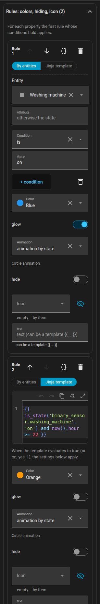
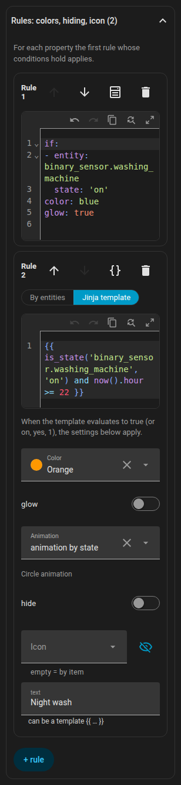

# Reguły

Reguły sprawiają, że element reaguje na coś więcej niż własny stan. Istnieją przy każdym rodzaju elementu: światłach, taśmach LED, urządzeniach, stacji dokującej odkurzacza, meblach, elementach tekstowych i pomieszczeniach.

{ loading=lazy }

## Jak reguły są oceniane

`rules` to uporządkowana lista. Każda reguła ma warunki (`if`) i wyjścia. **Dla każdego pola wyjściowego wygrywa pierwsza reguła, której wszystkie warunki są spełnione i która ustawia to pole.** Reguła bez `if` jest domyślna.

```yaml
rules:
  - if: [ ... ]        # wszystkie warunki muszą być spełnione (AND)
    color: red
  - color: blue        # bez „if”: obowiązuje, gdy żadna wcześniejsza reguła nie ustawiła koloru
```

## Warunki

Warunki możesz zapisywać w dwóch trybach. Każda reguła ma przełącznik **Według encji / Szablon Jinja**; przełączenie z encji na Jinja przekształca istniejące warunki.

=== "Według encji"

    Warunek to `{entity, attribute?, state | state_not | above | below}`. `state` i `state_not` mogą być listą. `{any: [conditions]}` to grupa OR.

    ```yaml
    if:
      - entity: climate.living_room
        attribute: hvac_action
        state: heating
      - entity: sensor.outdoor_temperature
        below: 5
      - any:
          - entity: binary_sensor.window
            state: "on"
          - entity: binary_sensor.door
            state: "on"
    ```

    W formularzu każdy warunek ma encję (ze skrótem **ta encja**), opcjonalny atrybut oraz operator jest / nie jest / powyżej / poniżej / szablon. Nowe warunki są wstępnie wypełnione encją elementu (pomieszczenie używa swojego czujnika temperatury).

=== "Szablon Jinja"

    Pojedynczy warunek `{template: "{{ ... }}"}`. Home Assistant renderuje go na żywo, a jest prawdziwy dla `true`, `on`, `yes`, `1` lub niezerowej liczby.

    ```yaml
    if:
      - template: "{{ is_state('binary_sensor.front_door', 'on') and states('sensor.outdoor_temperature') | float(0) < 0 }}"
    ```

Wyjście `text` zawierające `{{ }}` jest również szablonem.

## Wyjścia

| Wyjście | Efekt |
|--------|--------|
| `color` | Barwi ikonę i obwódkę znacznika; na meblu obrys i wypełnienie; na świetle nadpisuje kolor żarówki (znacznik, poświata, taśma); na robocie zastępuje kolor motywu, także w stacji |
| `glow` | Dodaje poświatę wokół elementu |
| `animate` | Nadpisuje `active` urządzenia: `true` / `false`. `animate: false` zatrzymuje też animację ikony |
| `wave` | Kolor fal ciepła grzejnika |
| `text` | Zastępuje tekst pod ikoną (zwykły lub szablon) |
| `tint` (lub `color`) | Na pomieszczeniu: cieniuje podłogę; `opacity` ustawia jego siłę (domyślnie 0,14) |
| `hide` | Ukrywa element (na pomieszczeniu: jego etykietę) |
| `icon` | Zamienia ikonę (urządzenia, światła, meble, stacja). `none` ją usuwa; wybierz ją selektorem ikon |
| `background` | Tło elementu tekstowego |
| `fx` | Animacja pierścienia: `ring`, `radar`, `comet`, `countdown`, `spin`, `orbit`, `breath`, `blink`, `heartbeat`, `shake`, `none` |
| `progress` | Encja, która steruje `countdown` (zobacz niżej) |
| `progress_total` | Długość w minutach dla `countdown` |

Kolory: `red`, `orange`, `yellow`, `green`, `blue`, `purple`, `pink`, `white`, `black`, dowolna nazwa koloru motywu wybrana w formularzu (zapisywana nazwą, na przykład `teal`) albo dowolny kolor CSS (hex, `rgb(...)`, `var(...)`).

Światła, taśmy LED, stacja i meble nie mają własnej animacji pierścienia, więc pierścień pojawia się tylko wtedy, gdy reguła ustawia `fx`. Pierścień taśmy LED jest pośrodku taśmy, na meblu pośrodku prostokąta.

Dla wyjścia pierścienia priorytet jest taki: reguła, potem własne ustawienie urządzenia, potem domyślne ustawienie alarmu według stanu.

### Odliczanie { #countdown }

`fx: countdown` rysuje kurczący się łuk. Skąd bierze postęp:

- `progress: timer.kitchen`: `timer` (aktywny lub wstrzymany),
- `progress: sensor.dryer_remaining` z `device_class: duration` (sekundy, minuty lub godziny; całkowity czas to `progress_total`, w przeciwnym razie najwyższa dotąd widziana wartość),
- `progress: sensor.dryer_end` z `device_class: timestamp` (czas zakończenia; początek to `last_changed` pracującego urządzenia, w przeciwnym razie `progress_total`),
- `progress: sensor.dryer_progress` w `%`: pierścień **wypełnia się jak bateria** (0 % pusty, 100 % pełny),
- `progress_total: 45` bez encji: odliczanie o tej długości w minutach, liczone od zmiany encji warunku reguły (dla urządzenia od chwili, gdy zaczyna pracować).

Bez żadnego z nich odliczanie jest dekoracyjnym 4-sekundowym cyklem.

## Reguły jako YAML

Każda reguła ma w nagłówku przycisk **{ }**, który otwiera tylko tę regułę jako YAML w edytorze kodu Home Assistanta (kolorowanie składni, numery wierszy, podpowiedzi encji i ikon). Zmiana jest zatwierdzana po opuszczeniu edytora. Ten sam YAML widzisz w [formacie planu](../reference/plan-format.md#rules).

{ loading=lazy }

## Asystent AI Task

Jeśli twój Home Assistant ma encję `ai_task.*` obsługującą generowanie danych, sekcja Reguły pokazuje **Zaproponuj z AI**. Opisz jednym zdaniem, czego chcesz. Edytor wysyła opis do `ai_task.generate_data` razem z formatem reguł, wyjściami dozwolonymi dla tego elementu, jego encją (stan i atrybuty), bieżącymi regułami oraz listą twoich encji (do 1500, bez encji update, event, scene i script). Odpowiedź przychodzi jako YAML i otwiera się jako **szkic**; dopiero **Użyj szkicu** zastępuje reguły. Jeśli prośby nie da się spełnić, asystent odpowiada jednym zdaniem, które widzisz jako komunikat.

## Przykłady

### Koniec prania

```yaml
devices:
  - id: washer
    kind: generic
    name: Washer
    entity: sensor.washer_state
    icon: mdi:washing-machine
    x: 1.2
    z: 3.4
    rules:
      - if:
          - entity: sensor.washer_state
            state: running
        color: blue
        animate: true
        fx: countdown
        progress: sensor.washer_finish_time   # device_class: timestamp
      - if:
          - entity: sensor.washer_state
            state: finished
        color: green
        fx: blink
        text: Gotowe
```

### Drzwi zostawione otwarte

Szablon z `now()` jest renderowany ponownie co minutę, więc reguła włącza się pięć minut po otwarciu drzwi.

```yaml
rooms:
  - id: hall
    name: Hall
    points: [[0, 0], [3, 0], [3, 2.5], [0, 2.5]]
    rules:
      - if:
          - template: >-
              {{ is_state('binary_sensor.front_door', 'on')
                 and (now() - states.binary_sensor.front_door.last_changed).total_seconds() > 300 }}
        tint: orange
        opacity: 0.3
```

### Alarm zalania

```yaml
devices:
  - id: leak
    kind: generic
    name: Leak
    entity: binary_sensor.kitchen_leak
    x: 2.0
    z: 1.0
    rules:
      - if:
          - entity: binary_sensor.kitchen_leak
            state: "on"
        color: red
        glow: true
        fx: blink
        text: Zalanie!
      - hide: true
```

Ostatnia reguła nie ma warunku, więc element jest ukryty zawsze, gdy nie ma zalania.

### Pierścień procentowy w stylu baterii

```yaml
devices:
  - id: phone_battery
    kind: generic
    name: Phone
    entity: sensor.phone_battery_level
    x: 4.0
    z: 2.0
    rules:
      - if:
          - entity: sensor.phone_battery_level
            below: 20
        color: red
        fx: countdown
        progress: sensor.phone_battery_level
      - fx: countdown
        progress: sensor.phone_battery_level
        color: green
```

### Odliczanie timera

Piekarnik, który odlicza 45 minut od chwili włączenia:

```yaml
devices:
  - id: oven
    kind: generic
    name: Oven
    entity: switch.oven
    x: 3.1
    z: 0.4
    rules:
      - if:
          - entity: switch.oven
            state: "on"
        fx: countdown
        progress_total: 45
        color: orange
```

A pomocnik timera kuchennego, który steruje pierścieniem:

```yaml
    rules:
      - if:
          - entity: timer.kitchen
            state: active
        fx: countdown
        progress: timer.kitchen
        color: yellow
```

### Grzejnik reagujący na okno, dogrzewanie i zawór

```yaml
devices:
  - id: radiator_living
    kind: radiator
    entity: climate.living_room
    x: 4.3
    z: 1.1
    rules:
      - if:
          - entity: switch.boost_living_room
            state: "on"
        color: yellow
      - if:
          - any:
              - entity: binary_sensor.living_room_window
                state: "on"
              - entity: binary_sensor.balcony_door
                state: "on"
        color: blue
      - if:
          - entity: switch.valve_living_room
            state: "on"
        color: orange
        animate: true
        wave: red
      - animate: false
```

Powrót do [Elementy](items.md) albo zobacz [Format planu](../reference/plan-format.md#rules).
