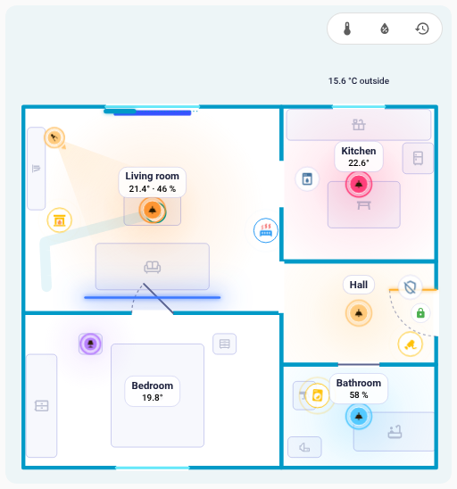

# FNS Floorplan – pomoc

FNS Floorplan zamienia pulpit Home Assistanta w żywy plan piętra: światła świecą swoim prawdziwym kolorem, drzwi i okna się otwierają, a odkurzacz jeździ po pomieszczeniu, w którym akurat się znajduje. Plan rysujesz we wbudowanym edytorze, bez YAML-a i bez edycji obrazów.

Znajdziesz tu przewodniki po karcie i edytorze oraz rozwiązania najczęstszych problemów. Gdy coś nie działa, poszukaj objawu, który widzisz.

!!! info "Inspiracja: NeonPlan 3D"
    FNS Floorplan powstał z inspiracji [NeonPlan 3D](https://github.com/Mastershort/neonplan3d), kartą z planem piętra 3D dla Home Assistanta. Rozwija ten pomysł w animowany plan 2D z własnym edytorem. [Przechodzisz z NeonPlan 3D?](quick-start.md#coming-from-neonplan-3d)

!!! tip "Zapytaj na GitHubie"
    Nie znalazłeś swojego problemu? [Otwórz nowe zgłoszenie](https://github.com/matata86/fns-floorplan/issues) na GitHubie albo najpierw wypróbuj [demo na żywo](https://matata86.github.io/fns-floorplan/demo/) – działa na prawdziwej karcie z fikcyjnymi stanami.

!!! example "Podoba ci się FNS Floorplan?"
    Wesprzyj go przez [Ko-fi](https://ko-fi.com/matata86), [PayPal](https://paypal.me/matata86) albo [Bitcoinem](support.md).

## Pierwsze kroki
- [Instalacja](installation.md)
- [Szybki start: pierwszy plan w około dziesięciu krokach](quick-start.md)

## Karta
- [Karta: dodawanie i wszystkie opcje](card.md)
- [Jasny i ciemny wygląd](card.md#light-and-dark)
- [Animacje](card.md#animations)
- [Panel pomieszczenia](room-panel.md)

## Edytor
- [Przegląd edytora](editor/index.md)
- [Pomieszczenia](editor/rooms.md)
- [Drzwi i okna](editor/openings.md)
- [Elementy](editor/items.md)
- [Reguły](editor/rules.md)
- [Historia i kontrola](history.md)

## Odkurzacz
- [Odkurzacz: czujnik pomieszczenia, stacja dokująca i jazda](robot-vacuum.md)

## Gdy coś nie działa
- [Karta nie jest znaleziona po instalacji](help/card-not-found.md)
- [Pojawia się „Custom element doesn't exist” lub błąd konfiguracji](help/custom-element-missing.md)
- [Karta pokazuje starą wersję po aktualizacji](help/old-version-after-update.md)
- [Karta pisze, że czeka na integrację](help/waiting-for-integration.md)
- [Plan jest pusty](help/plan-empty.md)
- [Brakuje pozycji w pasku bocznym](help/sidebar-entry-missing.md)
- [Brakuje ikon](help/icons-missing.md)
- [Zapis zgłasza, że plan w międzyczasie się zmienił (konflikt)](help/plan-conflict.md)
- [Karta działa wolno lub się zacina](help/performance.md)
- [Światło nie świeci w kolorze, jakiego oczekuję](help/light-wrong-colour.md)
- [Reguła nie działa](help/rule-not-applied.md)
- [Niektóre teksty nie są przetłumaczone](help/languages.md)
- [Coś innego nie działa](help/still-not-working.md)

## Dokumentacja techniczna
- [Format planu](reference/plan-format.md)
- [Websocket API](reference/websocket-api.md)

## Lista zmian
- [Co zmieniło się w której wersji](changelog.md)

{ loading=lazy }

| Ciemny motyw | Jasny motyw |
|---|---|
| { loading=lazy } | { loading=lazy } |
