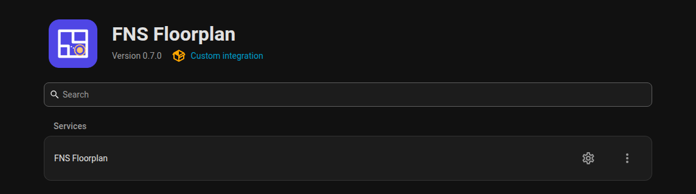
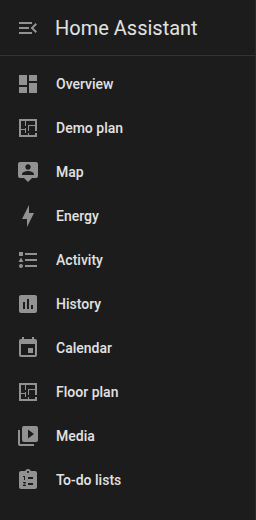
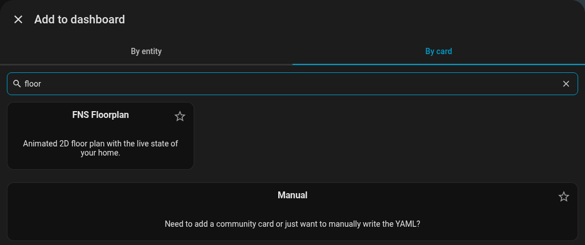
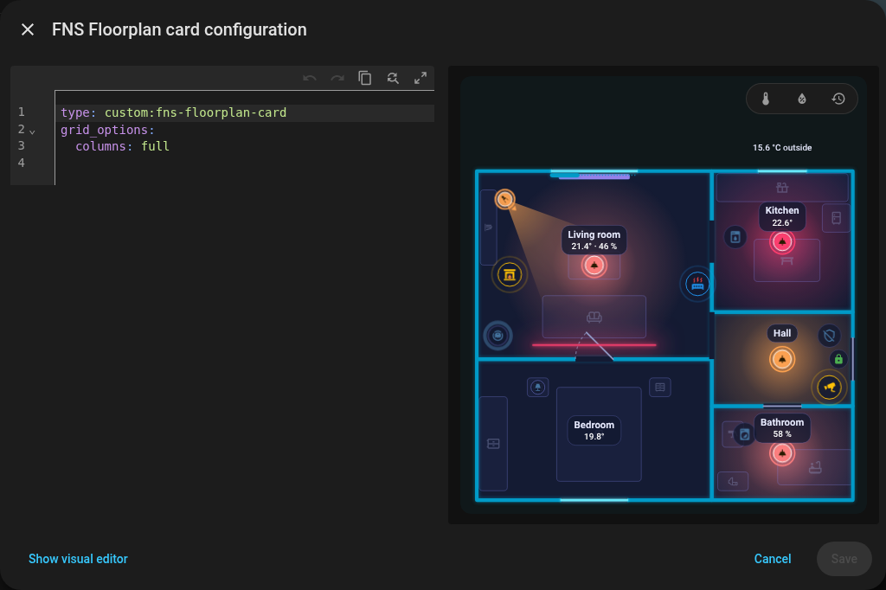

# Instalacja

## Wymagania

- Home Assistant **2025.1.0** lub nowszy.
- [HACS](https://hacs.xyz) dla zalecanej instalacji (instalacja ręczna też działa).
- Konto administratora do edytora. Sama karta działa dla każdego użytkownika.

## Instalacja przez HACS

FNS Floorplan nie jest na domyślnej liście HACS, więc dodajesz go jako repozytorium niestandardowe.

1. Otwórz **HACS** w pasku bocznym Home Assistanta.
2. Otwórz menu z trzema kropkami w prawym górnym rogu i wybierz **Repozytoria niestandardowe**.
3. Jako repozytorium wpisz `https://github.com/matata86/fns-floorplan` i wybierz kategorię **Integracja**. Kliknij **Dodaj**.
4. Wyszukaj **FNS Floorplan** w HACS i kliknij **Pobierz**.
5. **Zrestartuj Home Assistanta** (Ustawienia, System, Restart).

## Instalacja ręczna

1. Pobierz najnowsze wydanie ze [strony wydań](https://github.com/matata86/fns-floorplan/releases) albo sklonuj repozytorium.
2. Skopiuj folder `custom_components/fns_floorplan` do folderu `custom_components` w konfiguracji Home Assistanta tak, aby istniał plik `custom_components/fns_floorplan/manifest.json`.
3. Zrestartuj Home Assistanta.

## Dodanie integracji

1. Przejdź do **Ustawienia, Urządzenia oraz usługi, Dodaj integrację**.
2. Wyszukaj **FNS Floorplan** i dodaj go. Nie ma nic do skonfigurowania, może istnieć tylko jedna instancja.

{ loading=lazy }

{ loading=lazy }

Integracja rejestruje kartę, więc nie musisz ręcznie dodawać zasobu do pulpitu.

## Opcje

Kliknij **Konfiguruj** na karcie integracji.

| Opcja | Domyślnie | Znaczenie |
|--------|---------|---------|
| Pokaż edytor w pasku bocznym | włączone | Dodaje pozycję **Plan piętra** do paska bocznego (tylko administratorzy). |

Edytor jest zawsze dostępny pod adresem `/fns-floorplan` (na przykład `http://homeassistant.local:8123/fns-floorplan`), nawet gdy pozycja w pasku bocznym jest ukryta. Edytor karty na pulpicie ma przycisk **Edytuj plan piętra**, który otwiera ten sam adres.

{ loading=lazy }

{ loading=lazy }

## Dodanie karty

W trybie edycji pulpitu wybierz **Dodaj kartę**, wyszukaj „floor” i wybierz **FNS Floorplan**. Edytor wizualny oferuje poniższe opcje oraz przycisk **Edytuj plan piętra**; **Pokaż edytor kodu** przełącza na YAML.

{ loading=lazy }

{ loading=lazy }

{ loading=lazy }

{ loading=lazy }

Dzięki `rotate` plan obraca się o 90 stopni na wąskiej karcie; tutaj widać przełączanie `rotate` między `true` a `false`.

## Aktualizacja

Aktualizuj przez HACS jak każdą inną integrację i zrestartuj Home Assistanta. Karta i edytor są ładowane z wersją integracji w adresie URL, więc przeglądarka sama czyści pamięć podręczną. Jeśli nadal widzisz starą wersję, zajrzyj do [FAQ](help/old-version-after-update.md).

Twój plan jest przechowywany przez Home Assistanta (`.storage/fns_floorplan`) i aktualizacje go nie ruszają.

## Odinstalowanie

1. Usuń kartę ze swoich pulpitów.
2. **Ustawienia, Urządzenia oraz usługi, FNS Floorplan, menu z trzema kropkami, Usuń.**
3. Usuń repozytorium w HACS (albo folder `custom_components/fns_floorplan`) i zrestartuj.
4. Opcjonalnie: usuń zapisane pliki planu `.storage/fns_floorplan` i `.storage/fns_floorplan.history` oraz obrazy podkładu w `www/fns_floorplan/`.

Dalej: [Szybki start](quick-start.md).
