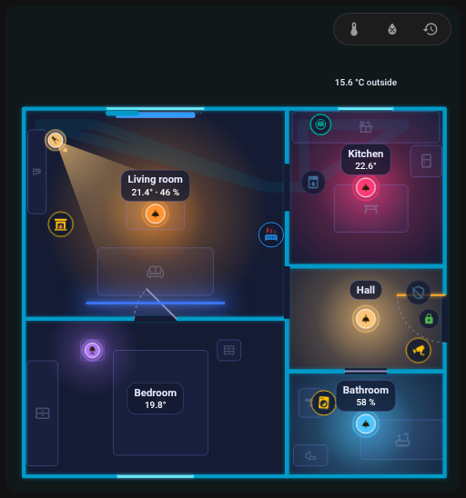

# Odkurzacz

Odkurzacz jest rysowany jako mały robot, który mieszka w swojej **stacji dokującej** i podczas sprzątania jeździ po pomieszczeniu, w którym się według raportu znajduje.

{ loading=lazy }

## Element stacji dokującej

Dodaj **Odkurzacz** (typ mebla `robot_vacuum`) i umieść go tam, gdzie stoi stacja. Jego formularz ma pola:

| Pole | Klucz | Znaczenie |
|-------|-----|---------|
| Encja | `entity` | Encja `vacuum` |
| Czujnik pomieszczenia | `room_sensor` | Czujnik, którego stanem jest nazwa pomieszczenia, w którym jest odkurzacz (dla Roborocka `sensor.*_current_room`) |
| Parowanie pomieszczeń | `room_map` | `{ "<nazwa pomieszczenia w odkurzaczu>": "<id pomieszczenia w planie>" }` |
| Bateria | `battery` | Czujnik baterii; puste = czujnik `battery` urządzenia odkurzacza |
| Sekcja pracy | `color_on`, `fx`, `progress`, `progress_total` | Wygląd podczas sprzątania |
| Warstwa | `layer` | Zobacz [niżej](#layer-and-stacking) |

Stacja przyjmuje także [reguły](editor/rules.md) (`color` reguły zastępuje kolor motywu, również w stacji) oraz akcję dotknięcia; domyślne dotknięcie otwiera szczegóły.

## Czujnik pomieszczenia i room_map

Karta musi wiedzieć, w którym pomieszczeniu planu odkurzacz się według raportu znajduje. Tabela **Parowanie pomieszczeń** w formularzu stacji wypisuje nazwy z `options` czujnika pomieszczenia, klucze już obecne w `room_map`, bieżący stan oraz nazwy dodane ręcznie. Dla każdej nazwy wybierz:

- **automatycznie**: ta sama nazwa lub id co pomieszczenie planu, bez rozróżniania wielkości liter i znaków diakrytycznych,
- **konkretne pomieszczenie**,
- **nie paruj** (`__none`): robot nie wjeżdża do tego pomieszczenia.

**Kontrola** (zobacz [Historia i kontrola](history.md)) zgłasza nazwy z opcji czujnika, które nie są sparowane.

```yaml
furniture:
  - id: dock
    type: robot_vacuum
    entity: vacuum.robot
    room_sensor: sensor.robot_current_room
    room_map:
      Living room: living_room
      Kitchen: kitchen
      Hallway: __none
    x: 0.4
    z: 3.1
```

Starszy plan z kluczem `vacuum` na najwyższym poziomie (`entity`, `room_sensor`) nadal działa; edytor przekształci go w stację przy następnym zapisie.

## Jak jeździ

| Stan | Co widzisz |
|-------|--------------|
| `cleaning` | Robot jeździ pasami po pomieszczeniu z czujnika pomieszczenia i zostawia ślad |
| `returning` | Jedzie do stacji; ślad jest czyszczony |
| `docked`, `charging` | Stoi w stacji. **Pierścień wokół niego pokazuje baterię** (pełny przy 100 %), „oddycha” tylko wtedy, gdy poziom baterii jest nieznany. Robot ma kolor motywu odpowiadający stanowi odkurzacza |
| `idle`, `paused`, `error` | Stoi **w swoim pomieszczeniu** na wolnym miejscu i miga (obwódka znacznika ma kolor stanu, błędy są czerwone) |

{ loading=lazy }

*Robot opuszcza stację, jedzie przejściem do kuchni i wraca do stacji.*

- Między pomieszczeniami i z powrotem do stacji jeździ **przez drzwi i przejścia** (wyszukiwanie ścieżki po otworach innych niż okna; druga strona otworu to pomieszczenie 35 cm za ścianą). Gdy nie ma ścieżki, jedzie prosto.
- Gdy strona się ładuje, a robota nie ma w stacji, pojawia się od razu w swoim pomieszczeniu, zamiast wyjeżdżać ze stacji.
- Podczas jazdy robot zachowuje orientację, jaką ma w stacji.
- **Parkowanie na wolnym miejscu:** zatrzymany robot stoi tam, gdzie niczego nie zasłania: najdalej od znacznika, świateł i etykiet. Miejsce jest obliczane po narysowaniu karty.
- **Objazd całego piętra:** gdy sprząta, a pomieszczenie jest nieznane (brak czujnika lub parowania), objeżdża **wszystkie pomieszczenia piętra**: kolejno najbliższe, przez drzwi, pas po pasie, pomijając niedostępne, a potem wraca do stacji.

## Podczas sprzątania

Sekcja **W trakcie pracy (sprzątanie)** ustawia, co stacja pokazuje, gdy robot sprząta: `color_on`, efekt pierścienia `fx` (na przykład `comet`) oraz, dla odliczania, `progress` / `progress_total` (zobacz [Reguły](editor/rules.md#countdown)).

## Warstwa i kolejność { #layer-and-stacking }

Podczas jazdy robot jest rysowany **nad meblami i ścianami, a pod światłami, urządzeniami i etykietami**. Gdy stoi, `layer: 0` zachowuje tę samą kolejność; `layer` większe od 0 stawia go nad światłami i urządzeniami, dopóki stoi.

## Ukrycie w panelu pomieszczenia

Robot pojawia się w [panelu pomieszczenia](room-panel.md) pomieszczenia ze swoją stacją. Zaznacz **nie pokazuj w panelu pomieszczenia** (`sheet_hide: true`), aby go pominąć.

## Odkurzacz jako zwykłe urządzenie

Możesz też umieścić urządzenie `generic` z encją `vacuum.*`: pracuje podczas sprzątania lub powrotu (pierścień `comet`), a w stacji pokazuje pierścień baterii i tekst z poziomem naładowania („ładowanie 64 %” lub „100 %”). Bateria pochodzi z rejestru urządzeń (czujnik z `device_class: battery` i czujnik binarny `battery_charging` na tym samym urządzeniu) albo z atrybutu `battery_level`.

Powrót do [Elementy](editor/items.md).
