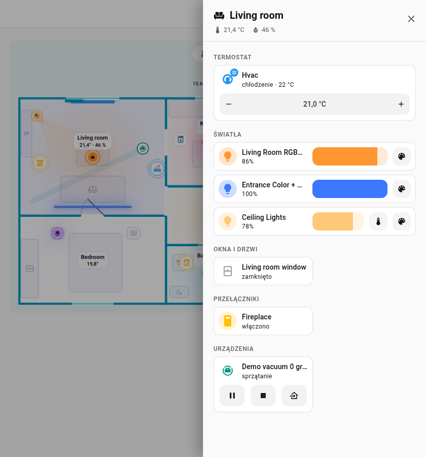

# Panel pomieszczenia

Dotknij pomieszczenia na karcie, a **panel wysuwany** wsunie się od prawej krawędzi ekranu. Wygląda jak pulpit obszaru w Home Assistancie: tło motywu, nagłówek z ikoną pomieszczenia, nazwą, temperaturą i wilgotnością oraz karty Home Assistanta w dwóch kolumnach. Zamkniesz go krzyżykiem, ++esc++ lub kliknięciem poza panelem.

| Ciemny motyw | Jasny motyw |
|---|---|
| { loading=lazy } | { loading=lazy } |

{ loading=lazy }

{ loading=lazy }

*Otwieranie panelu, ustawianie jasności światła i zamykanie.*

## Sekcje

Panel jest zbudowany z własnych kart Home Assistanta, każda umieszczona jak na pulpicie, więc style nadaje im także twój motyw (łącznie z motywami card-mod / UIX). Każda sekcja ma kartę nagłówka z ikoną w stylu podtytułu nagłówków sekcji pulpitu. Dotknięcie karty otwiera szczegóły, a ikona przełącza to, co da się przełączyć. Termostaty, światła ze sterowaniem, kamery i rolety zajmują całą szerokość, reszta leży po dwie w rzędzie.

| Sekcja | Co się tam znajduje |
|---------|-----------------|
| **Termostat** | Encje `climate` jako kafelek ze sterowaniem temperaturą docelową |
| **Światła** | Światła umieszczone w pomieszczeniu. Z zainstalowanymi kartami [Mushroom](https://github.com/piitaya/lovelace-mushroom): karta światła Mushroom z paskiem jasności w kolorze światła i przyciskami temperatury barwowej i koloru (jeśli światło je ma); dotknięcie ikony przełącza światło. Bez Mushroom: kafelek z paskiem jasności obok nazwy |
| **Kamery** | Kamery pomieszczenia jako podgląd na całą szerokość panelu (zdjęcie odświeżane co kilka sekund); dotknięcie otwiera obraz na żywo w szczegółach |
| **Okna i drzwi** | Otwory pomieszczenia z czujnikiem kontaktowym i ich rolety (także z dodatkowych encji) z przyciskami otwórz / stop / zamknij obok nazwy i suwakiem położenia pod nimi |
| **Przełączniki** | `switch` i `input_boolean` |
| **Multimedia** | Odtwarzacze multimediów i piloty (telewizory, głośniki, odtwarzacze); odtwarzacz z regulacją głośności dostaje suwak głośności |
| **Roboty** | Odkurzacze automatyczne ze start / stop / powrót do stacji, kosiarki automatyczne |
| **Urządzenia** | Urządzenia (zamek dostaje polecenia zamka) |
| **Czujniki** | Czujniki pomieszczenia |
| **Inne** | Cała reszta |

Pokazywane są tylko elementy **umieszczone w pomieszczeniu** oraz encje z `sheet_extra`. Obszary Home Assistanta nie są dodawane automatycznie. Odkurzacz pojawia się w pomieszczeniu ze swoją stacją dokującą.

## Wybór tego, co się pokazuje

- `sheet_extra`: dodatkowe encje pomieszczenia (pole w formularzu pomieszczenia, jedna w wierszu, początkowe `- ` jest w porządku; **Dodaj encję** pod polem wybiera jedną). Wpis może być też szablonem, który zwraca id encji, zobacz [Pomieszczenia](editor/rooms.md). Każda encja dostaje kartę swojej sekcji powyżej (światło swoją kartę światła, kamera obraz, roleta sterowanie roletą, reszta kafelek).
- `sheet_hide: true` na dowolnym elemencie (światło, urządzenie, okno, drzwi, zamek, odkurzacz) pomija go.
- `icon` pomieszczenia pojawia się w nagłówku.

```yaml
rooms:
  - id: living_room
    name: Living room
    icon: mdi:sofa
    temperature: sensor.living_room_temperature
    sheet_extra:
      - climate.living_room
      - camera.living_room
      - switch.tv_plug
```

Powrót do [Karta](card.md).
